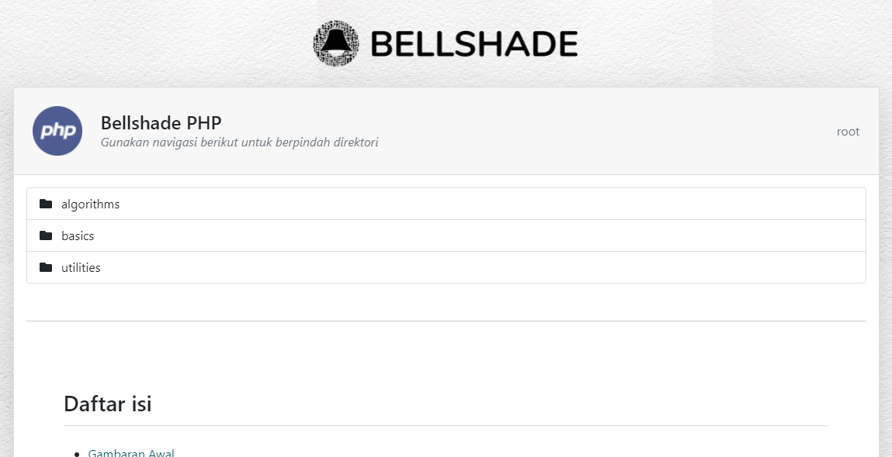

<p align="center">
    <br/><br/>
    
    
</p>

## Daftar isi
- [Gambaran Awal](#gambaran-awal)
- [Cara penggunaan](#cara-penggunaan)
- [Kategori yang tersedia](#kategori-yang-tersedia)
  - [Pembelajaran _(basics)_](#pembelajaran-basics)
  - [Komponen Kegunaan _(utilities)_](#komponen-kegunaan-keperluan-utilities)
  - [Algoritma _(algorithms)_](#algoritma-algorithms)
- [Berkontribusi](#berkontribusi)

## Gambaran awal

Selamat datang di repositori Bellshade PHP. Disini kamu dapat mempelajari semua tentang bahasa pemrograman PHP mulai dari dasar-dasar, fitur-fitur PHP, implementasi algoritma dan lain sebagainya. Dikemas dengan gaya penulisan yang rapi terorganisir dan penjelasan berbentuk artikel berbahasa Indonesia yang mudah dimengerti, sehingga repo ini dapat kamu gunakan sebagai referensi bahasa pemrograman PHP.

Bellshade PHP dapat digunakan untuk semua level baik itu pemula, menengah atau bahkan _expert_. Untuk pemula, kami menyediakan materi dasar dalam bentuk artikel dan demonstrasi yang runtut sehingga secara perlahan Bellshade PHP dapat membantu kalian untuk meningkatkan pengetahuan dan skill pemrograman PHP tanpa mengalami kesusahan akibat jalan belajar yang tidak runtut.

Bagi kamu yang sudah berpengalaman dalam pemrograman menggunakan PHP, tentunya kamu dapat kembali lagi mempelajari materi-materi tertentu untuk mengasah skill pemrograman atau hanya sekedar mengingat-ingat kembali. Selain itu, kami juga memberikan topik referensi lain yang sifatnya adalah umum dan opsional. Topik referensi ini dapat berupa implementasi fitur-fitur atau komponen kegunaan _(utilities)_ seperti manipulasi gambar, chart, datetime dan sebagainya yang sejatinya adalah opsional dan tidak ada prasyarat tertentu untuk bisa digunakan.

> _"Harapannya, Bellshade PHP dapat terus digunakan oleh para web developer PHP di Indonesia sebagai referensi / kamus / tempat belajar tentang pemrograman web berbasis PHP"_

PHP adalah bahasa pemrograman yang cukup luas dengan ekosistem yang luar biasa besarnya. Untuk terjaga agar tetap terorganisir dan informatif, kami kategorikan tiap pembahasan menjadi beberapa topik kategori. 


## Cara penggunaan
Ada 2 cara kalian dapat menggunakan repositori ini sebagai referensi utama. 

### Dengan secara langsung di Github

kalian dapat langsung menjelajahi direktori-direktori di repo ini, dan karena artikel penjelasannya berupa markdown `README.md`, kalian dapat membacanya saat berada di direktori yang berkaitan. Namun kalian tidak dapat menjalankan demo file PHPnya secara langsung

### Dengan clone di web server kamu di _local_

Jika kalian perhatikan, tiap direktori selalu memiliki `index.php` yang berfungsi untuk menampilkan penjelasan berupa markdown `README.md` kedalam browser. Kalian juga dapat menjelajahi setiap folder langsung dari browser dan dapat menjalankan demo file PHPnya juga. akan tetapi, karena kami menggunakan _dependency_ pihak ketiga, setelah meng-_clone_ kalian harus mengikuti langkah dibawah:

- Download & Install composer di [situs resminya](https://getcomposer.org/download/)
- pada direktori hasil _clone_ nya, lakukan perintah berikut

```bash
composer install
```
- Kemudian kamu dapat mengaksesnya dibrowser.
<p align="center">
    <br/><br/>
</p>


## Kategori yang tersedia

### Pembelajaran _(basics)_
Di bellshade PHP terdapat kategori basic yang berisi tentang kumpulan materi pembelajaran dalam bentuk artikel berisi text dan media-media visual yang informatif. Kumpulan materi pembelajaran ini juga disusun secara runtut sehingga dapat digunakan sebagai pembelajaran.

> kategori pembelajaran (basic learning) ini bisa kalian ditemukan pada direktori `/basics` 

didalam folder `/basics` terdapat folder-folder materi yang didalam tiap folder materi tersebut terdapat file `README.md` yang mana file ini adalah artikel penjelasan dari materinya. Dan tentunya, didalam tiap folder materi juga terdapat file demo PHP berisi contoh kode implementasi dari materinya yang dapat dijalankan di local jika sudah di clone dan ditempatkan di web-server.


### Komponen kegunaan / keperluan _(utilities)_
Kategori _utilities_ adalah kumpulan referensi dan contoh penggunaan komponen-komponen / fitur-fitur umum yang mungkin diperlukan oleh para web developer untuk diterapkan pada project aplikasi webnya. Didalam kategori ini, kalian dapat menjelajahi berbagai macam kebutuhan umum  untuk pengembangan web umum dan mempelajari bagaimana cara mengimplementasikannya. 

Contoh skenario penggunaan kategori referensi ini adalah sebagai berikut: _"Misalnya kamu sedang mengerjakan project, lalu tiba-tiba ditengah project dibutuhkan bagaimana cara memanipulasi gambar yang diunggah dengan menggunakan PHP"_. Manipulasi gambar adalah hal yang sangat opsional dan tidak esensial pada setiap pengembangan web, meskipun sudah level menengah terkadang juga masih perlu mencari referensi lagi. Oleh karena itu, hal ini termasuk dalam kategori _utilities_ dan anda dapat menjelajahi kebutuhan-kebutuhan lainnya di kategori ini.

> kategori kegunaan _(utilities)_ dapat kalian temukan pada direktori `/utilities`

### Algoritma _(algorithms)_
Topik kategori algoritma berisi tentang kumpulan penyelesaian masalah dengan berbagai macam jenis algoritma yang ditulis dalam bahasa pemrograman PHP. Meskipun kurang begitu menyenangkan untuk dipelajari, dan kurang begitu sering digunakan pada pengembangan web berbasis PHP, mempelajari algoritma dapat meningkatkan kemampuan cara berpikir fundamental sebagai seorang _programmer_.

> kategori algoritma _(algorithms)_ dapat ditemukan pada direktori `/algorithms`

## Berkontribusi
Kami sangat senang sekali jika kamu dapat berkontribusi pada project open source ini. Untuk berkontribusi pastikan kamu sudah mengetahui bagaimana pola pemrograman dan struktur dari project repositori ini. Kami juga menuliskan pedoman berkontribusi di [`CONTRIBUTING.md`](CONTRIBUTING.md), pastikan kamu sudah membaca, menyetujui dan memenuhi syarat-syarat yang telah ditetapkan. 

Tentang apa saja yang bisa kalian kerjakan untuk berkontribusi, kamu dapat mencari issue yang kosong di [_issues_](https://github.com/bellshade/PHP/issues). Lalu, kamu dapat assign diri sendiri ke salah satu issues, setelah itu ajukan _Pull Request_ dengan menutup issue itu. Kami akan mereview hasil pengerjaan anda, dan jika disetujui kami akan merge kedalam repositori ini. 
