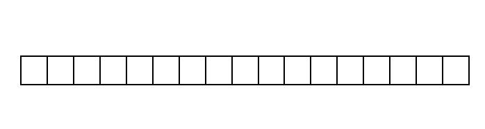
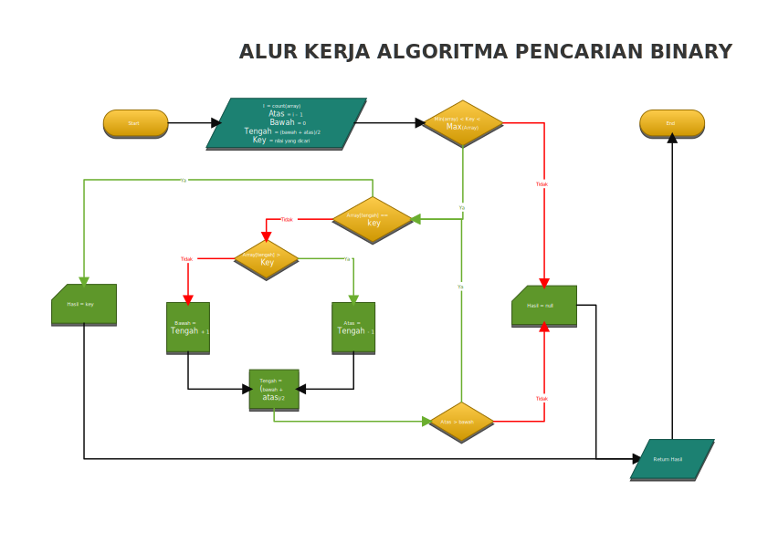

<p align="center">
  
  <h1 align="center">Algoritma Pencarian</h1>
</p>

## Pencarian Binary

Pencarian Binary atau algorithm binary search, merupakan sebuah algoritma pencarian dengan metode yang digunakan mengambil nilai elemen bagian tengah array kemudian membandingkan dengan nilai pencarian, dimana bila nilai pencarian lebih kecil, maka abaikan elemen dengan nilai lebih besar dan lakukan pencarian ke nilai lebih kecil, dan sebaliknya.

Ulangi hal diatas terus sampai nilai ditemukan atau index bawah dan index atas sama besar.

Untuk lebih jelas coba kita pelajari ilustrasi dibawah ini:



Ilustrasi diatas dapat dilihat bahwa array yang akan diperiksa elemennya dalam kondisi telah terurut, karena ini salah satu sarat dalam menggunakan algoritma ini. Jika array yang akan kita periksa memiliki elemen dengan nilai tidak berurutan maka algoritma ini tidak akan dapat bekerja.

Kemudian nilai dari elemen yang kita cari berupa bilangan.  

Untuk mempermudah kita dalam menyusun baris kode sebaik kita susun alur kerja dari ilustrasi diatas dalam bentuk diagram dan pseudo code yang kemudian kita terjemahkan kedalam bahasa pemograman.

Dibawah ini dapat kita liat diagram alur kerja dari algoritma tersebut.



Pada diagram ada satu proses yang saya tambahkan diluar algoritma pencarian secara binary pada umumnya yaitu pengecekan nilai dicari apakah berada dalam range (jangkauan) dari nilai elemen array, ini bertujuan mengurangi proses yang tidak diperlukan. Dimana kita ketahui bahwa nilai dari elemen array telah diurutkan sehingga bila nilai yang kita cari berada dibawah nilai elemen terendah atau diatas nilai elemen tertinggi maka dapat kita pastikan nilai tersebut tidak akan ditemukan dalam pencarian, sehingga penggunaan sumber daya seperti memory dapat berkurang untuk hal-hal yang tidak perlu dilakukan.

Ada baiknya sebelum menulis baris kode dalam bahasa pemograman kita susun dulu rencana baris kode dalam dalam bahasa pseudo, sehingga kita dapat menilai baris kode yang kita tulis nanti apakah sesuai dengan yang kita inginkan.

Dari ilustrasi dan diagram alur dapat kita susun pernyataan dalam bahasa pseudo kira-kira seperti berikut:

```text
ALGORITMA BINARY SEARCH

GET 
  Data Array;
  Nilai yang dicari;
  Index Atas;
  Index Bawah;

IF Nilai yang dicari < array(Index Bawah) atau Nilai yang dicari > array(index Atas)
  RETURN NULL;
END IF;

WHILE Index Bawah < Index Atas
{
  Index Tengah = (Index Bawah + Index Atas)/2

  IF (array[index tengah] == Nilai Dicari)
    "Nilai ditemukan"
    RETURN Nilai Index Tengah
    BREAK
  ELSE IF (Array[Index Tengah] < Nilai Dicari)
    Index Bawah = Nilai Tengah + 1
  ELSE
    Index Atas = Nilai Tengah - 1
  END IF
}
bila tidak ditemukan
RETURN NULL;
```

Penjelasan dari bahasa pseudo,

- Pertama ambil data array dan data nilai yang dicari, data ini berupa parameter input.
- Kemudian kalkulasikan index elemen terendah dan tertinggi, index ini bisa juga dijadikan sebagai parameter input.
- Periksa apakah nilai yang dicari berada dalam range elemen array.
- Jika iya tentukan index tengah dari elemen array dengan pembulatan nilai rata-rata index atas dan index bawah.
- cek dan bandingkan nilai dari index tengah dengan nilai yang dicari
- jika sama dengan nilai yang di cari, nilai sudah ditemukan, kembalikan hasil pencarian, perulangan dihentikan.
- Jika ternyata nilai lebih kecil, maka index yang lebih kecil dari index tengah kita abaikan dengan cara menggeser index bawah ke posisi index sekarang(index tengah) + 1.
- Jika nilai lebih besar, kita abaikan pencarian di index lebih besar, dengan menggeser index atas menjadi index kita sekarang (index tengah) - 1
- tentukan index tengah yang baru dan ulangi sampai index atas dan index bawah key nya bernilai sama (index atas = index bawah = index tengah)

Dari bahasa pseudo diatas kita sudah bisa menuliskan baris kode untuk algoritma tersebut. Baik mari kita terjemahkan bahasa pseudo tersebut kedalam PHP.

```php
<?php
  function BinarySearch(array $array, int $key)
  {
    $atas = sizeof($array) - 1;
    $bawah = 0;

    //Cek apakah nilai pencarian berada dalam jangkauan data array
    if (($key < $array[$bawah]) || ($array[$atas] < $key)){
      return null;
    }

    //Lakukan pengecekan terhadap nilai elemen dengan perulangan
    while ($bawah < $atas)
    {
      //Tentukan index tengah dari array
      $tengah = floor($bawah + $atas) / 2     //pembulatan kebawah

      //cek nilai index tengah apakah nilai yang dicari
      if($array[$tengah] == $key){
        return $tengah;
        break;
      //jika bukan, dan nilainya lebih kecil
      } elseif ($array[$tengah] < $key) {
        //batas index bawah, kita pidahkan ke nilai tengah + 1
        $bawah = $tengah + 1;
      } else {
        //jika nilai lebih besar, index atas kita kurangi menjadi index tengah - 1
        $atas = $tengah -1;
      }
    }
    //jika data tidak ditemukan
    return null;
  }
?>
```

Baris kode diatas sudah dapat gunakan untuk pencarian.

Untuk menggunakan fungsi diatas dapat kita panggil dengan contoh baris kode dibawah ini :

```php
<?php
$dataArray = [6,7,10,11,14,17,18,19,23,26,38,42,78,79,82,84,85];
$nilaiPencarian = 43;

$hasil = BinarySearch($dataArray, $nilaiPencarian);
echo $hasil;
?>
```

Maka dengan memanggil algoritma binary di atas kita akan mendapatkan hasil bernilai `11` yaitu index key dari nilai yang kita cari.

Sampai disini algoritma kita sudah selesai, namun untuk lebih baik dan mudah di implementasikan, algoritma berupa prosedural di atas kita lakukan perubahan menjadi objek. Sehingga perubahan menjadi seperti ini :

```php
<?php
Namespace Searching\Binary;         //jika mau menggunakan namespace

class BinarySeacrh
{
  //Properti dari Binarysearch
  private $array;
  private $key;

  //Metode dari BinarySearch

  /**
   * Konstruktor
   */
  public funtion __construct(array $array, int $key)
  {
    $this->array = $array;
    $this->key = $key
  }

  /**
   * Metode Pencarian Binary
   */
  public function getHasil(int $min = null, int $max = null)
  {
    $bawah = $min ?? 0;
    $atas = $max ?? count($this->array) - 1;
    if($this->array[$bawah] > $this->key | $this->key > $this->array[$atas]){
      return null;
    }

    while ($this->bawah < $this->atas)
    {
      $tengah = ($bawah + $atas)/2;

      if($this->array[$tengah] == $this->key)
        return $tengah;
      elseif($this->array[$tengah] < $this->key)
        $bawah = $tengah + 1;
      else
        $atas = $tengah - 1;
      endif
    }
  }

  /**
   * Metode dibawah ini bersifat opsional
   * Bisa digunakan bila ingin mengganti properti dari objek.
   * cara lain dapat mengganti Akses Modifikasi properti dari private menjadi public
   */
  public function setData(array $array)
  {
    $this->array = $array;
  }

  public function setKeyWord(int $key)
  {
    $this->key = $key;
  }

  public function getData()
  {
    return $this->array;
  }

  public function getKeyWord()
  {
    return $this->key;
  }
}
?>
```

Kelas BinarySearch kita telah selesai. BinarySearch diatas dapat kita gunakan dengan meng-instansiasi class tersebut menjadi objek. Contoh penggunaan seperti baris kode dibawah ini :

```php
<?php

use Searching/Binary/BinarySearch;
require_once './BinarySearch.php';

$data = [6,7,10,11,14,17,18,19,23,26,38,42,78,79,82,84,85];
$cari = 42;
$binary = new BinarySearch($data, $cari);         //instansiasi class

echo (!empty($binary->getHasil())) ? 'Data ditemukan pada index ' . $binary->getHasil() : 'Data tidak ditemukan';
?>
```

Demikian mengenai algoritma pencarian secara binary.  
Untuk contoh hasil eksekusi baris kode diatas dapat melihat link dibawah ini :

[](../../run.php?algoritma=binarysearch)

Contoh kode diatas dapat dilihat disini :

[](./BinarySearch.php)

### Kelebihan

Kelebihan dari algoritma ini pencarian dapat diselesaikan lebih cepat, mengurangi banyak perulangan yang terjadi, dalam setiap sirkulasi perulangan, mengurangi setengah dari total elemen dalam sirkulasi tersebut sehingga dapat menghemat waktu dan sumber daya.

### Kekurangan

Kekurangan dari algoritma ini, data array yang akan dicari nilainya harus memiliki elemen dengan nilai yang sudah berurutan.

---
>**Info !** :  
>***pseudo code*** atau kode samaran biasa digunakan oleh para programer untuk menulis algoritma sehingga dapat dengan mudah dimengerti untuk kemudian diterjemahkan kedalam bahasa pemograman (interpreter/compiler).  
>***pseudo code*** tidak memiliki aturan penulisan yang baku.

---
\*\*\* Terima kasih \*\*\*

### Referensi

- Programiz. *"Binary Search C, C++, Java, Python"*. [Pranala Luar](https://www.programiz.com/dsa/binary-search).
- Kela Casey, *"Let Us Understand Searching Algorithms"*. [Codersera](https://codersera.com/blog/let-us-understand-searching-algorithms/). 2020
- Edy Budiman. *"Belajar Dasar: Algoritma dan Pemograman"*. Repository Unmul.
- Udy Manber. *Using Mathematical Induction to Design Computer Algorithms*, Computer Science Technical Report#660. 1986.
- PHP net. *"PHP Manual - Class and Object"*. [Pranala Luar](https://www.php.net/manual/en/language.oop5.php)
