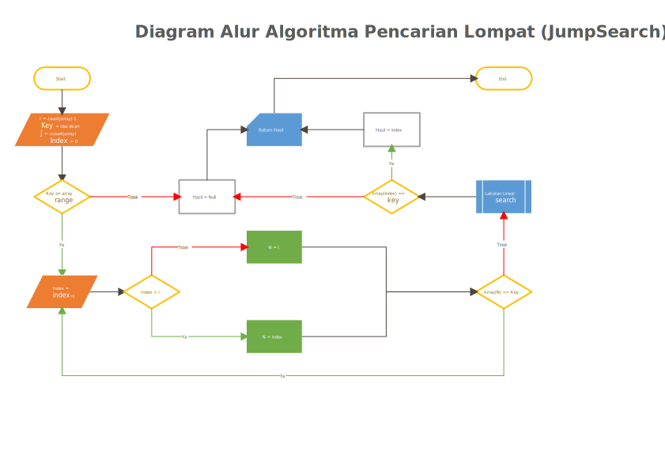

<p align="center">
  
  <h1 align="center">Algoritma Pencarian</h1>
</p>

## Jump Search

Algoritma Jump Search termasuk salah satu algoritma pencarian, berdasarkan namanya Jump Search dapat diartikan cari dan melompat. Algoritma ini bekerja dengan cara melopatti index dari elemen array, jadi tidak mengecek satu persatu tetapi mengecek satu elemen kemudian melompati beberapa elemen yang lebih tinggi untuk mengecek nilai elemennya sampai nilai dari elemen lebih besar dari pada nilai yang dicari, jika ini terjadi maka akan dilakukan linear search.

### Langkah

Langkah kerja dari algoritma ini sebagai berikut :

1. Tentukan banyak elemen yang akan dilewati setiap lompatan.
2. Cek nilai pada titik lompatan.
3. Jika nilai lebih kecil dari yang dicari lanjutkan lompatan
4. Jika nilai lebih besar dari yang dicari lakukan pencarian secara linear

Untuk lebih jelas bisa kita lihat ilustrasi dibawah ini :


Dari ilustrasi diatas dapat kita lihat bahwa pencarian akan dilakukan hanya pada beberapa titik, tidak semua elemen akan dicocokan. Sampai nilai lebih besar ditemukan, sehingga linear search akan dilakukan dari titik lompatan sekarang sampai titik lompatan sebelumnya.

Algoritma ini juga memiliki prasyarat parameter input yaitu elemen array dalam keadaan ter-urut, bila tidak kita harus melakukan pengurutan nilai elemen terlebih dahulu atau algoritma ini tidak dapat bekerja.

### Menghitung Jarak Antar Lompatan

Untuk jarak lompatan bisa kita tentukan berapapun tergantung keinginan kita. Tetapi untuk efisiensi pastinya kita perlu menghitung jarak lompatan akan perulangan untuk membandingkan nilai terjadi seminimal mungkin, sehingga dapat menghemat waktu dan sumber daya.

Untuk itu kita lihat ilustrasi di atas, kita mempunyai sebuah array dengan panjang 16 elemen kita anggap sebagai `y`, kita melakukan lompatan sebanyak 4 elemen untuk setiap lompatan yang kita anggap sebagai `x`, untuk mendapat nilai 26 sebagai `z`, algoritma akan melakukan lompatan dan pencarian sebagai berikut:

1. Lompatan dari index 0 ke index 3 (lompatan (1 `x`) - 1)
2. Lompatan dari index 3 ke index 7. (lompatan (2 `x`) - 1)
3. Lompatan dari index 7 ke index 11. (lompatan (3 `x`) - 1)
4. Pada index ke 11 nilai elemen lebih besar dari nilai yang dicari, maka akan dilakukan linear search dengan panjang array 4 elemen
5. Linear search pencarian 1 elemen array 1 menyisakan 3 elemen array yang dicari.
6. Linear Search pencarian ke 2, menyisakan 2 elemen array yang belum dicari
7. Linear Search pencarian ke 3, menyisakan 1 elemen array yang belum dicari
8. Linear Search pencarian ke 4, menyisakan 0 elemen array yang belum dicari

Sekarang kita perhitungkan satu-satu
**Untuk linear**
Perulangan yang dilakukan maksimal adalah 4 kali untuk lompatan setiap 4 elemen. Maka perulangan terjadi pada saat linear search dilakukan  =  sebanyak panjang lompatan.

```text
perulangan = x.
```

Perulangan pada lompatan :

Perulangan yang terjadi untuk panjang elemen = `y`, jarak lompatan =`x`, dan nilai di cari  =`z`

linear search dilakukan pada elemen antara lompatan kedua dan ketiga, karena nilai elemen pada lompatan ke 2 lebih kecil dari nilai dicari tetapi nilai elemen pada lompatan ke 3 lebih besar dari nilai dicari.
Untuk index elemen setiap lompatan dari kita ketahui dari contoh ilustrasi yaitu :  
&#9755; index awal = array[0];  
&#9758; index lompatan 1 = array[(0 + 4) - 1];  
&#9758; index lompatan 2 = array[(0 + 8) - 1];  
&#9758; index lompatan 3 = array[(0 + 12) - 1];  
&#9758; jika lompatan sebanyak 4 elemen maka index dapat kita buat persamaan sebagai berikut.  
&#9758; lompatan 1 = array[0 + (1&#215;4) - 1] atau array[(1&#215;4) - 1];  
&#9758; lompatan 2 = array[0 + (2&#215;4) - 1] atau array[(2&#215;4) - 1];  
dan terus selanjutnya, sampai lompatan ke `i` maka index array = array [i&#215;4 - 1] dimana 4 adalah panjang lompatan (`x`).

Maka dapat kita tulis dalam persamaan :  
array[(`i` &#215; `x`) - 1] < c < array[((`i`+ 1) &#215; `x`) - 1];

Dalam skenario terburuk nilai `z` berada pada akhir lompatan atau nilai `z` lebih besar dari index terakhir(`y` - 1).

```text
maka lompatan yang terjadi = panjang elemen/panjang lompatan
banyaknya lompatan = y/x.
```

Karena setiap lompatan merupakan perulangan maka banyaknya perulangan yang terjadi adalah = <sup>`y`</sup>/<sub>`x`</sub>

Maka total perulangan yang terjadi dapat kita hitung sebagai berikut :
Perulangan pada Linear Search +  Perulangan pada Lompatan.
dimana panjang elemen dari linear adalah sepanjang nilai lompatan.
-> (`x`) + (`y`/`x`).

Penyelesaian :

banyak perulangan

&#10149; = (x) + (y/x)

perulangan akan minimum jika :  
perulangan pada linear search = 1  
perulangan pada lompatan = 1  

Sehingga :  
Perulangan pada linear search = perulangan pada lompatan

> Dasar pemikiran
> Jika lompatan = 0 algoritma ini tidak pernah terjadi, jadi tidak bisa dijadikan minimum
> Jika perulangan linear = 0 maka kita belum menemukan nilai nya, sebab kita belum mencocokan nilai elemen dengan nilai yang kita cari

Berdasarkan persamaan dapat kita buat sebuah solusi

&#10149; x = <sup>`y`</sup>&#8725;<sub>`x`</sub>  
&#10149; x&#178; = y  
&#10149; x = &#8730;y dimana `y` adalah panjang elemen.

### Diagram Alur

Setelah kita perhitungkan jarak lompatan, maka kita bisa membuat diagram dan pseudo code. Diagram alur seperti di bawah ini :



### Pseudo

Kita susun pseudo code-nya, seperti di bawah ini :

```text
ALGORITMA JUMP SEARCH
GET
  Data Array
  Nilai yang dicari

SET
  panjang array = COUNT(Data Array)
  panjang lompatan = sqrt(panjang Lompatan)
  index = 0

IF Nilai dicari di luar range array
  RETURN null
END IF

WHILE Data Array[index] <= Nilai yang Dicari
  index = index + panjang lompatan

  IF index > panjang array - 1
    index = panjang array - 1
  END IF
LOOP

//Jika nilai lebih besar kita jalankan linear search
WHILE Data Array[index] >= Nilai yang Dicari
    IF Data Array[index] == Nilai yang Dicari
      RETURN index
    END IF
    DECREMENT index
LOOP
```

### Koding

Dari pseudo code, kita sudah dapat gambaran yang akan kita tulis kedalam PHP. Mari kita terjemahkan kedalam PHP,

Inti dari algoritma ini terbagi 2, yaitu lompatan itu sendiri dan linear search setelah jangkauan ditemukan. Sebagai contoh untuk lompatan kita akan buat perulangan seperti di bawah ini:

```php
  while ($array[$index] <= $nilai_di_cari)
  {
    $index = $index + $panjang_lompatan;
  }
```

Kode di atas melakukan perulangan selama nilai elemen lebih kecil dari nilai dicari.

Jika nilai elemen lebih besar maka kita lakukan pencarian secara linear, seperti contoh dibawah ini :

```php
  while ($array[$index] >= $nilai_di_cari){
    if($array[$index] == $nilai_di_cari)
    {
      #jika nilai ditemukan kita kembalikan index dari elemen array
      return $index;
      break;
    }
    $index--;
  }
```

Untuk pencarian linear ini juga bisa kita gunakan algoritma yang sudah kita tulis sebelumnya. Dengan meng-instansiasi class LinearSearch, kita tambahkan batas atas dan batas bawah index pencarian, dimana batas atasnya adalah index sekarang, dan batas bawahnya index pada lompatan sebelumnya (bawah: $index - $jarak_lompatan, atas: $index). Namun sebelumnya kita memerlukan modifikasi algoritma baris kode pada algoritma kita sebelumnya dengan menambah properti batas atas dan batas bawah.
Serta nilai kembalian yang sebelumnya berupa boolean kita ganti dengan index elemen.
Untuk saat kita lakukan seperti biasa dulu.

Contoh baris kode selengkapnya seperti dibawah ini:

```php
<?php
class JumpSearch
{
  # Properti
  private $data;
  private $cari;

  # Metode
  # konstruksi
  public function __construct(array $array, int $key)
  {
    $this->data = $array;
    $this->cari = $key;
  }

  # metode getHasil
  public function getHasil()
  {
    # persiapan parameter input
    $size = count($this->data);
    $jump = floor(sqrt($size));

    index = 0;

    # cek range array
    if(($this->cari < $this->data[$index]) || ($this->cari > $this->data[$size - 1]))
      return null;

    # jump
    while ($this->data[$index] <= $this->cari)
    {
      $index += $jump;
    }

    # linear search
    while ($this->data[$index] >= $this->cari)
    {
      # data ditemukan
      if($this->data[$index] == $this->cari){
        return $index;
        break;
      }
  
      $index++;
    }
    # data tidak ditemukan
    return null;
  }
}
?>
```

Class diatas sudah bisa kita eksekusi seperti contoh baris kode dibawah ini :

```php
<?php
  $array = [6,7,10,11,14,17,18,19,23,26,38,42,78,79,82,84,85];
  $key = 26;

  $jump = new JumpSearch($array, $key);
  echo $jump->getHasil();

  unset $jump;
?>
```

Untuk kode lengkapnya dapat dilihat pada link dibawah ini :
[](JumpSearch.php)

---

==== : ****TERIMA KASIH**** : ====

### Referensi

- GeeksforGeeks. *"Jump Search"*. [Pranala Luar](https://www.geeksforgeeks.org/jump-search/).
- PHP Manual. *"Class and Object"*. [Pranala Luar](https://www.php.net/manual/en/language.oop5.php)
- Edy Budiman. *"Belajar Dasar: Algoritma dan Pemograman"*. Repository Unmul.
- Udy Manber. *Using Mathematical Induction to Design Computer Algorithms*, Computer Science Technical Report#660. 1986.
