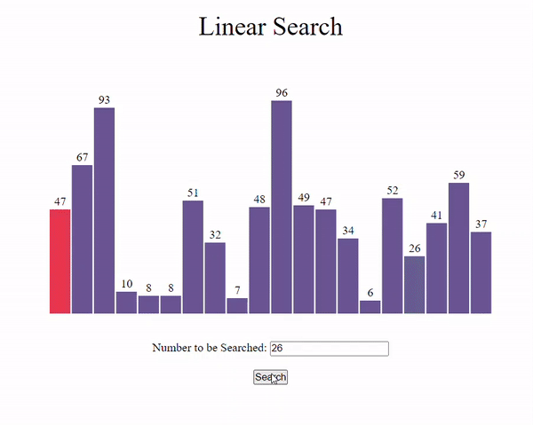
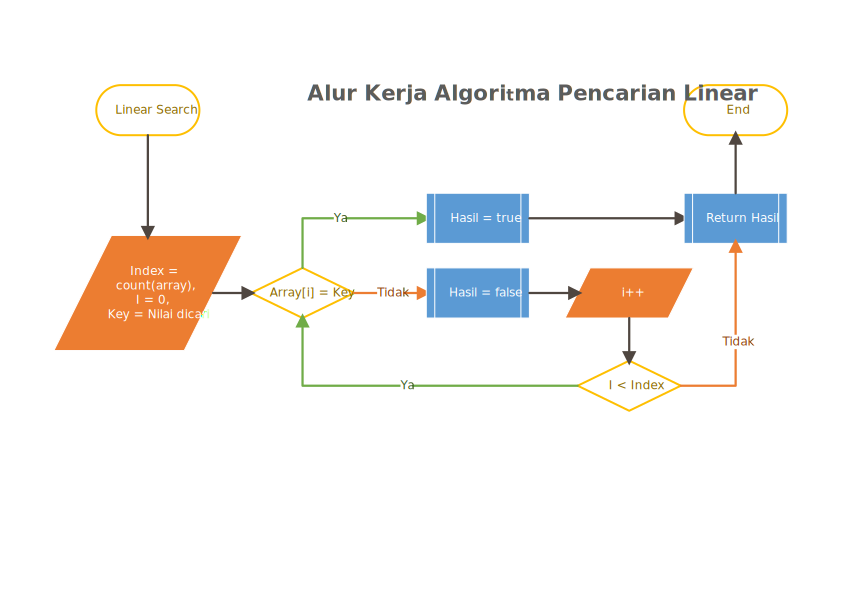

<p align="center">
  
  <h1 align="center">Linear Search</h1>
</p>

## Algoritma Pencarian Secara Linear

<p align="justify">Pencarian secara linear merupakan bagian dari algoritma pencarian. Algoritma ini terbilang sebuah algoritma sederhana, dengan tingkat kompleksitas rendah. Algoritma ini akan membandingkan semua elemen array dengan nilai pencarian, bila nilai ditemukan akan mengembalikan nilai true dan bila tidak ditemukan akan mengembalikan nilai false.</p>

Alur kerja algoritma ini adalah :

1. Ambil nilai dari elemen array.
2. Ambil nilai yang akan dicari.
3. Bandingkan nilai dari elemen array dengan nilai yang dicari.
4. ulangi langkah diatas sampai nilai yang dicari ditemukan dalam elemen array atau semua elemen array sudah diperiksa.
5. kembalikan hasil keluaran.

untuk lebih jelas kita bisa melihat simulasi pencarian secara linear dibawah ini:

<p align="center">

</p>

Pada contoh animasi diatas kita memiliki sekumpulan data dengan nilai:
[8,51,32,7,48,96,49,47,34,6,52,26,41] dan nilai yang ingin dicari didalam data adalah nilai 26. Pola yang dilakukan oleh animasi berupa mengecek nilai dari data index pertama sampai data ditemukan. dengan demikian bisa kita buatkan sebuah alur kerja dari animasi tersebut sebagai berikut:

<p align="center">

</p>

Alur diatas menjelaskan pola kerja dari algoritma yang akan kita tulis, setelah dapat alur kerja kita bisa langsung menuliskan baris kode. Tahap awal dulu kita siapkan paramater-parameter yang diperlukan, contoh sebagai berikut :

```php
<?php
    $data = [8,51,32,7,48,96,49,47,34,6,52,26,41];
    $index = count($data);
    $i = 0;
    $key = 26;
?>
```

kemudian kita buat perbandingan antara nilai elemen array dari index ke `i` dengan data kunci (nilai yang dicari) dengan cara pengkondisian, contoh sebagai berikut :

```php
<?php
    if ($data[$i] = $key)
    {
        $hasil = true;
    }
    else
    {
        $hasil = false;
    }
?>
```

Kita lakukan perulangan untuk memeriksa nilai dari setiap elemen array, dalam kasus ini kita bebas menentukan metode perulangan yang kita ingin gunakan, dalam contoh ini saya menggukan metode perulangan do..while, contoh sebagai berikut :

```php
<?php
    do
    {
        if($data[$i] == $key)
        {
            $hasil = true;
        }
        else
        {
            $hasil = false;
        }
        $i++;
    }while($i < $index);        //elemen terakhir count($array) - 1 || x < count($array)

    echo $hasil;
?>
```

Jangan lupa untuk menghentikan perulangan jika data sudah ditemukan, hal ini dapat mengurangi beban kerja perangkat kita. Sebagai hasil baris kode lengkap sebagai berikut :

```php
<?php
    $data = [8,51,32,7,48,96,49,47,34,6,52,26,41];
    $key = 26;
    $index = count($array);
    $i = 0

    do
    {
        if ($data[$i] == $key)
        {
            $hasil = true;
            break;
        } else {
            $hasil = false;
        }
    } while ($i < $index);

    echo $hasil;        //true
?>
```

Baris kode di atas telah berhasil memeriksa apakah nilai yang kita cari terdapat dalam elemen array tersebut, agar kita dapat menggunakan baris kode diatas secara global, ada baiknya baris kode diatas kita tuangkan kedalam fungsi PHP, agar kita dapat mengaksesnya kapan saja, kemudian nilai `false` untuk parameter $hasil akan selalu muncul kecuali nilai yang kita cari dalam array ditemukan maka parameter $hasil bernilai `true`, sebaiknya nilai dari parameter $hasil kita set `false` secara default dan kita ubah menjadi `true` saat data ditemukan.

contoh baris kode sebagai berikut:

```php
<?php
namespace Algoritma;

class LinearSearch
{
    protected $hasil = false;

    public function cari(array $data, $key)
    {
        $index = count($data);
        $i = 0;

        do
        {
            if ($data[$i] == $key)
            {
                $this->hasil = true;
                break;
            }
            $i++;
        } while ($i < $index)

        return $this->hasil;
    }
}
?>
```

Sampai disini telah selesai, baris kode diatas sudah bisa kita akses secara global sebagai contoh :

```php
<?php
    require_once 'Algoritma\LinearSearch.php';

    use LinearSearch;

    $data = [8,51,32,7,48,96,49,47,34,6,52,26,41];
    $linear = new LinearSearch();

    $hasil = $linear->cari($data, 26);

    echo '<pre>';
    echo ($hasil) ? 'Data ditemukan' : 'Data tidak ditemukan';  //Data ditemukan
?>
```

Baris kode kita telah selesai sampai disini.

Algoritma ini memiliki kelebihan dan kekurangan, sebagai gambaran

**Kelebihan** :

-   Data Array yang diterima diawal tidak harus terurut, sehingga langsung bisa dapat melakukan pencarian.

**Kelemahan** :

-   Jika Array yang diterima memiliki elemen yang banyak maka akan memberatkan kinerja dari perangkat kita.

dalam hal demikian algoritma ini baik digunakan untuk pencarian dalam data kecil dengan data array berupa linear ( array satu dimensi ), walaupun dapat digunakan untuk pencarian di dalam array multi dimensi dengan metode recursive, tetapi hal tersebut <b>dapat membebani memory perangkat</b>.

untuk mencari pada array multi dimensi, bisa menggunakan contoh baris kode dibawah ini :

```php
<?php
class .......
{
    public function cari($data, $key){
        ......
        do
            .....
            if (is_array($data[$i])
            {
                $this->cari($data[$i], $key);
            }
            $i++;
        } while ($i < $index);
    ....
.....
?>
```

[](LinearSearch.php)

### Referensi

-   Programiz. _"Linear Search C, C++, Java, Python"_. [Pranala Luar](https://www.programiz.com/dsa/linear-search).
-   Edy Budiman. _"Belajar Dasar: Algoritma dan Pemograman"_. Repository Unmul.
-   Udy Manber. _Using Mathematical Induction to Design Computer Algorithms_, Computer Science Technical Report#660. 1986
