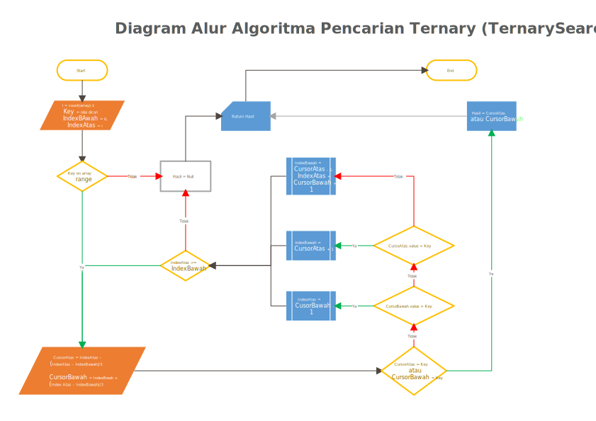

<p align="center">
  
  <h1 align="center">Algoritma Pencarian</h1>
</p>

## Ternary Search

Ternary Search dari namanya algoritma ini termasuk kedalam algoritma pencarian, algortima ini melakukan pencarian dengan menggunakan 2 cursor atau 2 tempat sekaligus, dimana kedua tempat ini akan membagi array menjadi 3 bagian yang hampir sama panjang, kemudian akan membuang 2 bagian yang jangkauan nya tidak mengandung nilai dicari, untuk lebih memahami dapat kita lihat animasi pola kerja algoritma Ternary Search sebagai berikut.


Agar Algoritma ini dapat berjalan ada beberapa persyaratan yang harus terpenuhi, yaitu:

- Kumpulan data berupa `index array`,
- Value dari array berupa numeric,
- Data Array telah tersusun secara berurutan, bila data array tidak tersusun secara berurutan disarankan menggukan Linear Search,
- Nilai yang dicari bertype sama dengan nilai element array (berupa numeric),

Pola kerja dari pencarian ternary yaitu dengan menggukan 2 cursor pencarian dimana 2 cursor ini akan membagi panjang array menjadi 3 bagian yang hampir sama panjang, untuk itu harus dilakukan perhitungan posisi cursor pada index array agar dapat membagi array tersebut dengan baik.

Secara matematika dapat dihitung dengan membuat sebuah konstanta bernilai panjang array di bagi 3, sehingga diperoleh posisi cursor sebagai berikut:

- Cursor Pertama berada pada Index Pertama array ditambah konstanta,
- Cursor kedua berada pada Index terakhir array dikurangi konstanta, atau Cursor Pertama ditambah konstanta.

Jika pada kedua index ini tidak ditemukan nilai yang kita cari maka kita akan memprediksi posisi nilai ini berada diantara 3 bagian yang terbetuk oleh cursor tadi, yaitu:

1. Nilai yang dicari kemungkinan berada di bagian pertama jika nilai cursor pertama lebih besar dari pada nilai dicari | "Nilai di Cari < Nilai Cursor1".
2. Nilai dicari kemungkinan berada di bagian kedua jika nilai cursor kedua lebih besar dari nilai yang dicari dan nilai cursor pertama lebih kecil dari nilai yang di cari | "Nilai Cursor1 < Nilai di Cari < Nilai Cursor2".
3. Nilai dicari kemungkinan berada di bagian terakhir jika nilai cursor kedua lebih kecil dari nilai yang di cari | "Nilai Cursor2 < Nilai di Cari"

Bagian-bagian yang tidak memiliki kemungkinan terdapat nilai yang di cari kita keluarkan dari pencarian, kemudian mengulangi langkah-langkah pencarian sampai cursor satu dan dua bertemu di index yang sama. Jika index tempat cursor ini bertemu tidak sama dengan nilai dicari maka, disimpulkan bahwa nilai yang di cari tidak terdapat dalam kumpulan data ini.

untuk lebih jelas kita susun dalam bentuk alur kerja dibawah ini.



dari diagram alur kerja tersebut dapat kita susun pseudo code sebagai berikut :

```text
ALGORITMA PENCARIAN SECARA TERNARY

GET
  Array = Kumpulan Data Array
  Nilai = Nilai Dicari

SET
  PanjangArray = COUNT(Array);
  IndexAwal = 0;
  IndexAkhir = PanjangArray - 1;

VALIDASI

WHILE(IndexAwal <= IndexAkhir>)
  Cursor1 = IndexAwal + ((IndexAkhir - IndexAwal)/3)
  Cursor2 = IndexAkhir - ((IndexAkhir - IndexAwal)/3)

  //Jika Nilai ditemukan pada cursor1
  IF Array[Cursor1] == Nilai
    RETURN Cursor1

  //Jika Nilai ditemukan pada cursor2
  IF Array[Cursor2] == Nilai
    RETURN Cursor2

  //Jika Nilai Tidak Ditemukan
  CASE Array[Cursor1] > Nilai
    IndexAkhir = Cursor1 - 1
  CASE Array[Cursor2] < Nilai
    IndexAwal = Cursor2 + 1
  DEFAUL
    indexAwal = Cursor1 + 1
    indexAkhir = Cursor2 - 1
LOOP

//Data Tidak ditemukan
RETURN Null
```

Dari pseudo code di atas kita mulai menyusun code kita kedalam PHP, dalam hal ini agar lebih flexibel kita akan menerapkan paradigma OOP dalam penulisan code ini seperti algoritma-algoritma sebelumnya.

Tahap awal kita buat sebuah class `TernarySearch` yang memiliki beberapa property seperti dibawah ini:
```php
  <?php

    namespace Search\TernarySearch;

    class TernarySearch
    {
      protected $array;
      protected $nilai;
      protected $indexAwal;
      protected $indexAkhir;

      public function __construct(int $nilai, array $array, int $indexAwal = null, int $indexAkhir = null){
        $this->array = $array;
        $this->nilai = $nilai;
        $this->indexAwal = $indexAwal ?? 0;
        $this->indexAkhir = $indexAkhir ?? count($array) - 1;
      }
    }

  ?>
```

`class` TernarySearch telah kita bentuk dengan beberapa property, langkah selanjutkan kita akan lakukan validasi terhadap parameter yang di kirim kedalam class, agar method pencarian berjalan dengan baik, untuk validasi data berupa array dan nilai pencarian berupa numerik tidak perlu lagi kita lakukan validasi karena saat menginstanisasi `class` ini kedalam object telah kita tetap parameter key harus berupa `integer` dan kumpulan data harus berupa `array` atau `object` ini akan gagal dibentuk. Sehingga tinggal 2 validasi yang akan kita lakukan dapat parameter yang di kirim kedalam class.

1. Kumpulan data array memiliki element bertipe numerik,
2. Element Array harus tersusun secara berurutan.

untuk hal tersebut kita buatkan sebuat method bernama validasi di dalam class TernarySearch dengan hak akses hanya untuk class itu sendiri. Code kita susun sebagai berikut:

```php
<?php
  ........
  class TernarySearch{
    ........
    private function validated(){
      $data = $this->array;
      
      //Validasi array numerik


      //Validasi Sorted Array
      $cekArray = function(){
        $nilaiCek = $this->array[0];
        foreach ($this->array as $val){
          if($nilaiCek > $val){
            return false;
            break;
          }
          $nilaiCek = $val;
        }
        return true;
      };

      if(!$cekArray()){
        return "Array tidak terurut, disarankan menggunakan linear search";
      }
    }
  }

```