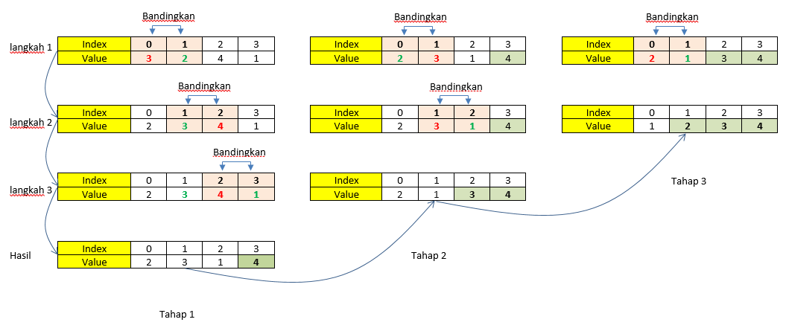
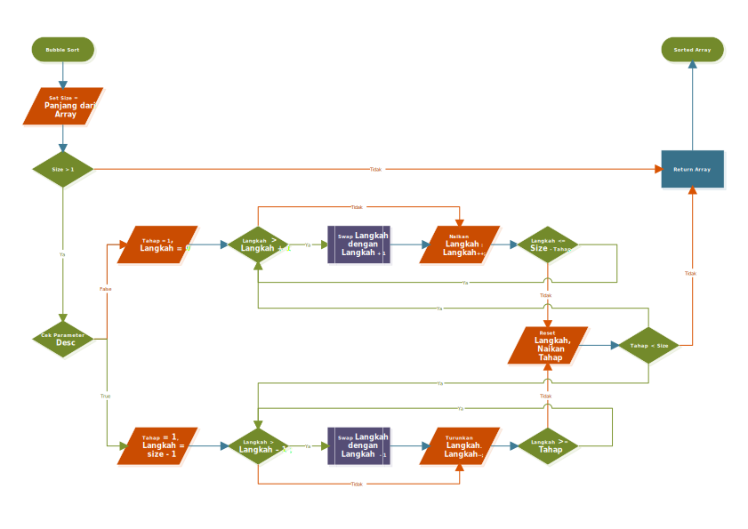

# Bubble Sorting

Bubble Sort adalah metode pengurutan algoritma dengan cara melakukan penukaran data secara terus menerus sampai bisa dipastikan dalam suatu iterasi tertentu tidak ada lagi perubahan/penukaran.

Urutan Kerja Bubble Sorting sebagai berikut :
1. Ambil dua data yang saling berdekatan. Bila susunan menaik (Ascending) dimulai dari data paling bawah (index terkecil). Sebaliknya, untuk susunan menurun mulai dari data paling atas (index terbesar).
2. Bila susunan data tidak benar maka akan dilakukan pertukaran. Untuk susunan naik nilai terkecil berada di bawah dan sebaliknya untuk susunan menurun.
3. Untuk susunan menaik ambil nilai terbesar dari kedua data tersebut dan bandingkan dengan nilai data yang berada di posisi berdekatan selanjutnya. Sebaliknya, untuk susunan menurun ambil data terkecil.
4. Ulangi langkah 2 dan 3 sampai tidak ada lagi posisi yang salah.

Penting untuk diingat saat menyusun secara naik atau turun (Asc dan Desc). Penyusunan data naik (Asc) dimulai dari index terkecil dengan menukar nilai terbesar ke index lebih besar. Sedangkan penyusunan secara menurun dimulai dari index terbesar dengan menggeser nilai terkecil ke index lebih besar.

Untuk lebih memahami coba kita pelajari hasil kerja Bubble Sort untuk penyusunan data secara naik (Asc) di bawah ini :



Pada diagram Tahap 1 dan pada langkah 1, karena penyusunan secara ascending kita ambil nilai dari elemen array dengan index terkecil yaitu data pada elemen array dengan nomor index `0` dan nilai elemen yang berdekatan dengannya yaitu data pada elemen array dengan nomor index `1`, karena nilai dari elemen array dengan nomor index `0` lebih besar dari pada nilai elemen array dengan nomor index `1` maka posisi ini tidak benar, dan kita lakukan pertukaran nilai.

Kemudian pada langkah 2 masih pada tahap 1 nilai elemen array terbesar dari tahap 1 kita ambil dan kita bandingkan dengan nilai pada elemen array dengan nomor index selanjutnya, dimana nilai elemen terbesar pada langkah 1 terdapat pada elemen array dengan nomor index `1` dengan nilai 3 dan elemen array dengan nomor index selanjutnya berada pada elemen array dengan nomor index `2` dengan nilai 4, karena nilai dari elemen array dengan nomor index `1` lebih kecil dari nilai elemen array dengan nomor index `2` maka posisi ini benar, dan kita tidak perlu melakukan pertukaran nilai.

Kemudian langkah ini kita ulangi kembali sampai tidak ada lagi elemen array dengan nomor index selanjutnya yang bisa di bandingkan.

Dari alur di atas dapat kita susun sebuah Pengkondisian yaitu bila nilai elemen array pada index 1 lebih besar daripada nilai elemen array pada index 2 maka lakukan pertukaran nilai. Dimana nomor array index ke 2 adalah nomor index pertama + 1, sehingga bisa ditulis dalam pengkondisian sebagai berikut :
```php
<?php
    if ($array[$index] > $array[$index + 1])
    {
        //lakukan pertukaran
    }
?>
```

Sekarang bagaimana melakukan pertukaran nilai antara elemen, kita bisa menggunakan sebuah variabel untuk menampung salah satu data terlebih dahulu dengan cara:
```php
    $temp = $array[$index];                 //tampung nilai dari elemen array[index] terlebih dahulu
    $array[$index] = $array[$index + 1];    //pindahkan nilai dari elemen $array[index + 1] kedalam elemen $array[index]
    $array[$index + 1] = $temp              //Kembalikan nilai yang kita tampung dari elemen $array[index] kedalam elemen $array[index + 1]
```
dengan demikian kita dapat peroleh baris kode secara utuh seperti ini:
```php
<?php
    if ($array[$index] > $array[$index + 1])
    {
        $temp = $array[$index];
        $array[$index] = $array[$index + 1];
        $array[$index + 1] = $temp;
    }
?>
```
Dari sini kita sudah bisa melakukan pertukaran susunan pada langkah 1, lalu bagaimana dengan langkah 2 dan selanjunya? dari yang kita perhatikan pada diagram diatas, langkah 2 dan selanjutnya merupakan perulangan dari langkah 1, dimana elemen array yang digunakan adalah elemen array yang memiliki nilai terbesar dari langkah sebelumnya, karena kita telah melakukan pertukaran nilai elemen array dimana nilai terbesar terletak pada elemen array dengan index lebih tinggi maka dapat kita pastikan elemen array yang kita pakai selanjutnya adalah elemen array dengan index + 1.

Karena bisa kita pastikan acuan kita adalah nomor index dari array, dimana perulangan selanjutnya menggunakan index lebih besar satu langkah dan perulangan dilakukan sebanyak 3 kali dengan index awal 0. Maka kita dapat menggunakan metode Perulangan For untuk ini, dengan baris kode sebagai berikut;
```php
<?php

    $array = [3,2,4,1];

    for($j = 0; $j < 3; $j++)
    {
        if ($array[$i] > $array[$i + 1])
        {
            $temp = $array[$i];
            $array[$i] = $array[$i + 1];
            $array[$i + 1] = $temp;
        }
    }

    print_r($array);                   //hasil tahap satu
    echo '<br>';
?>
```
Sekarang kita sudah selesaikan tahap 1, bagaimana dengan tahap 2 dan selanjutnya. Dari gambar hasil kerja dapat kita lihat bahwa ada 3 Tahap, dan setiap langkah dikerjakan dalam setiap tahap, berdasarkan hal ini kita bisa buatkan sebuah perulangan bersarang dengan metode perulangan for, dan perulangan for untuk langkah berada dalam perulangan for untuk tahap, dengan aturan for melakukan perulangan untuk tahap sebanyak 3 kali. sehingga bisa kita tulis baris kode sebagai berikut:
```php
<?php
    $array = [3,2,4,1];

    //loop untuk Tahap
    for ($j = 3; $j > 0; $j--)
    {
        //nested loop untuk langkah
        for($i = 0; $i < 3; $i++)
        {
            if ($array[$i] > $array[$i + 1])
            {
                $temp = $array[$i];
                $array[$i] = $array[$i + 1];
                $array[$i + 1] = $temp;
            }
            print_r($array);         //cek hasil setiap langkah
            echo '<br>';
        }
    }
?>
```
Baris kode diatas akan menghasilkan :
```html
[2,3,4,1]       //Tahap 1
[2,3,4,1]
[2,3,1,4]
[2,3,1,4]       //Tahap 2
[2,1,3,4]
[2,1,3,4]
[1,2,3,4]       //Tahap 3
[1,2,3,4]
[1,2,3,4]
```
Sampai di sini, baris kode yang kita buat sudah berhasil melakukan sorting terhadap array. Akan tetapi, ini hanya berlaku untuk array yang terdiri dari 4 elemen. Bagaimana jika array yang di-sorting kurang atau lebih dari 4 elemen? Tentunya kita harus mengubah kembali baris kode ini untuk menyesuaikan kebutuhan kita. Coba kita uji dengan array yang memiliki 6 elemen, sebagai contoh $array2 = [3,5,2,4,1,6]. Jika kita buat dalam bentuk ilustrasi di atas maka kita akan membuat langkah sebagai berikut:
```html
[3,5,2,4,1,6]   [2,3,4,1,5,6]   [2,3,1,4,5,6]   [1,2,3,4,5,6]   [1,2,3,4,5,6]
[3,2,5,4,1,6]   [2,3,4,1,5,6]   [2,1,3,4,5,6]   [1,2,3,4,5,6]
[3,2,4,5,1,6]   [2,3,1,4,5,6]   [2,1,3,4,5,6]
[3,2,4,1,5,6]   [2,3,1,4,5,6]   
[3,2,4,1,5,6]                   
Tahap : 1       Tahap: 2        Tahap: 3        Tahap: 4        Tahap: 5
```
Dengan langkah hasil kerja seperti di atas dan di bandingkan dengan langkah hasil kerja array dengan 4 elemen diatas, kita bisa temukan sebuah pola yaitu: 
1. Tahap :
    - Perulangan Tahap terjadi sebanyak elemen array kurang satu,
    - Setiap Tahap mengurangi satu elemen array akan di disusun.
2. Langkah :
    - Perulangan terjadi sebanyak elemen array yang akan disusun dalam setiap tahap.
    - Setiap tahap mengurangi banyaknya langkah penyusunan yang disebabkan oleh berkurangnya elemen array yang disusun.
    - Langkah dimulai dari index `0` atau index terkecil.

**Solusi**
 - Nomor Tahap ditambah banyaknya langkah sama dengan banyaknya elemen array, dapat ditulis | $tahap + $langka = count($array).
 - Tahap dimulai dari nilai 1 dan berakhir dengan banyak elemen array - 1. | 0 < $tahap <= count($array) - 1 | 0 < $tahap < count($array).
 - Langkah pertama dimulai dari `0` sesuai dengan index elemen. | $langkah = `0`.
 - Banyaknya langkah tiap tahap tidak akan melebihi dari jumlah elemen array dikurangi tahap, | $langkah <= count($array) - $tahap.

 dari solusi diatas bisa kita tuliskan kedalam kode sebagai berikut
```php
<?php
    $array = [3,5,2,4,1,6];
    $size = count($array);

    /** tahap dimulai dari 1 dan berakhir lebih kecil 1 dari jumlah elemen */
    for($tahap = 1; $tahap < $size; $tahap++ )
    {
        /** batas langkah dalam setiap tahap */
        echo 'Tahap ' . $tahap . ' :<br>';

        /** langkah dimulai dari index 0, dan berakhir dengan jumlah elemen dikurangi tahap */
        for($langkah = 0; $langkah < $size - $tahap; $langkah++)
        {
            /** Bandingkan, dan tukar jika urutan data tidak benar */
            if($array[$langkah] > $array[$langkah + 1]){        //bandingkan Nilai
                /** Jika posisi nilai salah */
                $temp = $array[$langkah];                        //Simpan data sementara
                $array[$langkah] = $array[$langkah + 1];         //Pindahkan nilai
                $array[$langkah + 1] = $temp;                    //Kembalikan data tersimpan
            }
            /** coba kita cek hasil setiap langkah */
            print_r($array);
            echo '<br>';
        }
        echo '<hr>';

    }
?>
```

Sampai disini akhirnya Algoritma BubbleSort Pengurutan Naik (Ascending) kita selesai. Untuk Pengurutan secara menurun kita cukup membalik pola kerja langkah, dimana dimulai dari index elemen array terbesar ke terkecil, dengan pertukaran perbandingan dari yang besar berada dibagian depan.

Untuk membuat pengurutan secara menurun (descending), lebih baik kita jadikan baris kode di atas menjadi sebuah fungsi dengan menambah sebuah paramater bertipe boolean untuk menentukan apakah pengurutan secara menaik atau secara menurun. Rincin alur atau flow nya sebagai berikut :
1. Langkah dimulai dari index elemen array tertinggi. | $langkah = count($array) - 1.
2. index elemen yang akan dibandingkan adalah langkah dan langkah - 1 | $array[$langkah] > $array[$langkah - 1].
4. setiap tahap mengurangi index elemen yang akan diurutkan, yaitu elemen dengan index terendah | indexTerendah = $tahap - 1. 
3. Langkah berada pada index elemen tertinggi ke yang index elemen terendah setiap tahap | $tahap - 1 < $langkah < count($array) | $tahap <= $langkah < count(array).

Baris kode :
```php
<?php

namespace Algoritma;

class MyClass
{
    public function BubbleSort(array $array, bool $desc = false)
    {
        $size = count($array);

        if ($size <= 1)return $array;

        $a = ($desc) ? $size - 1 : 0;

        for ($tahap = 1; $tahap < $size; $tahap++)
        {
            for($langkah = $a; ($desc) ? $langkah >= $tahap : $langkah < $size - $tahap; ($desc) ? $langkah-- : $langkah++)
            {
                $index = $langkah;
                $nextIndex = ($desc) ? $langkah - 1 : $langkah + 1;
                if ($array[$index] > $array[$nextIndex])
                {
                    $temp = $array[$index];
                    $array[$index] = $array[$nextIndex];
                    $array[$nextIndex] = $temp;
                }
            }
        }

        return $array;
    }
}

$array = [100,120,140,110,130,105,115,125]      //contoh array.
echo '<pre>';
echo 'Sebelum Pengurutan :' . PHP_EOL;
print_r($array) . PHP_EOL;             //Array Sebelum diurutkan

$asc = (MyClass())->BubbleSort($array);         //Pengurutan Naik.
$desc = (MyClass())->BubbleSort($array, true);  //Pengurutan Turun.

echo PHP_EOL . 'Pengurutan Secara Ascending :' . PHP_EOL;
print_r($asc);                          //hasil pengurutan naik
echo PHP_EOL . 'Pengurutan Secara Descending :' . PHP_EOL;
print_r($desc);                         //hasil pengurutan turun
echo '</pre>';
?>
```

Akhirnya algoritma kita selesai dan dapat kita panggil dengan syntax:
```php
BubbleSort(array $array[, bool $desc = false]);
```
dengan parameter $desc bersifat opsional jika menginginkan pengurutan secara menurun. Hasil dari baris kode diatas adalah:
```html
Sebelum Pengurutan :
Array
(
    [0] => 100
    [1] => 120
    [2] => 140
    [3] => 110
    [4] => 130
    [5] => 105
    [6] => 115
    [7] => 125
)

Pengurutan Secara Ascending :
Array
(
    [0] => 100
    [1] => 105
    [2] => 110
    [3] => 115
    [4] => 120
    [5] => 125
    [6] => 130
    [7] => 140
)

Pengurutan Secara Descending :
Array
(
    [0] => 140
    [1] => 130
    [2] => 125
    [3] => 120
    [4] => 115
    [5] => 110
    [6] => 105
    [7] => 100
)
```

Untuk algoritma parameter dan nilai parameter tidaklah baku, baris kode diatas dapat berubah-ubah sesuai pendekatan yang kita gunakan, dari sebuah algoritma yang terpenting adalah flow atau standard kerja sistem komputasi untuk menyelesaikan suatu masalah komputasi, sebagai contoh metode `For` di atas bisa saja kita ganti dengan metode perulangan lain seperti `While` dan `Do While` bahkan dengan metode `Foreach`, yang terpenting adalah menterjemahkan alur kerja algoritmanya dan kemudian kita terjemahkan kedalam baris kode.

Baris kode kita diatas bila kita susun diagram alur nya akan terbentuk seperti ini :



<p align="center">*** Terima Kasih ***</p>
