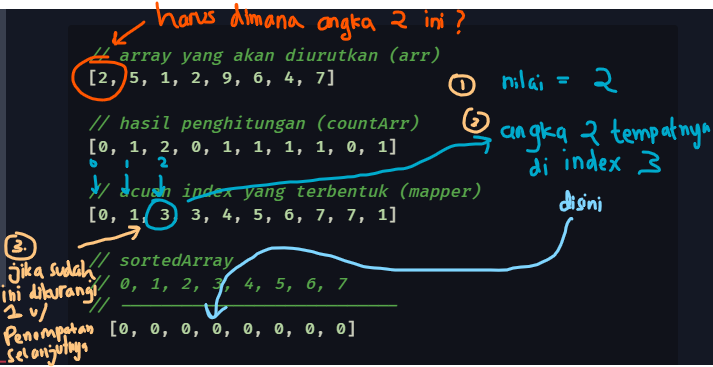

# Counting Sort

Salah satu algoritma pengurutan data yang lumayan populer adalah counting sort. Salah satu kelebihan algoritma counting sort adalah kompleksitas yang lebih efisien dari pendekatan algoritma pengurutan data yang lain. Salah satu caranya adalah counting sort mengeliminasi salah satu kondisi persyaratan yang umum dan mengasumsikan nilai maksimum dari deretan nilai data. Dengan begitu counting sort memanfaatkan _space complexity_ untuk meminimalisir _time complexity_.

Konsep utama dari counting sort adalah sesuai dengan namanya yaitu menghitung jumlah angka dari tiap nilai dalam deretan array. Setelah didapatkan akumulasi jumlah nilai yang muncul berdasarkan tiap deretan nilai, akumulasi total jumlah itu digunakan untuk menentukan tempat dimana suatu nilai tertentu harus berada.

Berikut mekanisme sederhana dari counting sort:

- Sebuah array yang tidak berurutan didefinisikan, nilai maksimum yang diasumsikan diawal adalah `9`

```php
[2, 5, 1, 2, 9, 6, 4, 7]
```

- Dari deretan itu dilakukan satu _loop_ untuk menghitung tiap nilai dan menyimpan nilai itu dalam sebuah array tersendiri, array tersebut dapat berbentuk seperti ini

```php
//  1  2  3  4  5  6  7  8  9
// ---------------------------
[0, 1, 2, 0, 1, 1, 1, 1, 0, 1]
```

> _Perhatikan array akumulasi penghitungan diatas, pada index ke 2 bernilai `2` karena pada array yang akan diurutkan, nilai 2 muncul dua kali._ <br/>
> _Dan begitu pula dengan nilai deretan array yang lain._

- Untuk dilakukan penempatan tiap nilai agar tersusun secara urut, array akumulasi perhitungan diatas dimodifikasi dengan sum secara bertahap. Jadi tiap nilai pada array akumulasi itu dijumlahkan dengan nilai sebelumnya.

```php
//  1  2  3  4  5  6  7  8  9
// ---------------------------
[0, 1, 3, 3, 4, 5, 6, 7, 7, 1]
// ^  ^  ^  ^  ^  ^  ^  ^  ^
//+1 +2 +0 +1 +1 +1 +1 +0 +1
```

> _Tiap nilai dalam elemen array, dijumlahkan dengan nilai yang sebelumnya, hal ini dilakukan agar tiap nilai berkorelasi dan terbentuk offset dengan nilai yang lebih kecil sehingga nilai-nilai itu dapat digunakan sebagai acuan index penempatan count array._

- Lakukan pengurutan dengan menempatkan nilai array berdasarkan acuan index diatas.

```php
# array yang akan diurutkan (arr)
[2, 5, 1, 2, 9, 6, 4, 7]
#
# hasil penghitungan (countArr)
[0, 1, 2, 0, 1, 1, 1, 1, 0, 1]
#
# acuan index yang terbentuk (mapper)
[0, 1, 3, 3, 4, 5, 6, 7, 7, 1]
#
# sortedArray
# 0, 1, 2, 3, 4, 5, 6, 7
# --------------------------- 
  [0, 0, 0, 0, 0, 0, 0, 0]
#
# penempatannya    -> sortedArray[tempatnya]        = nilainya
#                  -> sortedArray[mapper[nilainya]] = nilainya
#                  -> mapper[nilainya]--
# setelah penempatan:
  [1, 2, 2, 4, 5, 6, 7, 9]
```

> _untuk melakukan penempatan, acuan penempatan sudah di tentukan dan tinggal di tempatkan pada array `sortedArray` setelah ditempatkan, array acuan itu dikurangi satu agar jika ada nilai duplikat (contohnya ada nilai 2 yang muncul dua kali) dapat di letakkan pada index sebelumnya_

<p align="center">
    
</p>

**Demo / Contoh kode:**<br/>
<a href='CountingSort.php' target='_blank'>
    
</a>
