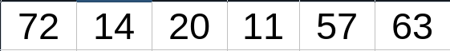
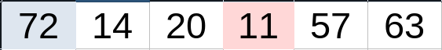
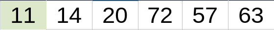
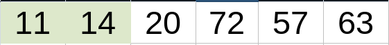
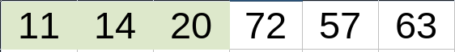
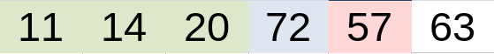
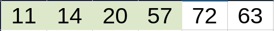
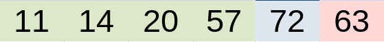
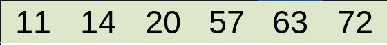
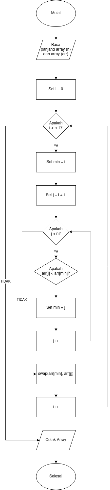

# Selection Sort

Selection Sort adalah salah satu algoritma untuk melakukan penyortiran nilai di dalam array yang acak dengan cara mencari nilai terkecil di dalam array dan menukarnya ke index awal dari array tersebut.

## Cara Kerja
Ketika kita ingin menggunakan Selection Sort, kita harus mengikuti beberapa langkah berikut ini:

- Pertama, Set variable `min` dengan nilai index pertama dari array yang akan di sort.
- Kedua, Cari nilai terkecil dari index ke-1 hingga index terakhir.
- Ketiga, Tukar nilai terkecil dengan nilai pada variable `min`.
- Keempat, increment variable `min` ke index selanjutnya.
- Kelima, Lakukan semua langkah di atas hingga array sudah terurut.

## Visualisasi

Bayangkan kita memiliki array dengan isi seperti berikut:



Untuk posisi awal pada array, kita akan mencari nilai terkecil di keseluruhan array dan menukar nilai tersebut dengan nilai pada index awal array.

Dalam contoh array ini kita akan menukar nilai 72 pada index ke-1 dengan nilai 11 dimana nilai tersebut adalah nilai terkecil setelah kita selesai mencari dari keseluruhan array.



Jika penukaran nilai berhasil kita akan memiliki array seperti berikut



Selanjutnya pada index ke-2 dimana nilai 14 berada kita akan mencari nilai terkecil lainnya didalam array, namun tidak ada yang lebih kecil dari nilai tersebut, maka kita tidak melakukan penukaran.



Sama halnya dengan index ke-3, tidak ada nilai yang lebih kecil dari nilai 20, maka kita tidak melakukan penukaran terhadap nilai tersebut.



Kita akan terus mengulang proses proses diatas hingga array yang kita miliki sudah terurut









## Flowchart
Proses Selection Sort dapat digambarkan menggunakan flowchart untuk menggambarkan bagaimana cara kita mengimplementasikan algoritma tersebut.

Berikut ini adalah flowchart dari algoritma Selection Sort:



## Implementasi

Buatlah sebuah fungsi `selectionSort` yang menerima parameter berupa array dan panjang dari array tersebut.

```php
public function selectionSort($arr, $len)
{
    // Tulis Kode Disini
}
```

Buatlah sebuah perulangan didalam fungsi tersebut dengan indeks `i = 0` dimana kondisi perulangan ini akan berjalan jika `i < n - 1`.

```php
public function selectionSort($arr, $len)
{
    // Mulai loop dari index ke 0 sampai index ke n-1
    for ($i = 0; $i < $len - 1; $i++) {
        // Tulis Kode Disini
    }
}
```

Buat sebuah variable bernama `min` dimana variable tersebut diisi dengan nilai dari index `i` pada array di dalam perulangan.

```php
public function selectionSort($arr, $len)
{
    // Mulai loop dari index ke 0 sampai index ke n-1
    for ($i = 0; $i < $len - 1; $i++) {
        // Set nilai minimum dengan nilai dari index ke i
        $min = $i;
        // Tulis Kode Disini
    }
}
```

Buat sebuah perulangan didalam perulangan tersebut dengan indeks `j = i + 1` dimana kondisi perulangan ini akan berjalan jika `j < n`.

```php
public function selectionSort($arr, $len)
{
    // Mulai loop dari index ke 0 sampai index ke n-1
    for ($i = 0; $i < $len - 1; $i++) {
        // Set nilai minimum dengan nilai dari index ke i
        $min = $i;
        // Mulai loop dari index ke i+1 sampai index ke n-1
        for ($j = $i + 1; $j < $len; $j++) {
            // Tulis Kode Disini
        }
    }
}
```

Buatlah sebuah kondisi didalam perulangan `j` dimana jika nilai `$arr[$j] < $arr[min]` maka nilai `$min` akan ditukan dengan `$j`.

```php
public function selectionSort($arr, $len)
{
    // Mulai loop dari index ke 0 sampai index ke n-1
    for ($i = 0; $i < $len - 1; $i++) {
        // Set nilai minimum dengan nilai dari index ke i
        $min = $i;
        // Mulai loop dari index ke i+1 sampai index ke n-1
        for ($j = $i + 1; $j < $len; $j++) {
            // Jika nilai index ke j lebih kecil dari nilai minimum,
            if ($arr[$j] < $arr[$min]) {
                // Set nilai minimum dengan nilai index ke j
                $min = $j;
            }
        }
        // Tulis Kode Disini
    }
}
```

Proses tersebut berfungsi untuk mencari indeks dengan nilai terkecil dari array.

Jika kita sudah menemukan indeks dengan nilai terkecil, maka kita akan melakukan penukaran nilai tersebut dengan nilai pada index `i`.

```php
public function selectionSort($arr, $len)
{
    // Mulai loop dari index ke 0 sampai index ke n-1
    for ($i = 0; $i < $len - 1; $i++) {
        // Set nilai minimum dengan nilai dari index ke i
        $min = $i;
        // Mulai loop dari index ke i+1 sampai index ke n-1
        for ($j = $i + 1; $j < $len; $j++) {
            // Jika nilai index ke j lebih kecil dari nilai minimum,
            if ($arr[$j] < $arr[$min]) {
                // Set nilai minimum dengan nilai index ke j
                $min = $j;
            }
        }
        // Simpan nilai index ke i ke variabel temp
        $temp = $arr[$i];
        // Set nilai index ke i dengan nilai minimum
        $arr[$i] = $arr[$min];
        // Set nilai minimum dengan variabel temp
        $arr[$min] = $temp;
    }
}
```

Proses diatas berfungsi untuk menukar nilai pada index `i` dengan nilai terkecil yang kita temukan didalam array pada perulangan `j`.

Kita akan terus mengulang semua proses diatas hingga array yang kita miliki sudah terurut.

Jika array yang kita miliki sudah terurut maka kita akan mengembalikan nilai array tersebut.

```php
public function selectionSort($arr, $len)
{
    // Mulai loop dari index ke 0 sampai index ke n-1
    for ($i = 0; $i < $len - 1; $i++) {
        // Set nilai minimum dengan nilai dari index ke i
        $min = $i;
        // Mulai loop dari index ke i+1 sampai index ke n-1
        for ($j = $i + 1; $j < $len; $j++) {
            // Jika nilai index ke j lebih kecil dari nilai minimum,
            if ($arr[$j] < $arr[$min]) {
                // Set nilai minimum dengan nilai index ke j
                $min = $j;
            }
        }
        // Simpan nilai index ke i ke variabel temp
        $temp = $arr[$i];
        // Set nilai index ke i dengan nilai minimum
        $arr[$i] = $arr[$min];
        // Set nilai minimum dengan variabel temp
        $arr[$min] = $temp;
    }
    // Kembalikan nilai array
    return $arr;
}
```

Fungsi Selection Sort sudah berhasil kita buat, kita dapat mencoba untuk menjalankan fungsi tersebut dengan array yang ingin kita urutkan.

```php
// Buat array yang akan diurutkan
$items = [72, 14, 20, 11, 57, 63];
// Hitung panjang array
$length = count($items);
// Cetak array sebelum diurutkan
echo "Data sebelum disort: " . json_encode($items) . "\n";
// Panggil fungsi Selection Sort dengan array yang ingin diurutkan dan panjang array tersebut
$sorted = selectionSort($items, $length);
// Cetak hasil array setelah diurutkan
echo "Data setelah disort: " . json_encode($sorted) . "\n";
```

Jika program yang kita buat tidak menghasilkan _error_ kita akan memiliki output seperti berikut:

```bash
Data sebelum disort: [72,14,20,11,57,63]
Data setelah disort: [11,14,20,57,63,72]
```

## Referensi
Tutorialspoint

- [Data Structures and Algorithms Selection Sort](https://www.tutorialspoint.com/data_structures_algorithms/selection_sort_algorithm.htm)

GeeksforGeeks

- [Selection Sort](https://www.geeksforgeeks.org/selection-sort/)
