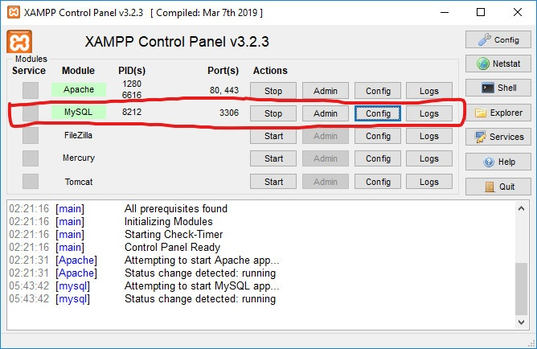
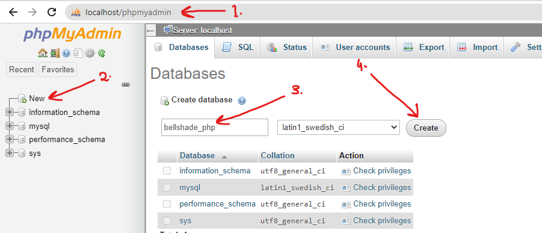
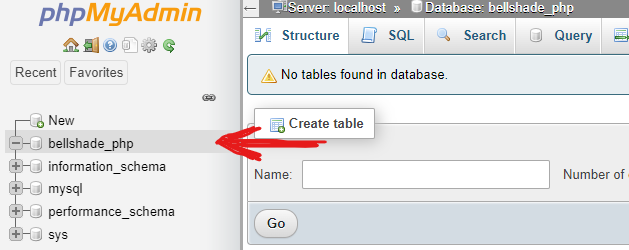
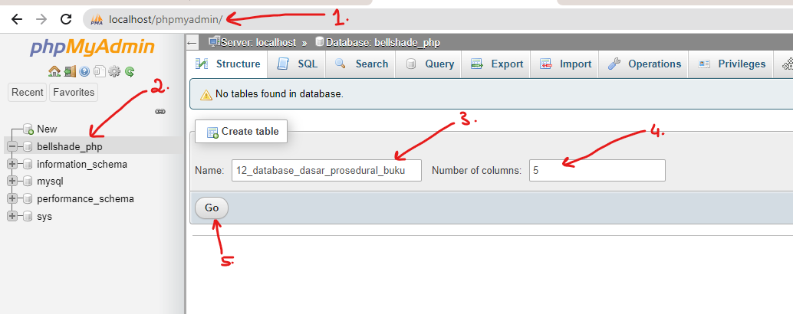
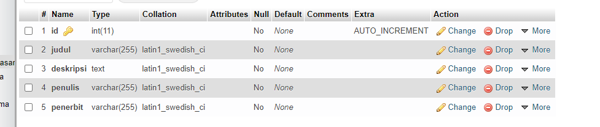
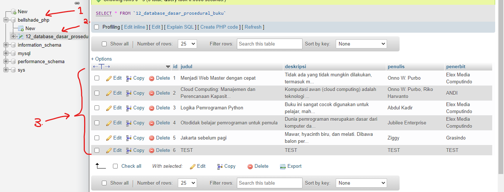
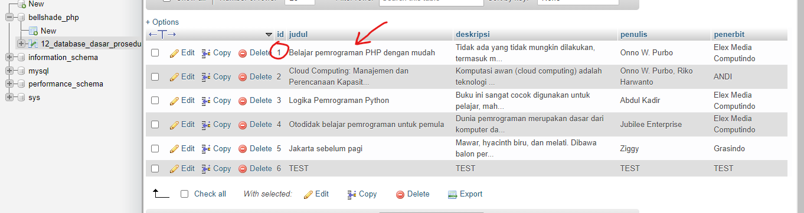
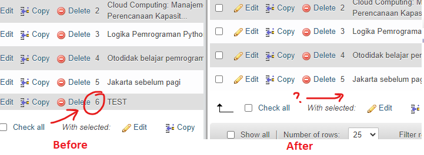

# Database dasar

Database dibutuhkan untuk menyimpan data pada sistem. Dengan menggunakan database, sebuah aplikasi PHP dapat menggunakan data yang tersimpan secara permanen dan terpusat. Maka, dibutuhkan yang namanya DBMS (Database Management System) yang dapat digunakan

## Daftar Isi

- [1. Pengenalan](#1-pengenalan)
  - [Bahasa Pemrograman untuk Olah Database](#bahasa-pemrograman-untuk-olah-database)
  - [DBMS _(Database Management System)_](#dbms-database-management-system)
  - [Database Administration / Management Tool](#database-administration--management-tool)
  - [Apa selanjutnya?](#apa-selanjutnya)
- [2. Koneksi Database](#2-koneksi-database)
- [3. Menjalankan Query](#3-menjalankan-query)
  - [Gambaran singkat](#gambaran-singkat)
  - [Membuat Tabel (Buku)](#membuat-tabel-buku)
  - [Contoh query INSERT](#contoh-query-insert)
  - [Contoh query UPDATE](#contoh-query-update)
  - [Contoh query DELETE](#contoh-query-delete)

## 1. Pengenalan

Dalam pemrograman, database digunakan sebagai media penyimpanan data. Jika diibaratkan, database adalah lemari yang mampu digunakan untuk menyimpan banyak barang, kemudian rak pada lemari adalah tabel-tabel/collection yang ada pada database. pada materi ini kita akan mempelajari tentang database mysql, salah satu database yang sering digunakan dalam berbagai kondisi.

Apa saja komponen yang dibutuhkan pada database untuk bisa digunakan?

### Bahasa Pemrograman untuk Olah Database

Ada banyak sekali yang digunakan untuk mengelola database, misalnya seperti: SQL, SchemeQL, LINQ, ScalaQuery, HaskellDB dan masih ada banyak lagi. Yang paling populer di kalangan web developer adalah SQL dan di Bellshade PHP ini, kita akan menggunakan SQL.

### DBMS _(Database Management System)_

DBMS adalah sistem utama database yang menjadi tempat dimana semua operasi database akan terjadi. Ada banyak DBMS yang populer digunakan seperti: MySQL, MariaDB _(turunan MySQL)_, PostgreSQL, SQLite, Oracle, MongoDB, Oracle dan masih banyak yang lain. Jika MySQL adalah DBMSnya, SQL adalah bahasa pemrograman untuk mengoperasikannya. Sama seperti PostgreSQL, SQLite yang juga menggunakan bahasa pemrograman SQL untuk melakukan manajemen database.

Di Bellshade Basic ini, kita akan menggunakan MySQL dan bahasa pemrogramannya yaitu SQL. Di materi ini, kita tidak membahas secara mendalam tentang bahasa SQL itu sendiri, melainkan kita referensikan ke Bellshade SQL dimana akan dibahas secara mendalam dan mendetail sekaligus disajikan agar lebih mudah dipahami.

> Baca selengkapnya: [Bellshade SQL](https://github.com/bellshade/SQL)

Di materi basic ini, kita akan lebih membahas tentang bagaimana cara menjalankan kode SQL di dalam PHP dan cara memanfaatkan data yang dikeluarkan oleh SQL untuk diterjemahkan menjadi informasi yang jelas menggunakan PHP.

### Database Administration / Management Tool

DB Administration tool sederhananya adalah sebuah software GUI yang bertujuan untuk memudahkan seorang developer / database administrator agar dapat mengelola database dengan mudah tanpa harus menuliskan kode sehingga dapat menghemat waktu saat pengembangan atau hanya sekedar melakukan manajemen data biasa. Dengan menggunakan manajemen software berbasis GUI, sebuah struktur tabel database, baris data, garis relasi, dsb dapat ditampilkan secara visual di layar.

Contoh dari db administration tool adalah diantaranya yang paling populer yaitu phpMyadmin, MySQL Workbench, HeidiSQL, DbVisualizer, Teradata dll. Jika kamu menginstall software stack `XAMPP`, kamu sudah disediakan `MariaDB` _(turunan MySQL)_ sebagai RDBMS dan `phpMyAdmin` sebagai DB Admin toolnya.

### Apa selanjutnya?

Kami membuat standar penulisan database untuk _project repository_ ini agar memudahkan kamu untuk memahami isi dari tabel dan database yang dibuat. Beberapa ketentuannya yaitu:

- Hanya ada satu database untuk melayani keseluruhan project repositori ini dengan nama defaultnya adalah **`bellshade_php`**.
- Nama tabel mengikuti format `[nomor]_[nama materi]_[nama tabel]`, spasi bisa menggunakan `_` _(underscore)_.

> **Contoh nama tabel:** `12_database_prosedural_buku`

Untuk memulai mempraktekkan materi ini, kamu dapat buat database dengan nama **`bellshade_php`** terlebih dahulu.
Ada banyak sekali cara untuk membuat database, namun jika kamu menggunakan `XAMPP` sebagai stack web development utama _(yang kami asumsikan banyak dari kamu yang menggunakan XAMPP)_, Kamu dapat menggunakan `phpMyAdmin` bawaan XAMPP untuk membuat database. Kamu dapat ikuti langkah berikut:

1. **Hidupkan server MySQL**

<p align="center">
    
</p>

2. **Buka phpMyAdmin lalu buat database dengan nama `bellshade_php`**

Untuk membuka phpMyAdmin, buka `localhost/phpmyadmin` > klik `new` > tuliskan nama databasenya yaitu `bellshade_php` > kemudian klik **Create**

<p align="center">
    
</p>

3. **Database sudah jadi**

Database ini akan digunakan untuk keseluruhan _project repository_ Bellshade PHP sehingga kamu tidak perlu repot membuat database lagi untuk demo materi / algoritma yang lain

<p align="center">
    
</p>

## 2. Koneksi Database

> Setelah melewati materi ini, diharapkan teman-teman dapat memahami bagaimana melakukan koneksi database mysql pada bahasa pemrograman PHP.

Sebelum melakukan operasi manajemen data yang ada didalam database, sebuah koneksi perlu dibuat terlebih dahulu. Pada dasarnya, sebuah sistem database seperti MySQL tidak langsung dapat di akses tanpa adanya otentikasi. Maka perlu masuk dulu kedalam sistem database MySQL menggunakan username, dan password.

Singkatnya, berikut beberapa hal yang dibutuhkan untuk terhubung kedalam sistem database.

- Host : Alamat host komputer tempat sistem database berjalan
- Username : Username untuk masuk kedalam database
- Password : Password untuk masuk kedalam database
- Nama database : Nama dari database yang akan digunakan
- Port (Opsional) : Port dari host yang melayani sistem Database, biasanya nilai _default:_ `3306`.

Untuk melakukan koneksi, PHP sejak versi 7 menyediakan 2 pilihan yaitu menggunakan mysqli atau menggunakan PDO (*PHP Data Objects*). Kita akan mulai dengan cara prosedural terlebih dahulu.

Untuk terhubung dengan database, PHP menyediakan fungsi `mysqli_connect(host, user, pass, dbname, port)`

```php
<?php

$host = 'localhost';
$user = 'root';
$pass = '';
$db = 'bellshade_php';
$port = '3306';

$connect = @mysqli_connect($host, $user, $pass, $db, $port);
if (!$connect) {
    echo 'Tidak dapat terhubung dengan database: ' . mysqli_connect_error();
    die;
}
```

<a href='2_connect.php' target='_blank'>
    
</a>

> Jika tidak ada tampilan apapun, itu artinya koneksi sudah berhasil dan database sudah dibuat.

## 3. Menjalankan Query

### Gambaran singkat

Disaat menjalankan kode perintah SQL, pasti ada kembalian berupa data atau pesan hasil dari operasi perintah yang dilakukan. Tentunya kita ingin aplikasi PHP kita yang melakukan operasi database ini dan secara otomatis menerjemahkan hasil eksekusinya menjadi informasi yang bermanfaat.  

Untuk menjalankan query, perlu dilakukan koneksi terlebih dahulu. Karena kita sudah membuat koneksi sebelumnya, kita cukup memanggil file koneksi tersebut dengan menggunakan perintah `require_once(filenya)`. PHP sudah menyediakan beberapa fungsi untuk melakukan operasi database, salah satunya adalah

```php
mysqli_query($connect, "kode MySQL")
```

Perhatikan pada parameter pertama dibutuhkan instance dari `mysqli_connect()` agar `mysqli_query()` mengetahui database mana yang akan dilakukan operasi. Itulah kenapa kita perlu memanggil file koneksi sebelumnya.

Kemudian untuk melihat berapa baris yang terpengaruh oleh perintah yang dijalankan, dapat meggunakan fungsi berikut.

```php
mysqli_affected_rows($connect);
```

Sama seperti `mysqli_query()`, fungsi ini memerlukan parameter berupa koneksi MySQLi.

### Membuat Tabel (Buku)

1. **Buat tabel terlebih dahulu dengan nama `12_database_dasar_prosedural_buku` di database `bellshade_php` yang dibuat tadi**

Ada banyak cara untuk membuat tabel, yaitu salah satunya adalah dengan langsung menjalankan kode SQL atau kamu juga dapat menggunakan *DB admin tool* seperti _phpMyAdmin_ untuk membuat tabel secara GUI.

Berikut struktur tabel untuk materi ini sekaligus jika kamu ingin membuat database menggunakan perintah SQL.

```sql
CREATE TABLE `12_database_dasar_prosedural_buku`
(
    id INT AUTO_INCREMENT NOT NULL PRIMARY KEY,
    judul VARCHAR(255),
    deskripsi TEXT,
    penulis VARCHAR(255),
    penerbit VARCHAR(255)
);
```

Jika kamu ingin membuat tabel dengan menggunakan _phpMyAdmin_, kamu bisa ikuti langkah-langkah berikut:

- Buka `phpMyAdmin` > pilih database `bellshade_php` > lalu tuliskan nama tabelnya dan masukkan jumlah kolomnya > klik **Go**

<p align="center">
    
</p>

<p align="center">
    
</p>

<p align="center">
    
</p>

### Contoh query INSERT

INSERT adalah salah satu perintah kode SQL yang bertujuan untuk menambahkan baris data pada tabel. Kita bisa melakukan query INSERT dengan menggunakan perintah seperti berikut

```php
$kolom1 = 'Nilai kolom 1';
$kolom2 = 'Nilai kolom 2';
$query = mysqli_query($connect, "INSERT INTO nama_tabel (kolom_1, kolom_2) VALUES ('$kolom1', '$kolom2')");
```

Perhatikan pada contoh kode di atas, kita dapat memasukkan variabel yang sejatinya bersifat dinamis dan dapat berubah-ubah. Selain itu variabel `$connect` berasal dari file koneksi yang berupa sebuah instance dari `mysqli_connect()`. Karena kita sudah membuat file koneksinya, kita cukup panggil dengan `require_once('file_koneksinya.php')`.

Hal ini dapat diartikan, _statement_ query tersebut adalah untuk menambahkan baris data pada tabel tertentu dengan koneksi yang diinginkan (`$connect`)

<a href='3_query_insert.php' target='_blank'>
    
</a>

Setelah kamu menjalankan demo di atas, coba cek ke software admin tool kamu _(phpMyAdmin jika memakai XAMPP)_ kemudian lihat isi dari tabel `12_database_dasar_prosedural_buku`. Kamu akan menemukan beberapa baris data baru yang dimasukkan oleh file demo di atas.

<p align="center">
    
</p>

### Contoh query UPDATE

Jika sebelumnya adalah contoh untuk menambahkan data, terkadang sebuah data yang sudah dimasukkan kedalam sistem perlu untuk diedit / diupdate. Untuk mengupdate data dengan menggunakan SQL, bisa menggunakan perintah `UPDATE` seperti berikut:

```php
$query = mysqli_query($connect, 'UPDATE tabelnya SET judul = "Judul yang lain" WHERE id = 1');
```

Seperti SQL pada umumnya, penulisan kode didalam parameter kedua `mysqli_query` sama persis dengan penggunakan bahasa SQL seperti biasa. Tentunya dalam bentuk string yang dapat kamu tambahkan, rubah atau manipulasi.

Berikut contoh demo melakukan UPDATE dengan PHP, didalam demo ini sebuah baris data dengan `id = 1` dirubah judulnya menjadi `Belajar pemrograman PHP dengan mudah`

<a href='3_query_update.php' target='_blank'>
    
</a>

> Pastikan sudah ada beberapa baris data didalam tabel untuk dirubah. Kamu juga dapat menjalankan demo insert di atas untuk memasukkan beberapa sampel data.

Jika kamu sudah menjalankan demonya, coba cek isi dari tabel `12_database_dasar_prosedural_buku`. Jika kamu lihat pada baris yang mempunyai `ID = 1`, judul dari baris tersebut berubah menjadi `Belajar pemrograman PHP dengan mudah`

<p align="center">
    
</p>

### Contoh query DELETE

Sebuah manajemen data, tidak lengkap rasanya jika tidak ada fitur hapus. Pada MySQL, kita cukup gunakan perintah `DELETE` untuk menghapus data. Dan seperti sebelumnya, kode SQL ini dapat dijalankan menggunakan `mysqli_query()`

```php
$query = mysqli_query($connect, "DELETE FROM tabelnya WHERE id = 6");
```

Jika kode di atas diartikan bakal menjadi: Hapus baris data dari tabel bernama `tabelnya` yang memiliki `id = 6`. Tentunya karena paramter kedua berupa string yang berisi kode SQL, kamu dapat memanipulasi sesuai yang kamu inginkan.

Berikut contoh demo untuk menghapus sebuah id dari tabel `12_database_dasar_prosedural_buku` yang memiliki `id = 6`

<a href='3_query_delete.php' target='_blank'>
    
</a>

> Pastikan sudah ada beberapa baris data didalam tabel untuk dirubah. Kamu juga dapat menjalankan demo insert sebelumnya untuk memasukkan beberapa sampel data.

Setelah melakukan demo di atas, coba cek isi dari tabel `12_database_dasar_prosedural_buku`. Baris data yang memiliki `id = 6` akan terhapus.

<p align="center">
    
</p>
