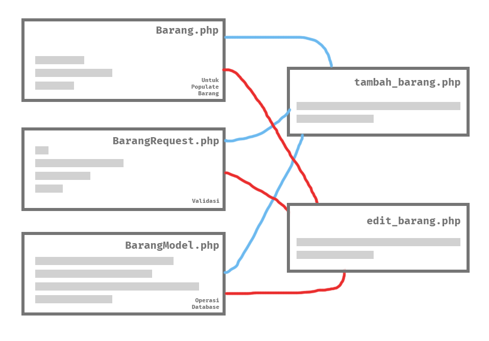
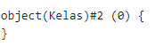

<p align="center">

<h1 align="center">Object Oriented Programing (OOP)</h1>
</p>

Object Oriented Programing atau pemrograman berorientasi terhadap objek lebih sering disebut sebagai OOP adalah salah satu paradigma dalam pemrograman untuk memudahkan pengembangan sebuah aplikasi. Pada materi kali ini kita akan coba mempelajari mengenai paradigma OOP dan implementasinya menggunakan bahasa pemrograman PHP.

## Daftar isi

- [Pengenalan Pemrograman Berorientasi Objek (OOP)](#1-pengenalan-pemrograman-berorientasi-objek-oop)
  - [Apa itu?](#apa-itu)
  - [Perbedaannya OOP dengan metode prosedural biasa](#perbedaannya-oop-dengan-metode-prosedural-biasa)
- [Class dan Object](#2-class-dan-object)

## 1. Pengenalan Pemrograman Berorientasi Objek (OOP)

Pada materi sebelumnya kita sudah mencoba membuat contoh-contoh baris kode yang kebanyakan merupakan pola kerja pemrograman prosedural atau pemrograman terstruktur. Dalam pemrograman ada yang disebut sebagai paradigma Pemrograman yang artinya sudut padang seorang programmer dalam menyelesaikan suatu kasus atau masalah dengan cara pemrograman. Hal ini penting bagi seorang programmer untuk mengidentifikasi permasalahan dan menyusun sebuah solusi dalam bentuk pemrograman.

Ada beberapa paradigma pemrograman sebagai contoh paradigma prosedural yang sudah sering kita gunakan dalam materi sebelumnya, dan paradigma _object oriented programing_ (OOP) atau Pemrograman Berorientasi Objek.

### Apa itu?

OOP singkatan dari _Object Oriented Programming_. OOP bukan hanya sekedar tentang merubah cara menuliskan baris kode, tapi juga mempermudah dalam pengembangan aplikasi kita. OOP adalah model pemrograman yang mengolah desain software menggunakan data dan objek daripada menggunakan fungsi dan logika prosedural.

Pada dasarnya paradigma pemrograman berorientasi objek adalah metode pemrograman yang memecah bagian-bagian dari aplikasi menjadi 1 bagian yang memiliki 1 fungsionalitas utama. Dari bagian-bagian ini dihubungkan satu sama lain berdasarkan fungsinya masing-masing sehingga membentuk aplikasi yang utuh. Akibatnya, sebuah aplikasi dapat terdiri dari bagian-bagian yang rapi terstruktur, _scalable_ dan _reusable_ sehingga paradigma ini bagus sekali untuk diterapkan pada project berskala besar.

Jika kita analogikan pada kehidupan sehari-hari, bayangkan ada sebuah restoran makanan. Agar pelayanan pada restoran tersebut dapat berjalan dengan efisien, semua aktifitas dalam restoran tersebut dibagi menjadi beberapa bagian. Ada yang jadi pelayan, ada yang di kasir, ada yang memasak di dapur,dsb. Jika kamu perhatikan, pecahan bagian-bagian ini mempunyai tugasnya sendiri-sendiri dan memiliki prosedur masing-masing. Akan tetapi satu bagian harus tetap berhubungan dengan bagian-bagian lainnya agar restoran bisa berjalan dengan lancar dan efisien.
<br/>
<br/>

### Perbedaannya OOP dengan metode prosedural biasa

Pemrograman dengan paradigma prosedural bekerja secara urut dan sistematis, sedangkan OOP bekerja dengan sebuah objek yang fleksibel, dapat dikembangkan _(scalable)_, dan dapat digunakan ulang _(reusable)_

<ins>Analogi Singkat</ins>

Jika kita menggunakan kembali analogi sebelumnya, pemrograman dengan cara prosedural dapat diibaratkan dengan melakukan pelayanan makanan secara berurutan mulai menerima pesanan, memasak di dapur sampai memberikan makanan ke pelanggan. Analogi yang tepat untuk alur prosedural adalah tiap aktifitas restoran tidak mempunyai _standar operational procedure_ (SOP) yang baik. Misalnya ada kemungkinan untuk kasir terlibat dalam bagian dapur, cara pemesanan selalu berubah tiap kali ada pelanggan dan sebagainya. Situasi yang kacau seperti ini dapat menimbulkan konsistensi yang buruk.

Di samping itu, paradigma pemrograman berorientasi objek telah mendefinisikan semua langkah-langkahnya dengan baik. Satu bagian kasir fokus mengerjakan pekerjaannya sesuai dengan prosedur yang jelas dan sudah ditentukan sehingga kasir tidak perlu mengurusi bagian dapur namun tetap berinteraksi dengannya secara rapi dan teratur. Akibatnya setiap bagian (objek) dapat fokus mengerjakan bagiannya masing-masing dengan lebih teratur. Selain itu jika ada masalah dengan alur layanannya, bisa mudah untuk dicari letak kesalahannya dan dapat diterapkan solusi yang mudah untuk diintegrasikan.

<ins>Gambaran pemrograman</ins>

Sama halnya dengan pemrograman sebenarnya. Misalnya pada implementasi form tambah data barang, hal-hal yang diimplementasikan pastinya dimulai dengan:

- menampilkan form
- mempopulasikan data barang
- melakukan validasi dan
- menambahkan rekam data ke database.

Jika menggunakan metode prosedural, biasanya semua itu dilakukan seluruhnya secara berurutan dalam satu file sehingga jika kita ingin membuat edit data barang yang sejatinya memiliki banyak kesamaan dengan tambah data barang harus membuat ulang dan melakukan hal yang sama berulang kali sehingga terjadi duplikasi. Perhatikan juga, hal ini bisa mengakibatkan konsistensi yang buruk seperti misalnya jika ada perubahan pada halaman tambah data, seringkali ada perbedaan kode dengan halaman edit data karena harus ada duplikasi yang dilakukan.

<p align="center">
    
</p>

Sedangkan pada pemrograman berorientasi objek, setiap fungsi _use case_ dipecah pada tiap-tiap objek yang nantinya berkorelasi satu sama lain membentuk sebuah fungsi aplikasi yang sebenarnya. Misalnya, objek `Barang` dibuat untuk mempopulasikan data barang. Di objek ini bisa dilakukan hal-hal seperti memastikan data barang tetap pada format dan bentuk yang ditentukan. Begitu pula dengan validasinya, bisa juga dibuat objek seperti `BarangRequest` yang menangani validasi saat sebuah form dikirimkan, memastikan semua inputan sudah sesuai yang diinginkan. Dan begitu pula untuk _use case_ yang lain seperti `BarangModel` khusus untuk interaksi dengan database.

Perhatikan disini karena setiap _use case_ disendirikan pada tiap-tiap objek, developer bisa fokus menuliskan apapun **khusus** untuk _use case_ tersebut. Developer bisa leluasa menuliskan kode-kode yang kompleks hanya untuk _use case_ objek tertentu secara terstruktur. Berbeda dengan prosedural yang prakteknya menumpuk semua kode menjadi satu sehingga susah dibaca dan tidak terstruktur. Ini sangat penting sekali karena dapat memudahkan kinerja programmer dalam memanajemen kode-kodenya. Selain itu, yang paling dirasa keuntungannya yaitu pada saat kerja tim yang mengharuskan kode terstruktur agar dapat dimengerti oleh semua anggota tim.

<p align="center">
    
</p>

Semua hal _use case_ diibaratkan sebagai sebuah objek yang terorganisir bertujuan membantu dalam menyelesaikan sesuai _use case_nya. Sehingga apapun dapat di gambarkan kedalam objek ini. Objek berisikan fungsi-fungsi dan atribute-atribute, dimana objek dapat di gandakan dengan nilai dari atribut berbeda-beda tetapi dapat menjalankan fungsi yang sama. Karena bersifat modular objek dapat digunakan kembali. Sehingga pengembangan dan perawatan sebuah aplikasi menjadi lebih mudah. Data dalam properti dan metode objek dapat diproteksi dengan encapsulasi dan memberikan batas hak akses modifikasi _(yang akan dibahas nanti)\_. Dengan demikian data dirasa "lebih aman" dari pada pemrograman prosedural.

## 2. Class dan Object

### Apa itu class dan object?

`Class` adalah sebuah tempelate / blueprint yang menyimpak banyak object.
`Object`adalah sebuah bagian didalam class

Sebagai contoh, kita akan menggunakan studi kasus seperti ini:
Saya punya sebuah buku untuk membuat sebuah HandPhone,
Buku tersebut akan digunakan untuk membuat semua HandPhone.
Dari sini bisa dibilang bahwa `buku` adalah sebuah class dan `HandPhone` Adalah sebuah objectnya,

### Cara Membuat Class

Cara membuat class adalah dengan menaruh keyword `class` didepan nya, Untuk penamaannya bebas

#### Contoh

```php
class namaClassNya {

}
```

```php
class Kelas {

}
```

### Cara Membuat Object

Cara membuat objectnya adalah dengan membuat sebuah variable dengan yang diisi dengan

```php
new namaClassNya();
```

#### Contoh

```php
$kelas1 = new Kelas();
$kelas2 = new Kelas();
```

---

#### `Hasil`

#### Variable kelas1


#### Variable kelas2



_Keterangan:_ 
> Untuk membuat sebuah variable untuk object, maka nama variable-nya harus berbeda tidak boleh sama,dan ` Isi variable boleh sama`
