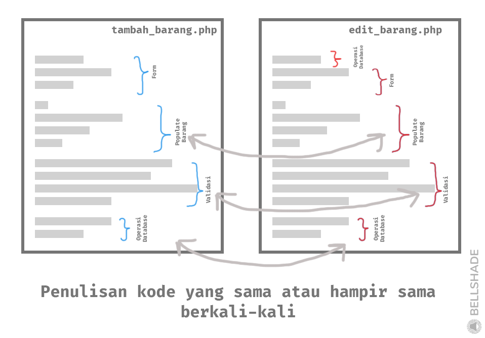

<p align="center">

<h1 align="center">Object Oriented Programing (OOP)</h1>
</p>

Object Oriented Programing atau pemrograman berorientasi terhadap objek lebih sering disebut sebagai OOP adalah salah satu paradigma dalam pemrograman untuk memudahkan pengembangan sebuah aplikasi. Pada materi kali ini kita akan coba mempelajari mengenai paradigma OOP dan implementasinya menggunakan bahasa pemrograman PHP.

## Daftar isi

- [Pengenalan Pemrograman Berorientasi Objek (OOP)](#1-pengenalan-pemrograman-berorientasi-objek-oop)
  - [Apa itu?](#apa-itu)
  - [Perbedaannya OOP dengan metode prosedural biasa](#perbedaannya-oop-dengan-metode-prosedural-biasa)
- [Class dan Object](#2-class-dan-object)
  - [Apa itu class dan object?](#apa-itu-class-dan-object)
  - [Cara Membuat Class](#cara-membuat-class)
  - [Cara Membuat Object](#cara-membuat-method)
- [Properti dan Method](#3-properti-dan-method)
  - [Apa itu property dan method?](#apa-itu-property-dan-method)
  - [Cara Membuat Property](#cara-membuat-property)
  - [Cara Membuat Method](#cara-membuat-method)
- [Constructor dan Destructor](#4-constructor-dan-destructor)
- [Property dan Method Static](#5-property-dan-method-static)
- [Constant dan Magic Constant](#6-constant-dan-magic-constants)
  - [Constant Biasa vs Constant Class](#constant-biasa-vs-constant-class)
  - [Magic Constants](#magic-constants)
- [Method Chaining](#8-method-chaining)

## 1. Pengenalan Pemrograman Berorientasi Objek (OOP)

Pada materi sebelumnya kita sudah mencoba membuat contoh-contoh baris kode yang kebanyakan merupakan pola kerja pemrograman prosedural atau pemrograman terstruktur. Dalam pemrograman ada yang disebut sebagai paradigma Pemrograman yang artinya sudut padang seorang programmer dalam menyelesaikan suatu kasus atau masalah dengan cara pemrograman. Hal ini penting bagi seorang programmer untuk mengidentifikasi permasalahan dan menyusun sebuah solusi dalam bentuk pemrograman.

Ada beberapa paradigma pemrograman sebagai contoh paradigma prosedural yang sudah sering kita gunakan dalam materi sebelumnya, dan paradigma _object oriented programing_ (OOP) atau Pemrograman Berorientasi Objek.

### Apa itu?

OOP singkatan dari _Object Oriented Programming_. OOP bukan hanya sekedar tentang merubah cara menuliskan baris kode, tapi juga mempermudah dalam pengembangan aplikasi kita. OOP adalah model pemrograman yang mengolah desain software menggunakan data dan objek daripada menggunakan fungsi dan logika prosedural.

Pada dasarnya paradigma pemrograman berorientasi objek adalah metode pemrograman yang memecah bagian-bagian dari aplikasi menjadi 1 bagian yang memiliki 1 fungsionalitas utama. Dari bagian-bagian ini dihubungkan satu sama lain berdasarkan fungsinya masing-masing sehingga membentuk aplikasi yang utuh. Akibatnya, sebuah aplikasi dapat terdiri dari bagian-bagian yang rapi terstruktur, _scalable_ dan _reusable_ sehingga paradigma ini bagus sekali untuk diterapkan pada project berskala besar.

Jika kita analogikan pada kehidupan sehari-hari, bayangkan ada sebuah restoran makanan. Agar pelayanan pada restoran tersebut dapat berjalan dengan efisien, semua aktifitas dalam restoran tersebut dibagi menjadi beberapa bagian. Ada yang jadi pelayan, ada yang di kasir, ada yang memasak di dapur,dsb. Jika kamu perhatikan, pecahan bagian-bagian ini mempunyai tugasnya sendiri-sendiri dan memiliki prosedur masing-masing. Akan tetapi satu bagian harus tetap berhubungan dengan bagian-bagian lainnya agar restoran bisa berjalan dengan lancar dan efisien.
<br/>
<br/>

### Perbedaannya OOP dengan metode prosedural biasa

Pemrograman dengan paradigma prosedural bekerja secara urut dan sistematis, sedangkan OOP bekerja dengan sebuah objek yang fleksibel, dapat dikembangkan _(scalable)_, dan dapat digunakan ulang _(reusable)_

<ins>Analogi Singkat</ins>

Jika kita menggunakan kembali analogi sebelumnya, pemrograman dengan cara prosedural dapat diibaratkan dengan melakukan pelayanan makanan secara berurutan mulai menerima pesanan, memasak di dapur sampai memberikan makanan ke pelanggan. Analogi yang tepat untuk alur prosedural adalah tiap aktifitas restoran tidak mempunyai _standar operational procedure_ (SOP) yang baik. Misalnya ada kemungkinan untuk kasir terlibat dalam bagian dapur, cara pemesanan selalu berubah tiap kali ada pelanggan dan sebagainya. Situasi yang kacau seperti ini dapat menimbulkan konsistensi yang buruk.

Di samping itu, paradigma pemrograman berorientasi objek telah mendefinisikan semua langkah-langkahnya dengan baik. Satu bagian kasir fokus mengerjakan pekerjaannya sesuai dengan prosedur yang jelas dan sudah ditentukan sehingga kasir tidak perlu mengurusi bagian dapur namun tetap berinteraksi dengannya secara rapi dan teratur. Akibatnya setiap bagian (objek) dapat fokus mengerjakan bagiannya masing-masing dengan lebih teratur. Selain itu jika ada masalah dengan alur layanannya, bisa mudah untuk dicari letak kesalahannya dan dapat diterapkan solusi yang mudah untuk diintegrasikan.

<ins>Gambaran pemrograman</ins>

Sama halnya dengan pemrograman sebenarnya. Misalnya pada implementasi form tambah data barang, hal-hal yang diimplementasikan pastinya dimulai dengan:

- menampilkan form
- mempopulasikan data barang
- melakukan validasi dan
- menambahkan rekam data ke database.

Jika menggunakan metode prosedural, biasanya semua itu dilakukan seluruhnya secara berurutan dalam satu file sehingga jika kita ingin membuat edit data barang yang sejatinya memiliki banyak kesamaan dengan tambah data barang harus membuat ulang dan melakukan hal yang sama berulang kali sehingga terjadi duplikasi. Perhatikan juga, hal ini bisa mengakibatkan konsistensi yang buruk seperti misalnya jika ada perubahan pada halaman tambah data, seringkali ada perbedaan kode dengan halaman edit data karena harus ada duplikasi yang dilakukan.

<p align="center">
    
</p>

Sedangkan pada pemrograman berorientasi objek, setiap fungsi _use case_ dipecah pada tiap-tiap objek yang nantinya berkorelasi satu sama lain membentuk sebuah fungsi aplikasi yang sebenarnya. Misalnya, objek `Barang` dibuat untuk mempopulasikan data barang. Di objek ini bisa dilakukan hal-hal seperti memastikan data barang tetap pada format dan bentuk yang ditentukan. Begitu pula dengan validasinya, bisa juga dibuat objek seperti `BarangRequest` yang menangani validasi saat sebuah form dikirimkan, memastikan semua inputan sudah sesuai yang diinginkan. Dan begitu pula untuk _use case_ yang lain seperti `BarangModel` khusus untuk interaksi dengan database.

Perhatikan disini karena setiap _use case_ disendirikan pada tiap-tiap objek, developer bisa fokus menuliskan apapun **khusus** untuk _use case_ tersebut. Developer bisa leluasa menuliskan kode-kode yang kompleks hanya untuk _use case_ objek tertentu secara terstruktur. Berbeda dengan prosedural yang prakteknya menumpuk semua kode menjadi satu sehingga susah dibaca dan tidak terstruktur. Ini sangat penting sekali karena dapat memudahkan kinerja programmer dalam memanajemen kode-kodenya. Selain itu, yang paling dirasa keuntungannya yaitu pada saat kerja tim yang mengharuskan kode terstruktur agar dapat dimengerti oleh semua anggota tim.

<p align="center">
    
</p>

## 2. Class dan Object

<br/>

### Apa itu class dan object?

`Class` adalah sebuah template / blueprint. Disinilah ditentukan aturan-aturan atau apa saja yang harus ada dari sebuah objek agar selalu dijaga konsistensinya. Sementara `Object` adalah sebuah penerapan dari _class_ itu sendiri, kita menyebutnya sebagai _instance_

Misalnya ada pengguna yang didalamnya harus ada nama, jenis kelamin, email, alamat dll. Kita bisa buat class `Pengguna` dan menentukan nama, email dll sebagai properti _(kita akan bahas di sub materi berikutnya)_. Lalu kita juga bisa buat penerapan dari class itu. misalnya ada `agus` yang merupakan penerapan dari class `Pengguna`, maka agus ini bisa kita sebut sebagai _object_. Karena `agus` merupakan objek dari class `Pengguna`, maka objek `agus` pasti mengikuti blueprint yang tertulis pada kelasnya, seperti mempunyai nama, email dsb. 

<br/>

### Cara Membuat Class

Cara membuat class adalah dengan menaruh keyword `class` didepan nya diikuti dengan nama kelasnya. Nama kelas harus diawali dengan huruf kapital.

```php
class NamaKelas {

}
```

<br/>

### Cara Membuat Object

Objek dapat dibuat dengan cukup buat sebuah variable, lalu isi dengan instance dari sebuah kelas yaitu dengan `new NamaKelas()`

```php
$agus = new Pengguna();
```
</br>

## 3. Properti dan Method

</br>

### Apa itu property dan method?

`Property` adalah segala asset yang dimiliki oleh sebuah `Class` yang berupa variabel-variabel yang nilai atau valuenya bisa diatur sendiri. Berbeda halnya dengan `Method` yang merupakan aksi yang dimiliki oleh sebuah `Class`. Sebuah Method akan berjalan ketika namanya dipanggil.

</br>

### Cara Membuat Property

</br>

Untuk membuat `Property`, terlebih dahulu untuk menyiapkan sebuah `class`. Setelah itu baru didalam `class` tadi ditambahkan property-property yang diinginkan. Perlu diingat bahwa `property` bisa public, protected atau private

</br>

```php
class NamaKelas {

  // Deklarasi Properti
  public $namaProperti = 'Nilai Properti';
  public $namaPropertDua;

}
```

</br>

### Cara Membuat Method

</br>

Selanjutnya, untuk `method` kurang lebih seperti `property` harus membuat sebuah `class`, kemudian setelah itu sebuah method baru dapat dibuat

</br>

```php
class NamaKelas {

  // Deklarasi Method
  public function namaFunction()
  {
    // Isi dengan perintah yang diinginkan
  }

}
```

</br>


## 4. Constructor dan Destructor

`Constructor dan destructor` adalah salah satu jenis method spesial yang disediakan PHP sebagai fitur paradigma pemrograman berorientasi objek dalam bahasa pemrograman PHP. _Constructor destructor_ ini tak hanya ditemukan dalam PHP namun juga bahasa pemrograman lainnya yang mendukung paradigma OOP. Singkatnya, `Constructor` adalah method yang akan dijalankan pertama kali saat sebuah kelas di instantiasi menjadi objek. Sementara `Destructor` adalah kebalikannya, yaitu method yang dijalankan di akhir penggunaan objeknya. 

Cara membuat constructor adalah mirip dengan saat membuat method biasa. Namun constructor harus dalam berbentuk method yang bernama `__construct` dan harus ditulis dalam sebuah kelas.
```php
class SebuahKelas 
{
  public function __construct() {
    # Ini akan dijalankan pertama kali
  }
}
```
Sementara destructor dapat dibuat dengan membuat method yang bernama `__destruct()`.
```php
class SebuahKelas
{
  public function __destruct() {
    # Ini akan dijalankan terakhir saat objek sudah digunakan
  }
}
```
> <i><small>Source code demo ada di basics/14_oop_dasar/4_constructor_destructor.php</small></i>
<a href='4_constructor_destructor.php' target='_blank'>
    
</a>

Pada constructor, parameter yang ditetapkan di method `__construct($param)` akan menjadi parameter saat menginstantiasi objek `sebuahKelas($param)`. Ini sangat berguna jika ingin passing data dari parameter saat membuat objek ke kelas internal untuk ditetapkan menjadi nilai properti atau kegunaan yang lain.

```php
class Anggota {
  public $nama
  public $jenisKelamin;
  public function __construct($nama, $jenisKelamin) {
    $this->nama = $nama;
    $this->jenisKelamin = $jenisKelamin;
  }
}
new Anggota('Budi', 'laki-laki');
```
> <i><small>Source code demo ada di basics/14_oop_dasar/4_constructor_destructor2.php</small></i>
<a href='4_constructor_destructor2.php' target='_blank'>
    
</a>
  
## 5. Property dan method static

Properti dan method dapat juga berbentuk static, artinya tidak ada ketergantungan antara method / properti static dengan objek dari kelasnya. Bahkan faktanya, tidak perlu dibuat objek agar dapat digunakan. Method / properti static adalah salah satu fitur dalam paradigma OOP untuk membuat method atau properti dari sebuah class yang dapat dijalankan tanpa dibuat sebuah objek dari class tersebut.

Untuk membuat properti static, cukup tambahkan keyword `static` sebelum nama variabel. Untuk membuat method static juga mirip, tambahkan keyword `static` sebelum `function`
```php
class Kelas 
{
  public static $propertyStatic;  #  <--  ini adalah properti static 
  public static function methodStatic() {
    # ini adalah method static
  }
}
```
untuk memanggil properti atau method static didalam kelas dapat menggunakan keyword `self::$propertinya` atau `self::methodStaticnya()`. Jika berada dalam parent class dan ingin memanggil dari class turunannya, dapat menggunakan keyword `parent::xx` _(kita akan bahas kelas turunan ini pada materi inheritance nanti)_
```php
class Kelas 
{
  public static $propertiStatic
  public static function methodStatic() {
  }
  public function methodBiasa() {
    $variabel = self::$propertiStatic;   #   <-- Mengakses properti static
    self::methodStatic();   #    <-- menjalankan method static
  }
}
```

Properti dan method static ini pada penggunaannya seringkali digunakan untuk melakukan sesuatu yang tidak spesifik ke objek dari kelas tertentu melainkan ke sesuatu yang lebih umum namun tetap terkait dengan tujuan kelas. Misalnya pada kelas `Kasir` terdapat waktu shift yang tidak spesifik ke kasir melainkan ke seluruh kasir. Pada kasus tersebut kita bisa gunakan method dan properti static seperti berikut 

```php
<?php
class Kasir
{
    public $nama;
    public $alamat;
    /**
     * Variabel properti static untuk menyimpan waktu shift semua kasir
     */
    public static $waktuShift;
    public function __construct($nama, $alamat)
    {
        $this->nama = $nama;
        $this->alamat = $alamat;
    }
    /**
     * Method static untuk melakukan operasi pada properti static
     */
    public static function setWaktuShift($shift)
    {
        self::$waktuShift = $shift;
    }
}
// Set waktu shift menggunakan method static
// Karena method static, jadi tidak perlu ada instantiasi objek
Kasir::setWaktuShift(2);
echo 'Waktu Shift: ' . Kasir::$waktuShift;
```
> <i><small>Source code demo ada di basics/14_oop_dasar/5_property_dan_method_static.php</small></i>
<a href='5_property_dan_method_static.php' target='_blank'>
    
</a>

## 6. Constant dan Magic Constants

_Constant_ merupakan sebuah alias untuk sebuah nilai yang dapat kita tetapkan[^1]. sedangkan, _magic constants_ adalah kumpulan _constant_ yang nilainya sudah ditetapkan oleh PHP pada saat program di-_compile_[^2]. Pada subbab ini kita akan mencoba memahami _constant_ dan _magic constants_ pada PHP.

### Constant Biasa vs Constant Class

_Constant_ merupakan sebuah "fitur" pada PHP yang memungkinkan kita untuk menyimpan sebuah nilai yang sama sekali tidak bisa diubah sejak nilai tersebut dideklarasikan. _Constant_ terdeklarasi secara global sehingga dapat dipanggil dari mana saja[^1]. Namun, untuk _constant_ pada _class_, nilai tersebut hanya dapat dipanggil/dikenali dalam sebuah _class_ saja, bahkan tidak bisa dilakukan _overriding_ pada PHP versi 8.1 ke atas[^3]. Untuk memahami penggunaan _constant_, mari kita membuat sebuah _constant_ biasa bernama `KONSTANTA_BIASA` dan _constant class_ bernama `KONSTANTA_KELAS`.

```php
// Deklarasi KONSTANTA_BIASA
define('KONSTANTA_BIASA', 'nilai konstan biasa');

/**
 * undocumented class
 */
class Kelasku
{
    // Dekalarasi KONSTANTA_KELAS
    public const KONSTANTA_KELAS = 'nilai konstan kelas';

    /**
     * Menampilkan nilai dua konstanta dari dalam kelas
     **/
    public function tampilkanKonstanta()
    {
        echo KONSTANTA_BIASA . "\n";
        echo self::KONSTANTA_KELAS . "\n";
    }
}

// Menampilkan nilai dua konstanta dari luar kelas.
echo KONSTANTA_BIASA . "\n";
echo Kelasku::KONSTANTA_KELAS . "\n";

// Menampilkan nilai KONSTANTA_KELAS dari object Kelasku.
$objectKelasku = new Kelasku();
echo $objectKelasku::KONSTANTA_KELAS . "\n";

// Menampilkan nilai dua konstanta melalui method class.
$objectKelasku->tampilkanKonstanta();
```

> _<small>Kode lengkap terdapat pada file <a href='6_constant_magic_constants.php' target='_blank'>basics/14_oop_dasar/6_constant_magic_constants.php</a></small>._

_Constant class_ dapat dipanggil dari dalam _class_ maupun dari luar _class_ melalui _object_ maupun _class_. Penggunaan _constant_ dapat memudahkan kita untuk mengelola nilai-nilai yang tidak akan pernah berubah pada aplikasi kita, seperti nilai pi pada kalkulator lingkaran, atau teks pesan untuk pengguna ketika login/logout. Adapun penggunaan _constant class_ untuk studi kasus tersebut adalah sebagai berikut:

```php
/**
 * Class Pengguna
 */
class Pengguna
{
    // Deklarasi konstanta
    public const PESAN_LOGIN = "Selamat datang‼️";
    public const PESAN_LOGOUT = "Sampai jumpa lagi 👋🏻";

    // Method login dan logout
    public function login()
    {
        echo self::PESAN_LOGIN . "\n";
    }

    public function logout()
    {
        echo self::PESAN_LOGOUT . "\n";
    }
}

/**
 * Class Lingkaran
 */
class Lingkaran
{
    // Deklarasi konstanta
    public const PI = 3.14;

    // Property jari-jari
    public $jariJari;

    // Method konstruktor
    public function __construct(float $jariJari)
    {
        $this->jariJari = $jariJari;
    }

    // Method hitung luas
    public function hitungLuas()
    {
        return self::PI * $this->jariJari * $this->jariJari;
    }
}

// Instansiasi Pengguna
$pengguna = new Pengguna();

// Menampilkan pesan login
$pengguna->login();

// Instansiasi Lingkaran
$lingkaran = new Lingkaran(10);

// Menampilkan luas lingkaran
echo "Luas lingkaran: " . $lingkaran->hitungLuas() . " cm \n";

// Menampilkan pesan logout
$pengguna->logout();
```

> _<small>Kode lengkap terdapat pada file <a href='6_constant_magic_constants2.php' target='_blank'>basics/14_oop_dasar/6_constant_magic_constants2.php</a></small>._

### Magic Constants

Pada PHP, terdapat sembilan konstanta (_magic constants_) yang secara "ajaib" dapat dipanggil secara global dari dalam _object_ maupun secara prosedural. Namun, konstanta-konstanta ini akan memiliki nilai yang berbeda-beda, bergantung di mana _constant_ tersebut dipanggil[[2]]. Salah satu kegunaan konstanta-konstanta ini adalah memberikan informasi yang dibutuhkan untuk kegiatan _debugging_. Adapun daftar konstanta beserta nilai-nilainya dapat dilihat pada daftar di bawah ini:

1. `__LINE__`.
2. `__FILE__`.
3. `__DIR__`.
4. `__FUNCTION__`.
5. `__CLASS__`.
6. `__TRAIT__`.
7. `__METHOD__`.
8. `__NAMESPACE__`.
9. `ClassName::class`.

Seperti yang terlihat pada daftar di atas, konstanta ke-9 (`class`) merupakan konstanta spesial yang hanya dapat dipanggil melalui _class_ atau _object_ saja. Demonstrasi pemanggilan semua konstanta dapat dilihat pada kode di bawah ini:

```php
namespace App\Basics\OOP;

class DemoKonstantaAjaib
{
    public function lihatBaris()
    {
        echo "Baris saat ini: " . __LINE__ . "\n";
    }
    
    // ....
}

// Instansiasi DemoKonstantaAjaib
$demo = new DemoKonstantaAjaib();

// Menampilkan nilai konstanta ajaib
$demo->lihatBaris();
$demo->lihatFile();
$demo->lihatDirektori();
$demo->lihatNamespace();
$demo->lihatFungsi();
$demo->lihatKelas();
$demo->lihatMetode();
$demo->lihatTrait();
$demo->lihatClass2();
```

> _<small>Kode lengkap terdapat pada file <a href='6_constant_magic_constants3.php' target='_blank'>basics/14_oop_dasar/6_constant_magic_constants3.php</a></small>._

## 8. Method Chaining

Apakah kalian pernah menemukan kode seperti di bawah ini:

```php
// ....
$total_gaji = $karyawan->hitungJamKerja(30)->hitungLembur(5)->aturPotongan(100000)->hitungTotalGaji();
// ....
```

> _<small>Kode lengkap terdapat pada file <a href='8_method_chaining.php' target='_blank'>basics/14_oop_dasar/8_method_chaining.php</a></small>_

Kode di atas merupakan contoh penggunaan teknik Method Chaining dalam bahasa pemrograman PHP. Method Chaining merupakan sebuah teknik dalam OOP yang memungkinkan kita untuk memanggil [Method](#3-properti-dan-method) yang terdapat pada _object_ secara berantai tanpa harus menampungnya terlebih dahulu ke dalam sebuah variabel, seperti yang dicontohkan pada kode di atas. Salah satu kegunaan Method Chaining adalah untuk merampingkan baris-baris kode sehingga dapat meningkatkan produktivitas _programmer_[^4]. Sebagai pembanding, jika kode di atas diterjemahkan menjadi kode tanpa Method Chaining, kurang-lebihnya akan menjadi seperti berikut:

```php
// ....
$karyawan = new Karyawan();

$karyawan->hitungJamKerja(30);
$karyawan->hitungLembur(5);
$karyawan->aturPotongan(100000);

$total_gaji = $karyawan->hitungTotalGaji();
// ....
```

> _<small>Kode lengkap terdapat pada file <a href='8_method_chaining.php2' target='_blank'>basics/14_oop_dasar/8_method_chaining2.php</a></small>_

Karena PHP sudah mendukung OOP, Method Chaining juga dapat diterapkan dalam pengkodean program PHP dengan cara mengembalikan variabel `$this` sebagai _return_ dari Method yang ingin dirantai. Untuk memperdalam pemahaman kita terhadap Method Chaining, mari kita membuat sebuah objek dalam PHP yang dapat kita interaksikan seperti benda yang ada di dunia nyata, misalnya teko air—penampung air minum. Mari kita analisa interaksi apa saja yang dapat kita lakukan terhadap teko kita di rumah.


> _<small><a href="https://www.freepik.com/free-vector/pouring-tea-realistic-composition-with-isolated-illustration_13693663.htm#query=kettle&from_query=ketle&position=11&from_view=search&track=sph" target="_BLANK">Gambar oleh macrovector</a> di Freepik</small>_

Hal pertama yang kita lakukan pada teko kosong adalah mengisinya dengan air minum. Teko dengan kapasitas 1 liter (1000 mililiter) kita isi sampai penuh. setelah itu, teko siap digunakan untuk membagikan air minum kepada anggota keluarga yang lain. Ketika membagikan air dalam teko, kita bisa mengisi lima gelas sekaligus secara berurutan tanpa berhenti untuk ayah, ibu, adik, kakak, dan kita sendiri dengan ukuran gelas yang berbeda-beda. kemudian semua orang meminum air dalam gelas masing-masing dengan kecepatan yang berbeda-beda. sebagai penanggung jawab teko, kita memeriksa isi teko untuk memastikan air dalam teko belum habis. Ayah setelah seharian bekerja tentu saja beliau yang paling merasa dahaga, sehingga dalam hitungan detik gelas ayah sudah kembali kosong dan kita kembali menuang air dalam teko untuk ayah.

Berdasarkan ilustrasi pada paragraf sebelumnya, sekarang kita dapat memodelkan teko yang asli menjadi objek teko dalam _kodingan_ kita. Kira-kira _kodingan_-nya akan menjadi seperti berikut:

```php
// ....
class Teko
{
    private $jumlahIsiTeko = 0;     //mililiter

    public function isiTeko($jumlahAirMasuk)
    {
        $this->jumlahIsiTeko += $jumlahAirMasuk;
    }

    public function tuangAir($jumlahAirKeluar)
    {
        $this->jumlahIsiTeko -= $jumlahAirKeluar;
    }

    public function periksaIsi()
    {
        echo "Jumlah air saat ini: {$this->jumlahIsiTeko} ml\n";
    }
}
// ....
```

> _<small>Kode lengkap terdapat pada file <a href='8_method_chaining3.php' target='_blank'>basics/14_oop_dasar/8_method_chaining3.php</a></small>_

Kemudian, untuk reka ulang kejadian atau simulasi peristiwa yang telah diilustrasikan di atas kita dapat menggunakan kode seperti di bawah ini:

```php
// ....
$teko = new Teko();

// mengisi teko kosong
$teko->isiTeko(1000);

// menuang air untuk seluruh anggota keluarga
$teko->tuangAir(250);
$teko->tuangAir(150);
$teko->tuangAir(100);
$teko->tuangAir(200);
$teko->tuangAir(200);

// memeriksa isi teko
$teko->periksaIsi();
// output:
// Jumlah air saat ini: 100 ml

// menuang lagi untuk ayah
$teko->tuangAir(100);

$teko->periksaIsi();
// output:
// Jumlah air saat ini: 0 ml

$teko->isiTeko(1000);

$teko->periksaIsi();
// output:
// Jumlah air saat ini: 1000 ml

```

> _<small>Kode lengkap terdapat pada file <a href='8_method_chaining3.php' target='_blank'>basics/14_oop_dasar/8_method_chaining3.php</a></small>_

Saat ini, kita telah berhasil melakukan reka ulang kejadian pada ilustrasi dalam bentuk kode. namun kode yang kita tulis tersebut belum menerapkan teknik Method Chaining. Untuk dapat menerapkannya, kita perlu menambahkan `return $this` pada method yang ingin kita buat berantai. Pada kasus ini, untuk penerapan Method Chaining, kita akan menambahkan `return $this` pada _method_ `tuangAir()` dan `periksaIsi()`, kemudian kita juga akan melakukan perubahan pada kode reka ulangnya. adapun kode lengkapnya akan menjadi seperti berikut:

```php
<?php

class Teko
{
    private $jumlahIsiTeko = 0; //Mililiter

    public function isiTeko($jumlahAirMasuk)
    {
        $this->jumlahIsiTeko += $jumlahAirMasuk;

        return $this; // Untuk Method Chaining
    }

    public function tuangAir($jumlahAirKeluar)
    {
        $this->jumlahIsiTeko -= $jumlahAirKeluar;

        return $this; // Untuk Method Chaining
    }

    public function periksaIsi()
    {
        echo "Jumlah air saat ini: {$this->jumlahIsiTeko} ml\n";
    }
}

$teko = new Teko();

// Mengisi teko kosong dan memeriksa isi teko
$teko->isiTeko(1000)->periksaIsi();
// Output:
// Jumlah air saat ini: 1000 ml

// Menuang air untuk seluruh anggota keluarga dan memeriksa isi teko
$teko->tuangAir(250)
    ->tuangAir(150)
    ->tuangAir(100)
    ->tuangAir(200)
    ->tuangAir(200)
    ->periksaIsi();
// Output:
// Jumlah air saat ini: 100 ml

// Menuang lagi untuk ayah dan memeriksa kembali isi teko
$teko->tuangAir(100)->periksaIsi();
// Output:
// Jumlah air saat ini: 0 ml

// Mengisi ulang teko yang kosong dan memeriksa isi teko
$teko->isiTeko(1000)->periksaIsi();
// Output:
// Jumlah air saat ini: 1000 ml

```

> _<small>Kode lengkap terdapat pada file <a href='8_method_chaining4.php' target='_blank'>basics/14_oop_dasar/8_method_chaining4.php</a></small>_

Penggunaan Method Chaining tidaklah wajib dalam PHP. Namun dengan Method Chaining kita dapat merampingkan baris-baris kode kita seperti yang sudah kita buat pada sub-bab ini dengan studi kasus yang sederhana. Perampingan yang signifikan akan dirasakan pada studi kasus yang lebih kompleks. Namun perlu dilakukan perancangan Method berantai secara matang agar kode tetap mudah dipahami oleh _programmer_ yang lain.

[^1]: [https://www.php.net/manual/en/language.constants.php](https://www.php.net/manual/en/language.constants.php) (diakses 1 Januari 2023).
[^2]: [https://www.php.net/manual/en/language.constants.magic.php](https://www.php.net/manual/en/language.constants.magic.php) (diakses 1 Januari 2023).
[^3]: [https://www.php.net/manual/en/language.oop5.constants.php](https://www.php.net/manual/en/language.constants.php) (diakses 1 Januari 2023).
[^4]: [https://quanticdev.com/articles/method-chaining/](https://quanticdev.com/articles/method-chaining/) (diakses 1 Januari 2023).
