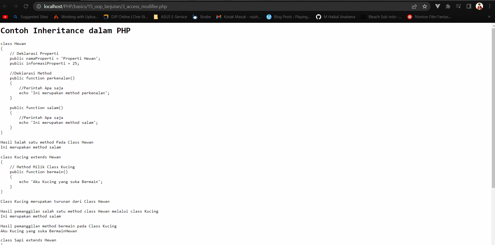
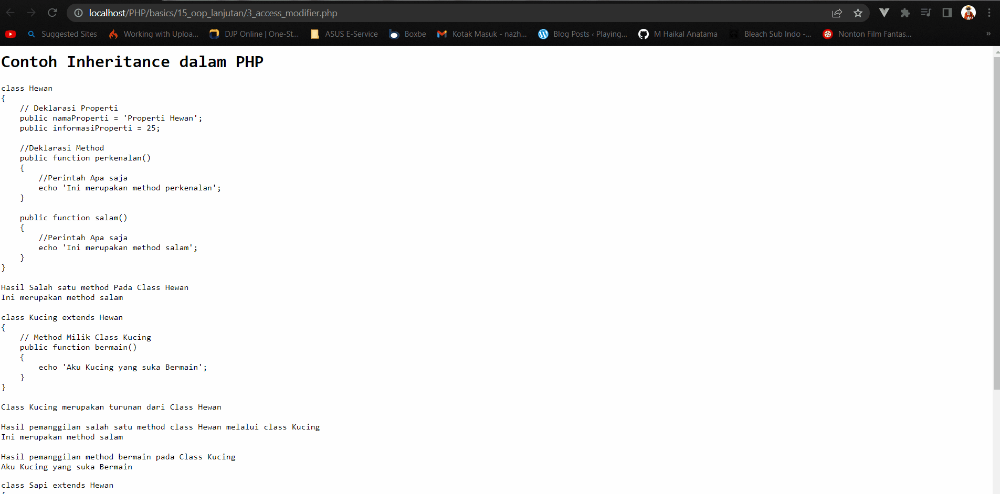

<p align="center">

<h1 align="center">Object Oriented Programing  Lanjutan</h1>
</p>

Materi kali ini merupakan materi lanjutan dari _Object Oriented Programming_ (OOP) Dasar. Kita akan membahas lebih mendalam lagi mengenai OOP itu sendiri.

## Daftar isi

- [Inheritance](#1-inheritance)
- [Object Type](#2-object-type)
- [Access Modifier](#3-access-modifier)
- [Overriding And Final](#4-overriding-and-final)
- [Abstract Class](#5-abstract-class)
  - [Pentingnya Abstract Class](#pentingnya-abstract-class)
  - [Struktur Program](#struktur-program)
  - [Penggunaan Program](#penggunaan-program)
  - [Contoh Output](#contoh-output)

## 1. Inheritance

_Inheritance_ merupakan sebuah kata dalam bahasa inggris yang memiliki arti warisan. Dalam OOP _Inheritance_ bisa diartikan sebagai pewarisan sifat. Maksudnya disini adalah sebuah _Class_ yang dibuat memiliki keturunan (anak) yang mewarisi semua yang ada dalam _Class_ tadi ditambah dengan tambahan properti dan method milik _Class_ Turunan itu sendiri.

[](1_inheritance_Kucing.php#L13-L23)
<br/>
<br/>

## 2. Object Type

Perlu diingat, ketika membuat sebuah class maka di dalam class tersebut tentu saja terdapat beberapa method yang bisa diberikan parameter apa saja. Selain dari stirng, integer, atau bahkan boolean ternyata object bisa digunakan juga sebagai sebuah parameter dalam satu method. Dengan begitu method yang ada dalam objek tersebut bisa juga digunakan di dalam method yang parameternya adalah sebuah objek.

[](2_object_type.php#L13-L23)
<br/>
<br/>

## 3. Access Modifier

Properti dan juga method memiliki 3 macam aksesiblitas yaitu public, private, dan juga protected. Properti dan methodu public artinya bisa diakses dimana saja. Kemudian untuk protected berarti property atau method tersebut masih bisa diakses dalam lingkup Class tersebut dan juga turunannya. Dan terakhir ada Private yang membuat property dan method hanya bisa di akses dalam lingkup Class tersebut saja.

Sebagai contoh yang sederhana, gambar berikut ini menunjukkan apa akibat ketika mencoba untuk mengakses sebuah properti Protected dan dipanggil melalui class yang berdiri sendiri.
<br/>
<br/>

<p align="center">
    
</p>
<br/>

Selanjutnya, gambar berikut ini menunjukkan apa akibat yang bisa didapatkan ketika mencoba untuk mengakses sebuah properti Private. Akan di peroleh error karena properti itu hanya bisa di akses di dalam Class yang membuatnya.

<p align="center">
    
</p>

[](3_access_modifier.php#L13-L23)
<br/>
<br/>

## 4. Overriding And Final

Class yang merupakan turunan dari satu class yang lain bisa melakukan overriding, maksudnya disini adalah mengubah method yang berasal dari class induknya sesuai dengan kebutuhan dari class itu sendiri. Akan tetapi apabila satu method dijadikan final maka method tersebut tidak akan bisa di override oleh class turunannya. Jadi ketika satu method dibuat jadi final method tersebut tidak akan bisa di override.


[](4_overriding_and_final.php#L13-L23)
<br/>
<br/>

## 5. Abstract Class
Abstract Class adalah salah satu konsep penting dalam pemrograman berorientasi objek (OOP) yang digunakan sebagai kerangka kerja bagi kelas turunannya. Sederhananya, Abstract Class adalah panduan dan aturan dalam pendefinisian kelas yang sesungguhnya. Abstract Class sendiri tidak dapat diinstansiasi, artinya Anda tidak dapat membuat objek langsung dari sebuah _abstract class_. Jika Anda mencoba melakukannya, Anda akan mendapatkan pesan kesalahan seperti yang ditunjukkan di bawah ini:
```php
$pengguna = new Pengguna("Mail");
```

```
cat /var/log/apache2/error.log

[Wed Sep 06 17:20:14.809723 2023] [php:error] [pid 1135] [client ::1:52564] PHP Fatal error:  Uncaught Error: Cannot instantiate abstract class Basic\\OOP_Lanjutan\\Pengguna in /home/rey/Documents/Project/PHP/Bellshade-PHP/basics/15_oop_lanjutan/5_abstract_class.php:138\nStack trace:\n#0 {main}\n  thrown in /home/rey/Documents/Project/PHP/Bellshade-PHP/basics/15_oop_lanjutan/5_abstract_class.php on line 138
```
### Pentingnya Abstract Class
Abstract Class sangat berguna untuk mengatur struktur dan kontrak dasar yang harus dipatuhi oleh kelas-kelas turunannya. Hal ini memungkinkan untuk membangun hierarki kelas yang kohesif dan konsisten dalam sebuah program OOP. Dengan Abstract Class, Anda dapat memastikan bahwa setiap kelas turunan memiliki metode-metode yang diperlukan dan dapat diandalkan untuk berperilaku sesuai dengan yang diharapkan.
### Struktur Program

Berikut adalah penjelasan singkat untuk setiap elemen dalam struktur program, sebagai contoh kita menggunakan nama class `Pengguna`, `FrontendDeveloper`, dan `BackendDeveloper` sebagai bagian dari program ini:

- **Abstract Class `Pengguna`**: Ini adalah kelas abstrak yang memiliki satu properti, yaitu `$nama`, dan dua metode: `__construct()` untuk mengatur nama pengguna saat objek dibuat dan `getNama()` untuk mengambil nilai nama. Selain itu, ada metode abstrak `printPerkenalan()` yang harus diimplementasikan oleh kelas turunannya.

- **Class `FrontendDeveloper`**: Ini adalah salah satu kelas turunan yang mengimplementasikan metode abstrak `printPerkenalan()`. Selain itu, kelas ini memiliki metode khusus `apaPekerjaanFrontendDeveloper()` yang menjelaskan pekerjaan seorang Frontend Developer.

- **Class `BackendDeveloper`**: Ini adalah kelas turunan lainnya yang juga mengimplementasikan metode abstrak `printPerkenalan()`. Kelas ini memiliki metode khusus `apaPekerjaanBackendDeveloper()` yang menjelaskan pekerjaan seorang Backend Developer.

### Contoh Program

Program ini memperlihatkan cara membuat objek dari kelas turunan, yaitu `FrontendDeveloper` dan `BackendDeveloper`, serta memanggil metode-metodenya. Meskipun kelas abstrak `Pengguna` tidak dapat diinstansiasi secara langsung, kelas turunannya dapat digunakan untuk membuat objek dan memanggil metodenya. Berikut adalah contoh kode untuk masing-masing kelas yang digunakan dalam program ini:

- **Abstract Class `Pengguna`**
    ```php
    abstract class Pengguna
    {
        protected $nama;

        public function __construct($nama)
        {
            $this->nama = $nama;
        }

        abstract public function printPerkenalan();

        public function getNama()
        {
            return $this->nama;
        }
    }
    ```
- **Class `FrontendDeveloper`**
    ```php
    class FrontendDeveloper extends Pengguna
    {
        public function printPerkenalan()
        {
            echo 'Saya adalah seorang Frontend Developer dengan nama ' . $this->getNama() . '.' . PHP_EOL;
        }

        public function apaPekerjaanFrontendDeveloper()
        {
            echo 'Saya bekerja untuk mengembangkan antarmuka pengguna.' . PHP_EOL;
        }
    }
    ```
- **Class `BackendDeveloper`**
    ```php
    class BackendDeveloper extends Pengguna
    {
        public function printPerkenalan()
        {
            echo 'Saya adalah seorang Backend Developer dengan nama ' . $this->getNama() . '.' . PHP_EOL;
        }

        public function apaPekerjaanBackendDeveloper()
        {
            echo 'Saya bekerja untuk mengatur logika dan server.' . PHP_EOL;
        }
    }
    ```

### Contoh Output
```php
$frontendDeveloper = new FrontendDeveloper('Upin');
$frontendDeveloper->printPerkenalan();
$frontendDeveloper->apaPekerjaanFrontendDeveloper();

echo "<br>";

$backendDeveloper = new BackendDeveloper('Ipin');
$backendDeveloper->printPerkenalan();
$backendDeveloper->apaPekerjaanBackendDeveloper();
```
Kode program di atas akan menghasilkan _output_ seperti berikut:

```
Saya adalah seorang Frontend Developer dengan nama Upin.
Saya bekerja untuk mengembangkan antarmuka pengguna.

Saya adalah seorang Backend Developer dengan nama Ipin.
Saya bekerja untuk mengatur logika dan server.
```

Ini adalah contoh sederhana tentang bagaimana Abstract Class dapat digunakan untuk membuat kerangka kerja yang konsisten untuk kelas-kelas turunan dalam pemrograman berorientasi objek. Perlu diingat bahwa Abstract Class sendiri tidak dapat diinstansiasi, artinya Anda tidak dapat membuat objek langsung dari sebuah abstract class.

[](5_abstract_class.php#L13-L23)
<br/>
<br/>