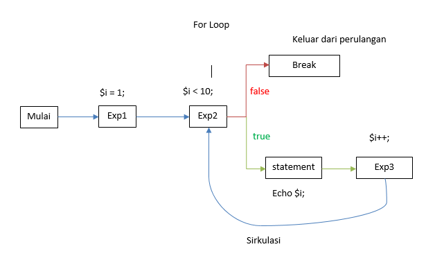
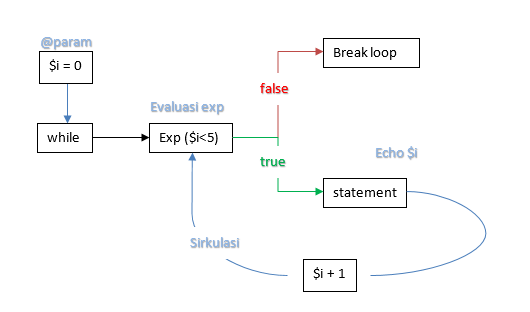
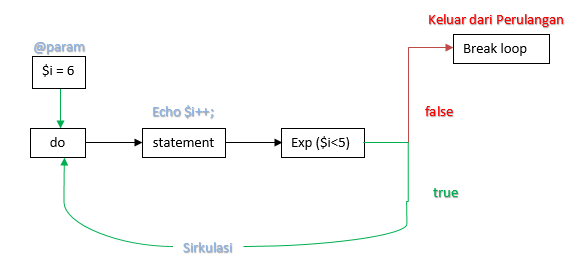

# Perulangan

*Loop* atau perulangan digunakan untuk mengeksekusi blok kode yang sama berulang kali, selama kondisi tertentu benar atau bernilai true.

## Daftar Isi

- [Perulangan](#perulangan)
  - [Daftar Isi](#daftar-isi)
  - [Jenis-Jenis Perulangan](#jenis-jenis-perulangan)
    - [1. Perulangan For](#1-perulangan-for)
    - [2. Perulangan Foreach](#2-perulangan-foreach)
    - [2.1 Nested Foreach](#21-nested-foreach)
    - [List sebagai Pengganti Nested Foreach](#list-sebagai-pengganti-nested-foreach)
  - [3. Perulangan While](#3-perulangan-while)
  - [4. Perulangan Do While](#4-perulangan-do-while)
    - [Referensi](#referensi)

## Jenis-Jenis Perulangan

Berikut adalah jenis *loop* yang ada di PHP.

|               Jenis                | Keterangan                                                                                        |
| :--------------------------------: | ------------------------------------------------------------------------------------------------- |
|      [for](#1-perulangan-for)      | *Loop* melalui blok kode beberapa kali                                                            |
|  [foreach](#2-perulangan-foreach)  | *Loop* melalui blok kode untuk setiap elemen dalam array                                          |
|    [While](#3-perulangan-while)    | *Loop* melalui blok kode selama kondisi yang ditentukan benar                                     |
| [do while](#4-perulangan-do-while) | *Loop* melalui blok kode satu kali, dan kemudian mengulangi *loop* selama kondisi yang ditentukan |

### 1. Perulangan For

Perulangan *for* atau secara umum dikenal dengan *For Loops* adalah metode perulangan paling kompleks dalam bahasa pemograman PHP.

*For Loops* secara umum ditulis dalam contoh baris code berikut :

```php
<?php

for(exp1, exp2, exp3)
    statement
```

Perulangan *Loop* akan mengeksekusi ekspresi pertama (exp1) sesaat setelah *prosedure loop* dimulai dan ini hanya dieksekusi sekali selama putaran perulangan terjadi, dimana pada umumnya ekspresi pertama berisi argument penugasan/assignment. Contoh : `$i = 1;`

Ekspresi kedua (exp2) pada umumnya berisi *conditional statement* dimana perulangan ini akan mengevaluasi nilai ekspresi kedua, selama ekspresi kedua menghasilkan nilai `true` maka *statement* perulangan akan terus dieksekusi. contoh exp2 : `$i < 10;`

Diakhir setiap sirkulasi Perulangan, ekspresi ketiga (exp3) akan dieksekusi. dan kemudian memulai sirkulasi selanjutnya, selama ekspresi kedua menghasilkan nilai `true`.

Setiap ekspresi bisa saja kosong atau memiliki lebih dari 1 (satu) argumen yang dipisahkan oleh tanda `,`.

Semua argumen yang ada dalam ekspresi kedua akan dieksekusi dan hanya argumen terakhir yang diperhitungan sebagai hasil ekspresi. Jika ekspresi kedua ini kosong, maka perulangan akan berjalan terus, seolah ekspresi kedua ini selalu menghasilkan nilai true, untuk menghentikan perulangan seperti ini kita dapat membuat *conditional* statement untuk menentukan kapan perulangan berakhir.

Diagram alur perulangan *For* :

<p align="center">
    
</p>

Dari diagram di atas kita bisa menulis kode contoh sebagai berikut:

```php
<?php

// Contoh 1. For secara umum
for ($i = 1; $i <= 5; $i++;){
    echo $i;
}

// Contoh 2. Alternatif Colon Syntax
for($i = 1; $i <= 5; $i++):
    Echo $i;
endfor;

// Contoh 3. For tanpa truth expression
for ($i = 1; ; $i++){
    if($i>5){
        break;
    }else{
        echo $i;
    }
}

// Contoh 4. For tanpa expression
$i = 1;
for ( ; ; ){
    if($i>5){
        break;
    } else {
        echo $i;
        $i++;
    }
}

// Contoh 5. expression memiliki 2 argument atau lebih
for ($i = 1, $j = 0; $i <= 5; $j += $i, print $i, $i++);
```

Keempat contoh di atas menghasilkan nilai yang sama yaitu 1 2 3 4 5.

Contoh penggunaan *for* dalam berinteraksi dengan data *Array()*, terdapat [disini](./1_for.php)

### 2. Perulangan Foreach

Perulangan Foreach atau dapat di artikan dalam bahasa Indonesia sebagai 'Untuk Setiap', dari arti kata ini dapat disimpulkan bahwa syntax ini digunakan untuk berinteraksi dengan variabel yang memiliki data/*arguments* lebih dari satu atau lebih tepatnya kita sebut data *Array()*. Selain dari data *Array()*, *foreach* juga dapat digunakan untuk perulangan data ber-tipe *Object*.

Perulangan *foreach* tidak dapat digunakan pada data ber-tipe selain *Array()* dan *Object*, atau variabel yang tidak di inisialisasikan. Memaksakan penggunaan perulangan pada data tersebut akan menimbulkan pesan kesalahan (`error`) pada aplikasi yang kita buat.

Sebelum melanjutkan lebih baik kita pahami terlebih dulu mengenai data tipe [*Array()*](../2_variable_datatype/#membuat-array), dimana setiap elemen dari data *Array()* memiliki pasangan *key* dan *value* (kunci dan nilai).

Secara umum fungsi *foreach* di tuliskan dalam bentuk seperti ini

```php
<?php

foreach(Array|Object $variable as [$key =>] $value){
    statement
}
```

Kode di atas pada setiap elemen dari *Array* atau *Object*, PHP akan mentransfer nilai yang terdapat pada elemen *Array* atau *Object* yang terdapat pada parameter `$variable` ke dalam parameter `$value`, dan *key* dari elemen menjadi parameter `$key`. Untuk *key* berupa opsional jika kita membutuhkan nilai *key* dari suatu elemen.

Kemudian paremeter `$key` dan `$value` dapat digunakan dalam statemen atau tugas yang kita buat di dalam fungsi *foreach* tersebut.

Contoh 1.

```php
<?php

$nomor = [20,30,40];

foreach($nomor as $value){
    echo $value . '\n';
}
```

Baris kode di atas akan mentransfer setiap nilai dari elemen parameter `$nomor` menjadi parameter `$value` dan dalam statemen kita perintahkan untuk menampilkan nilai `$value` tersebut. *Foreach* akan bekerja melakukan perulangan untuk melakukan transformasi sampai mencapai elemen terakhir dari array. Sehingga baris kode di atas akan menghasilkan

```html
20
30
40
```

Bentuk lain dengan menambahkan opsi key dalam parameter foreach,
contoh 2.

```php
<?php

$data = ['propinsi' => 'Banten', 'kabupaten' => 'Kota Tangerang', 'kecamatan' => 'Batu Ceper'];

foreach($data as $key => $value){
    echo ucfirst($key) . ' = ' . $value . '\n';
}
```

Dengan baris kode di atas key dari elemen array dapat kita gunakan dan telah ditranformasikan ke dalam parameter `$key`
sehingga menghasilkan tampilan sebagai berikut.

>**Penyegaran :**
>
>`ucfirst()` di atas merupakan syntax manipulasi string dengan bertujuan menjadikan huruf pertama menjadi huruf besar (Kapital).

```html
Propinsi = Banten
Kabupaten = Kota Tangerang
Kecamatan = Batu Ceper
```

Untuk melakukan perubahan nilai array kita bisa menambahkan operator *assigned by reference* pada *value* atau *key*. Sebagai contoh sebuah array linear berisi nilai *integer*, yang akan kita lipat gandakan.

```php
<?php

$nomor = [20, 25, 30];

foreach($nomor as &$value){                     // & merupakan operator assigned by reference
    $value *= 2;
}

print_r($nomor);
```

Kode di atas akan merubah nilai dari elemen `$nomor` menjadi 40, 50, 60. Karena kita menggunakan *assigned by reference* makan nilai elemen terakhir akan mengikuti perubahan terhadap parameter `$value`, jadi jangan lupa untuk menghentikan opertor ini jika kita tidak ingin nilai dari elemen array kita terus berubah saat nilai baru paramater `$value` muncul, dengan cara:

```php
<?php

foreach($nomor as &$value){
    statement
}
unset($value);  // Break terhadap operator assigned by reference
```

Bagaimana dengan Array Multi Dimensi. Mari kita pelajari bersama pada materi di bawah.

### 2.1 Nested Foreach

Sebelumnya kita bisa pelajari terlebih dahulu mengenai [Nested Array atau Array Multi Dimensi](../7_array_mendalam).
*Nested Foreach* digunakan dalam berinteraksi dengan Array Multi Dimensi, dengan contoh baris perintah sebagai berikut:

```php
<?php

// Multi Dimensional Array
$array = array();
$array[0][0] = "pinus";
$array[0][1] = "beringin";
$array[1][0] = "bayam";
$array[1][1] = "kangkung";

foreach ($array as $value1){                        //elemen array dimensi satu
    foreach($value1 as $value2){                    //elemen array dimensi dua
        echo $value2;                               //tampilkan setiap elemen
    }
}
```

Penjelas baris kode di atas tidak jauh beda dengan perulangan foreach pada linear array, hanya karena elemen dari array juga berupa array, maka kita melakukan perulangan kembali pada nilai elemen dari array.

Seperti yang kita peroleh dari baris kode di atas, elemen array dari parameter `$array` di transformasikan ke dalam parameter `$value1` dimana nilainya juga berupa array, kemudian kita lakukan perulangan lagi pada elemen array yang terdapat pada parameter `$value1`. Sehingga setiap elemen array pada parameter `$value1` di transformasikan ke dalam paramater `$value2`.

>**Penting :**
>
> Karena Array di atas berupa *matrix array* sehingga dapat langsung digunakan *nested foreach*, untuk menghindari pesan error sebaik dilakukan pengecekan terlebih dahulu terhadap `$value1` apakah dia berupa array dengan menggunakan *conditional statement* seperti `if...else` dengan ekspresi `is_array()`
>
> Misalnya: `if(is_array($value1)) { ... }`

### List sebagai Pengganti Nested Foreach

Cara lain untuk melakukan perulangan pada array multi dimensi bila kita mengetahui ukuran dari array kita dapat menggunakan list dalam perulangan *foreach*. Sebagai contoh kita memiliki matrix array dengan ukuran 2x2.

Contoh :

```php
<?php

$data = array(
    [101,102],
    [201,202]
);

foreach($data as list($val1, $val2)){
    echo $val1 . ', ' . $val2 . '\n'
}

// Akan menghasilkan
// 101, 102
// 201, 202
```

Baris kode di atas menjelaskan bahwa `$val1` menampung nilai pertama dan `$val2` menampung nilai kedua dari elemen array pada perameter `$data`.

Jika parameter dalam *list* melebihi dari nilai yang terdapat dalam elemen parameter `$data` maka akan memunculkan pesan kesalahan. Sebagai contoh tetap menggunakan array di atas.

```php
....
foreach($data as list($val1, $val2, $val3)){
    echo 'A: ' . $val1 . ', B: ' . $val2 . ', C: ' . $val3 . '\n';
}
```

Maka baris kode di atas akan menghasilkan nilai:

```html
Notice: Undefined offset: 2 in example.php on line ...
A: 101, B: 102, C:

Notice: Undefined offset: 2 in example.php on line ...
A: 201, B: 202, C:
```

Dengan demikian kita harus berhati-hati dalam menulis baris kode.

Demikian untuk pembahasan perulangan *Foreach*.

Contoh penggunaan foreach dalam php dapat dilihat [disini](./2_foreach.php)

[](./2_foreach.php)

## 3. Perulangan While

Perulangan *While* merupakan perulangan yang paling sederhana pada PHP, perulangan *While* memiliki *syntax* sebagai berikut:

```php
while(exp)
    statement
```

Tujuan dari baris kode tersebut sangat sederhana yaitu memerintah PHP untuk melakukan sirkulasi perulangan selama ekspresi yang diberikan bernilai `true`, sama seperti *for*, nilai ekspresi akan kembali di evalusi setelah satu sirkulasi selesai. Kemudian membuat sirkulasi baru jika ekspresi menghasilkan nilai `true` dan akan berhenti jika ekspresi bernilai `false`.

Sama seperti *conditional statement* `if`, ekspresi dapat diberikan dalam bentuk group di dalam tanpa kurung ekspresi.
Perhatikan diagram alur dari *while*.

<p align="center">
    
</p>

Dari diagram alur di atas bisa kita lihat bahwa *while* hampir sama dengan *for* dimana *while* hanya memiliki sebuah ekspresi berupa *conditional statement*. Diagram di atas dapat ditulis dalam baris kode sebagai berikut:

```php
<?php

// Deklarasi parameter $i sesuai diagram bernilai 0
$i = 0;
// Perulangan while dengan ekspresi selama $i lebih kecil dari 5
while($ < 5){
    // echo nilai $i dan kemudian $i ditambah 1 (post increment)
    echo $i++;
}
```

Baris kode di atas akan menghasilkan nilai `01234`, jadi selama `$i` lebih kecil dari 5, PHP akan melakukan tugas yang tertuang dalam *statement*, jika kita memberikan ekspresi awal bernilai `false` maka perulangan ini tidak akan pernah terjadi, dan sebaliknya jika kita memberikan ekspresi yang selalu bernilai `true`, maka PHP akan selalu akan melakukan perulangan tanpa berhenti seperti contoh di atas kita berikan ekspresi `$i >= 0` maka nilai nya akan selalu `true`.

Contoh penggunaan *while* dalam PHP dapat dilihat [disini](./3_while.php)

[](./3_while.php)

## 4. Perulangan Do While

Perulangan *Do While* hampir sama dengan perulangan *While*, yang membedakan adalah ekpresi akan dievaluasi di akhir dari sirkulasi perulangan, sehingga perintah dalam *statement* akan selalu terlaksana saat pertama kali sirkulasi perulangan ini berjalan.

Syntax :

```php
do {
    statement
} while (exp);
```

coba kita pelajari diagram alur dari sirkulasi perulangan Do While di bawah ini.
<p align="center">
    
</p>

Dari diagram bisa kita simpulkan bahwa statement akan dieksekusi pertama kali sebelum ekspresi dievalusi di akhir sirkulasi perulangan. Sesuai diagram alir kita susun baris kode sebagai berikut.

```php
<?php
// Deklarasi parameter berupa $i dengan nilai awal 6
$i = 6;

// Perintahkan perulangan Do While selama $i lebih kecil dari 5
do {
    echo $i++;
} while ($i < 5);
```

Baris kode di atas menghasilkan nilai 6, walaupun dari awal nilai `$i` sudah lebih besar dari 5, tetapi *echo* terhadap `$i` tetap dilakukan pada awal sirkulasi perulangan, kemudian ekspresi melakukan evaluasi terhadap `$i` yang bernilai 7, sehingga `7 > 5` menghasilkan nilai ekspresi `false`, dan perulangan *Do While* dihentikan.

Contoh penggunaan *Do While* dalam PHP dapat dilihat [disini](./4_do_while.php)

[](./4_do_while.php)

Itulah 4 perulangan yang terdapat dalam PHP.

> **Tips**
>
> Untuk mengkahiri perulangan ditengah-tengah sirkulasi kita dapat menggunakan perintah `goto` seperti contoh ini

```php
<?php

$i = 0;
while($i < 5){
    if($i === 3){
        goto end;
    } else {
        echo $i;
    }
    $i++;
}

end:
return $i;
```

### Referensi

- [W3School - PHP Loops](https://www.w3schools.com/php/php_looping.asp)
- [php.net - Manual](https://www.php.net/manual/en/)
