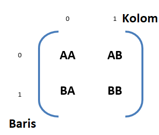

# Array Mendalam

Dalam materi ini kita bahas mengenai Array lebih lanjut.

- [Array Mendalam](#array-mendalam)
  - [1. Array](#1-array)
    - [Apa itu Array](#apa-itu-array)
    - [Bagaimana Membuat Array](#bagaimana-membuat-array)
    - [Mengakses Elemen Array](#mengakses-elemen-array)
  - [2. Jenis Array](#2-jenis-array)
    - [1. Array Index](#1-array-index)
    - [2. Array Asosiatif](#2-array-asosiatif)
  - [3. Array Multi Dimensi](#3-array-multi-dimensi)
  - [4. Manipulasi Array](#4-manipulasi-array)
    - [Menghitung ukuran array](#menghitung-ukuran-array)
      - [a. sizeof](#a-sizeof)
      - [b. count](#b-count)
    - [Mendapatkan nilai dari array](#mendapatkan-nilai-dari-array)
      - [a. array_keys](#a-array_keys)
      - [b. array_values](#b-array_values)
    - [Mengubah elemen pada array](#mengubah-elemen-pada-array)
      - [a. array_push](#a-array_push)
      - [b. array_pop](#b-array_pop)
      - [c. array_shift](#c-array_shift)
      - [d. array_unshift](#d-array_unshift)
    - [Membandingkan array](#membandingkan-array)
      - [a. array_diff](#a-array_diff)
      - [b. array_splice](#b-array_splice)
    - [Menggabungkan array](#menggabungkan-array)
      - [a. array_merge](#a-array_merge)
    - [Pengacakan pada array](#pengacakan-pada-array)
      - [a. array_flip](#a-array_flip)
      - [b. array_reverse](#b-array_reverse)
      - [c. array_rand](#c-array_rand)
      - [d. array_slice](#d-array_slice)
    - [Pengurutan pada array](#pengurutan-pada-array)
      - [a. sort](#a-sort)
      - [b. rsort](#b-rsort)
      - [c. asort](#c-asort)
      - [d. arsort](#d-arsort)
      - [e. ksort](#e-ksort)
      - [f. krsort](#f-krsort)

## 1. Array

### Apa itu Array

Pada [materi](../2_variable_datatype) sebelumnya kita sudah berkenalan dengan tipe data berbentuk Array, jadi apa itu Array?.

Sebuah Array adalah data struktur yang dapat menyimpan beberapa atau lebih elemen (parameter/nilai/variabel) dalam satu variabel, dan elemen ini tersimpan dalam bentuk pasangan key-value yang saling terhubung satu sama lain. Dalam pelaksanaannya kita dapat menggunakan array kapan saja saat kita ingin menyimpan daftar elemen (tabel elemen).

Array dapat menampung hampir semua tipe data dan bisa menampung berbagai macam tipe data dalam satu array, walaupun demikian dalam pelaksanaannya penggunaan Array memiliki elemen dengan tipe data yang sama.

Bahasa Pemograman PHP tidak memproses atau meng-alokasikan memori sebagaimana pada bahasa pemograman lain memproses memori untuk array, sehingga array dalam PHP hampir tidak memiliki keterbatasan kecuali maksimum memori yang dapat digunakan oleh PHP itu sendiri. Sebagai contoh dalam bahasa pemrograman lain array memiliki alokasi memori saat di dideklarsikan dan array tersebut memiliki ukuran tetap, tidak dapat ditambahkan atau dikurangi (array bertipe statis), berbeda dengan array dalam PHP yang bersifat dinamis, di mana kita dapat menambah dan mengurangi ukuran dari array tersebut, dan memiliki kebebasan penuh dalam menetukan key dari elemen array.

> **Catatan :**
>
> Key dari array bertipe Integer atau string, untuk tipe *decimal* otomatis di konversi ke dalam *integer* oleh php

Array sering di-sinonim-kan sebagai tabel, walaupun bukan, tetapi tabel sering di-implementasikan dalam bentuk array.

Sebagai contoh kita memiliki parameter berisi beberapa nama kota di Indonesia, jika tidak memiliki array maka kita akan membuat begitu banyak variabel, di mana setiap kota memiliki variabel sendiri, dengan array kita hanya butuh mendeklarasikan satu variabel, contoh :

```php
<?php

$kota = array('Padang', 'Payakumbuh', 'Solok', 'Batu Sangkar', 'Pariaman');
```

Seperti kita lihat dalam contoh, kita telah memiliki sebuah variabel `$kota` yang berisi beberapa nama kota, dan array ini dapat kita tambahkan elemen baru di waktu lain.

Kita dapat menggunakan berbagai macam cara untuk berinteraksi dengan array dan hal ini akan kita pelajari bersama pada materi berikutnya.

### Bagaimana Membuat Array

Setelah kita mengenal apa itu Array, sekarang kita akan mencoba membuat atau menginisialisasikan sebuah Array.

Ada beberapa macam cara untuk membuat array, pada umumnya array dibuat dengan fungsi `array()` yang akan menugaskan suatu variabel menjadi sebuah Array.

```php
<?php

$data = array();
```

Dari kode di atas dapat kita lihat variabel `$data` ditugaskan sebagai sebuah Array dengan nilai Kosong. Kemudian sejak PHP 5.4 diperkenalkan penggunaan kurung siku dalam mendeklarasikan sebuah Array

```php
<?php

$variable = [];
```

Kedua *syntax* di atas memiliki fungsi yang sama, kemudian mari kita tambahkan elemen ke dalam Array.

```php
<?php

$variable = [];     // Membuat sebuah variable array dengan nama variable

// Menambahkan elemen
$variable[] = 'Padang';
$variable[] = 'Batu Sangkar';
$variable[] = 'Payahkumbuh';

// Tampilkan elemen array
echo '<pre>';
print_r($variable);
echo '</pre>';
```

Baris kode di atas akan menghasilkan data di bawah ini:

```html
Array
(
    [0] => Padang
    [1] => Batu Sangkar
    [2] => Payahkumbuh
)
```

Kode di atas juga bisa diganti dengan syntax yang lebih pendek dengan mendeklarasikan array dan nilainya sekaligus

```php
<?php

$variable = ['Padang', 'Batu Sangkar', 'Payahkumbuh'];
```

[](1_array.php#L10-L28)

### Mengakses Elemen Array

Setelah membuat dan menyimpan array, tentunya kita akan mengakses elemen pada array pada saat dibutuhkan, untuk mengaksesnya kita dapat menggukan syntax sebagai berikut :

```php
<?php
$var[index];        //Array Index
$var['key'];        //Array Asosiatif
```

Pada materi [`Bagaimana Membuat Array`](#bagaimana-membuat-array), kita telah membuat sebuat array yang berisi nama kota yaitu 'Padang', 'Batu Sangkar', 'Payakumbuh'. Sekarang kita ingin menggunakan nilai 'Batu Sangkar' dan melakukan echo ke tampilan. Array di atas berupa array linear dengan key berupa index yang dimulai dari `0`, nilai 'Batu Sangkar' terdapat di barisan kedua sehingga memiliki index `1`, untuk mengaksesnya kita gunakan syntax sebagai berikut :

```php
<?php

echo $kota[1];
```

Dengan demikian kita telah bisa membuat dan mengakses sebuah Array.

[](1_array.php#L29-L34)

## 2. Jenis Array

Berdasarkan jenis *key* yang terdapat dalam elemen Array, Array dapat dikelompokan menjadi 2 yaitu :

### 1. Array Index

Array yang memiliki Key/Index berupa angka/bilangan *integer* akan tergabung dalam Array jenis ini atau disebut *Numerical Index Array*, array yang kita buat pada contoh-contoh di atas termasuk ke dalam jenis *Array Index*, di mana index nya berupa integer yang dibuat secara otomotis oleh sistem dengan nilai pertama dari index adalah `0`.

Untuk *Array Index* yang *key* awalnya tidak kita definisikan maka secara otomatis menjadi `0`, sebagai contoh :

```php
<?php

$kota = ['Padang', 'Batu Sangkar', 'Payakumbuh'];
```

Karena tidak ditemukan key yang didefinisikan maka sistem secara otomotis membuat index key berupa `Integer` yang di mulai dari `0`, sehingga menghasilkan

|  Key  | Nilai        |
| :---: | ------------ |
| [`0`] | Padang       |
| [`1`] | Batu Sangkar |
| [`2`] | Payakumbuh   |

kita juga bisa mendifinisikan index pertama dari Array tersebut, sebagai contoh :

```php
<?php

$kota = [5 => 'Padang', 'Batu Sangkar', 'Payakumbuh'];
```

Maka index dari array tersebut dimulai dari 5 yaitu : `5` = Padang, `6` = Batu Sangkar, `7` = Payakumbuh. Berbeda dengan beberapa bahasa pemrograman lain bukan, di mana index sebuah array harus dimulai dari `0`.

Dan hal ini berlaku bila index yang didefinisikan adalah index pertama, bagaimana jika index yang kita definisikan bukan index pertama, ini tetap bisa dilakukan, PHP akan mengenali di mana saat index terdefinisi, tetapi sebelum ditemukan index yang terdefinisi PHP secara otomotis tetap membuat index yang dimulai dari `0`, sebagai contoh:

```php
<?php

$kota ['Padang', 'Bukit Tinggi', 8 => 'Batu Sangkar', 'Payakumbuh', 'Padang Panjang'];      // Nilai Kedua memiliki index berupa Integer

print_r($kota);     // Menampilkan Hasil
```

*Syntax* di atas secara otomotis PHP mengenali bahwa pada index ketiga key terdefinisikan sebagai (`integer`) `8`, dengan demikian PHP tidak memulai index dari `8` tetapi tetap dari `0` untuk elemen yang terdapat sebelum key `8` ditemukan dan melajutkan key `8` untuk elemen yang terdapat setelahnya, sehingga hasil `print_r` di atas akan menghasilkan,

```html
Array
(
    [0] => Padang
    [1] => Bukit Tinggi
    [8] => Batu Sangkar
    [9] => Payakumbuh
    [10] => Padang Panjang
)
```

Wah.. cukup dinamis bukan!!!

> **Penting**
>
> **Kesimpulan** : Dalam PHP *Array Index* adalah array yang memiliki key berupa angka Integer, bilangan desimal atau lainnya akan di konversi menjadi integer oleh php dan data bertipe boolean akan di konversi menjadi integer dengan nilai `0` dan `1`.

Untuk memahami lebih lanjut kita dapat pelajari contoh kode.

[](2_jenis_array.php#L11-L22)

### 2. Array Asosiatif

Array Asosiatif tidak jauh beda dengan array index, yang membedakan hanya *key* array asosiatif berupa `string`. jadi kita tidak akan membahas lebih lanjut.

Inti nya semua Array yang *key* nya telah di definisikan berupa `string` termasuk dalam array asosiatif ini.

Contoh membuat array asosiatif:

```php
<?php

$propinsi = ['nama' => 'Sumatera Barat', 'ibukota' => 'Padang'];``// Membuat Array

print_r($propinsi);     // Menampilkan Array
```

Dari contoh di atas kita memiliki sebuah array dengan dua elemen, di mana elemen pertama memiliki key berupa `string` yang bernilai `nama` dan elemen kedua *key*-nya juga berupa `string` yang bernilai `ibukota`. Sehingga hasil dari perintah `print_r` yang kita buat akan menampilkan.

```html
Array
(
    [nama] => Sumatera Barat
    [ibukota] => Padang
)
```

Untuk mengakses data tersebut sama caranya dengan Array index hanya key yang tadi berupa index kita rubah menjadi string contoh kita ingin memanggil data Padang.

```php
<?php

echo $kota['ibukota'];  // Tampilkan elemen array dengan key ibukota
```

[](1_jenis_array.php#L24-L29)

**TAMBAHAN**

Array Index dan Array Asosiatif dapat digabungkan menjadi satu, dengan aturan sama yang terdapat dalam *Array Index* bagi elemen yang key nya tidak terdefinisikan.
contoh :

```php
<?php

$data = ['mangga', 'apel', 'sayur' => 'bayam', 'lauk' => 'daging', 8 => 'jeruk', 'markisa'];

print_r($data);
```

Perintah `print_r` di atas akan menampilkan hasil:

```html
Array
(
    [1] => mangga
    [2] => apel
    [sayur] => bayam
    [lauk] => daging
    [8] => jeruk
    [9] => markisa
)
```

[](1_array.php#L31-L45)

Akhirnya kita sudah mengenal apa itu **array index** dan **array asosiasif**.

## 3. Array Multi Dimensi

Pada pembahasan di atas kita sudah membuat dan mengkases data array dengan nilai elemennya berupa integer dan string, dan kita juga sudah mengetahui bahwa array dapat menampung tipe data hampir apa saja, termasuk data array itu sendiri.

Bila terdapat data Array dalam nilai elemen sebuah Array maka Array itu disebut Array Multi Dimensi (*Multidimensional Array*), Array yang telah kita pelajari sebelumnya adalah Array Linear (Array Satu Dimensi).

Dalam pelajaran matematika di sekolah kita pernah mempelajari yang namanya matrix, nah Array Dua dimensi juga dikenal sebagi Array Matrix (*matrice array*). di mana Array Dua Dimensi(*note :* Termasuk ke dalam Multi Dimensi Array) memiliki Kolom dan Baris seperti tabel. dan Table sering di implementasikan ke dalam Array Dua Dimensi ini.

sebagai contoh :

```php
<?php

$data = [
    ['AA','AB'],
    ['BA','BB']
];
```

Maka array di atas akan membentuk matrix berukuran 2x2 seperti ilustrasi.

<p align="center">
    
</p>

Untuk mengakses nilai array tersebut kita memakai sintaks `$data[baris][kolom]` atau dengan metode perulangan [Nested Foreach](../5_perulangan/#nested-foreach).

```php
<?php

echo $data[1][0];   // Hasil BA
```

[](3_1_array_multidimensi.php)

Untuk lebih memahami coba kita implementasikan sebuah tabel ke dalam array.

- ### tabel 1. contoh

|  No   | Username      | Nama            | Status              |
| :---: | :------------ | :-------------- | :------------------ |
|   1   | wildanie12    | Badar Wildani   | Member, Owner       |
|   2   | mhaikalla     | M Haikal Anatam | Member, Contributor |
|   3   | adhywiranto44 | Adhy Wiranto    | Member, Admin       |
|   4   | nomadkode     | Ramset          | Member, Admin       |
|   5   | kondiak       | Ricky Hadinata  | Contributor         |

Tabel di atas kita simpan ke dalam satu variabel data bertipe array dengan cara :

```php
<?php

$tabelcontoh = [
    1 => ['username' => 'wildanie12', 'nama' => 'Badar Wildani', 'status' => ['Member', 'Owner']],          // Baris pertama dari tabel
    2 => ['username' => 'mhaikalla', 'nama' => 'M Haikal Anatam', 'status' => ['Member', 'Contributor']],   // Baris kedua dari tabel
    3 => ['username' => 'adhywiranto44', 'nama' => 'Adhy Wiranto', 'status' => ['Member', 'Admin']],        // Baris ketiga dari tabel
    4 => ['username' => 'nomadkode', 'nama' => 'Ramset', 'status' => ['Member', 'Admin']],                  // Baris keempat dari tabel
    5 => ['username' => 'kondiak', 'nama' => 'Ricky Hadinata', 'status' => 'contributor']                   // Baris kelima dari tabel
];
```

Kode di atas telah menyimpan data [tabel 1. Contoh](#tabel-1-contoh) ke dalam Multi Dimensi Array (tepatnya tiga dimensi array), saat kita melakukan perintah `print_r` terhadap array tersebut akan menghasilkan tampilan seperti ini.

[](3_2_implementasi_table_array.php)

Untuk mengakses data tabel tersebut ke dalam tabel kita dapat menggunakan beberapa metode perulangan.

[](3_3_array_kedalam_table.php)

> **Dimensi Array**
>
> Walaupun Array memiliki dimensi yang tidak terbatas, tetapi array yang memiliki 4 dimensi dan lebih akan sulit dikelola, sehingga akan lebih efisien menggunakan array berdimensi sebatas 3.

Untuk contoh penggunaan matrix Array kita bisa pelajari implementasi [Algoritma BackTracking pada PathFinding](../../algorithms/BackTracking/PathFinding) atau [algoritma Sorting](../../algorithms/Sorting) untuk linear Array.

## 4. Manipulasi Array

Disaat menggunakan array kita akan dihadapkan dengan berbagai skenario yang mengharuskan kita melakukan manipulasi pada array, seperti menambah *value*, menghapus *value*, dan lainnya.

Terdapat berbagai macam manipulasi array yang dapat kita lakukan, yaitu :

### Menghitung ukuran array

Untuk menghitung elemen yang terdapat di dalam sebuah Array dapat menggunakan dua fungsi yaitu `sizeof()` dan `count()`, kedua syntax tersebut memiliki tujuan dan fungsi yang sama, di mana `sizeof()` adalah nama lain dari `count()`. dengan penggunaan sintaks sebagai berikut

#### a. sizeof

```php
sizeof(array $arr, int $mode = 0) : int
```

**Parameter**

- `$arr` Diisi dengan variable array yang akan dicari jumlah elementnya _(wajib diisi)_
- `$mode` Diisi dengan nilai `0` atau `1` _(opsional)_
  - `0` atau `COUNT_NORMAL` - Default, tidak akan menghitung elemen dari array multidimensi di dalamnya _(linear)_.
  - `1` atau `COUNT_RECURSIVE` - Akan menghitung jumlah elemen dari array multidimensi di dalamnya _(recursive)_.

**Hasil**

- Jumlah elemen pada array

**Contoh penggunaan**

```php
<?php

$creators = ['taylor otwell', 'caleb porzio', 'evan you'];

echo sizeof($creators);  // 3
```

[](4_manipulasi_array_sizeof_1.php)

Atau

```php
<?php

$tools = [
    [
        'author' => 'taylor otwell',
        'products' => ['laravel', 'forge', 'vapor'],
    ],
    [
        'author' => 'caleb porzio',
        'products' => ['alphine.js', 'laravel livewire'],
    ],
];

echo sizeof($tools);        // 2
echo sizeof($tools, false); // 2
echo sizeof($tools, 0);     // 2
echo sizeof($tools, true);  // 11
echo sizeof($tools, 1);     // 11
```

[](4_manipulasi_array_sizeof_2.php)

#### b. count

```php
count(array $arr, int $mode = 0) : int
```

**Parameter**

- `$arr` Diisi dengan variable array yang akan dicari jumlah elementnya _(wajib diisi)_
- `$mode` Diisi dengan nilai `0` atau `1` _(opsional)_
  - `0` atau `COUNT_NORMAL` - Default, tidak akan menghitung elemen dari array multidimensi di dalamnya _(linear)_.
  - `1` atau `COUNT_RECURSIVE` - Akan menghitung jumlah elemen dari array multidimensi di dalamnya _(recursive)_.

**Hasil**

- Jumlah elemen pada array

**Contoh Penggunaan**

```php
<?php

$array = [
    ['sepeda', 'motor', 'mobil'],
    ['gantole', 'helikopter', 'pesawat'],
];

echo count($array);                     //COUNT_NORMAL Mode menghasilkan nilai : 2
echo count($array, COUNT_RECURSIVE);    //COUNT_RECURSIVE Mode menghasilkan nilai : 8
```

[](4_manipulasi_array_count.php)

### Mendapatkan nilai dari array

#### a. array_keys

Untuk mendapatkan key dari suatu array.

```php
array_keys(array $arr, ?string $value = null, ?bool $strict) : array
```

**Parameter**

- `$arr` array yang akan digunakan _(wajib diisi)_
- `$value` nilai dari key yang akan kita ambil _(opsional)_
- `$strict` apakah spesifik dengan tipe datanya atau tidak? _(opsional)_

**Hasil**

- `Array`

**Contoh Penggunaan**

```php
<?php

$cars = [
    'japan' => 'toyota',
    'germany' => 'bmw',
];

print_r(array_keys($cars));                 // ['japan', 'germany']
print_r(array_keys($cars, 'bmw'));          // ['germany']
print_r(array_keys($cars, 'bmw', true));    // ['germany']
```

[](4_manipulasi_array_array_keys.php)

#### b. array_values

Untuk mendapatkan nilai dari suatu array.

```php
array_values(array $arr) : array
```

**Parameter**

- `$arr` array yang akan digunakan _(wajib diisi)_

**Hasil**

- `Array`

**Contoh Penggunaan**

```php
<?php

$cars = [
    'japan' => 'toyota',
    'germany' => 'bmw',
];

print_r(array_values($cars));   // ['toyota', 'bmw']
```

[](4_manipulasi_array_array_values.php)

### Mengubah elemen pada array

#### a. array_push

Untuk menambahkan elemen pada bagian **akhir** array.

<p align="center">
    Sebelum <code>array_push</code> :<br><br>
    
</p>

<br>

<p align="center">
    Setelah <code>array_push</code> :<br><br>
    
</p>

```php
array_push(array &$arr, mixed ...$values) : int
```

> **Mixed** berarti bertipe data campuran.
>
> `...$values` berarti dapat diisi nilai `1,2,3`
>
> Contoh:
>
> ```php
> array_push($letters, 'a', 'b')
> ```

**Parameter**

- `$arr` array tujuan
- `$values` nilai elemen baru, yang akan ditambahkan

**Hasil**

- Jumlah elemen setelah ditambahkan

**Contoh Penggunaan**

```php
<?php

$cars = ['bmw', 'toyota'];

array_push($cars, 'daihatsu');          // 3
array_push($cars, 'mitsubisi', 'audi'); // 5

// $cars = ['bmw', 'toyota', 'daihatsu', 'mitsubisi', 'audi']
```

[](4_manipulasi_array_array_push.php)

#### b. array_pop

Untuk mengeluarkan elemen bagian **akhir** pada array.

<p align="center">
    Sebelum <code>array_pop</code> :<br><br>
    
</p>

<br>

<p align="center">
    Setelah <code>array_pop</code> :<br><br>
    
</p>

```php
array_pop(array &$arr) : mixed
```

**Parameter**

- `$arr` array yang akan dikeluarkan elemen terakhirnya.

**Hasil**

- Element yang dikeluarkan.

**Contoh Pengunaan**

```php
<?php

$cars = ['bmw', 'toyota'];

array_pop($cars);   // 'toyota'

// $cars = ['bmw']
```

[](4_manipulasi_array_array_pop.php)

#### c. array_shift

Untuk mengeluarkan elemen **pertama** pada array.

<p align="center">
    Sebelum <code>array_shift</code> :<br><br>
    
</p>

<br>

<p align="center">
    Setelah <code>array_shift</code> :<br><br>
    
</p>

```php
array_shift(array &$arr) : mixed
```

> **Mixed** berarti bertipe data campuran.
>
> Tanda `&` pada `$arr` berarti akan mengubah nilai dari `$arr`

**Parameter**

- `$arr` array yang akan dikeluarkan elemen pertamanya.

**Hasil**

- Element yang dikeluarkan.

**Contoh Penggunaan**

```php
<?php

$cars = ['bmw', 'toyota'];

array_shift($cars);   // 'bmw'

// $cars = ['toyota']
```

[](4_manipulasi_array_array_shift.php)

#### d. array_unshift

Untuk menambahkan elemen di posisi **pertama** pada array.

<p align="center">
    Sebelum <code>array_unshift</code> :<br><br>
    
</p>

<br>

<p align="center">
    Setelah <code>array_unshift</code> :<br><br>
    
</p>

```php
array_unshift(array &$arr, mixed ...$values) : int
```

> **Mixed** berarti bertipe data campuran. <br>
>
> Tanda `&` pada `$arr` berarti akan mengubah nilai dari `$arr`. <br>
> **...$values** berarti dapat diisi nilai `1,2,3`, contoh: `array_push($letters, 'a', 'b')`

**Parameter**

- `$arr` array yang akan ditambahkan elemen pertamanya.
- `$values` nilai elemen baru, yang akan ditambahkan.

**Hasil**

- Jumlah elemen setelah ditambahkan

**Contoh Penggunaan**

```php
<?php

$cars = ['bmw', 'toyota'];

array_push($cars, 'daihatsu');          // 3
array_push($cars, 'mitsubisi', 'audi'); // 5

// $cars = ['mitsubisi', 'audi', 'daihatsu', 'bmw', 'toyota']
```

[](4_manipulasi_array_array_unshift.php)

### Membandingkan array

#### a. array_diff

Berfungsi untuk membandingkan 1 atau lebih array, dan akan menghasilkan elemen yang tidak terdapat pada tiap array

<p align="center">
    Sebelum <code>array_diff</code> :<br><br>
    
</p>

<br>

<p align="center">
    Setelah <code>array_diff</code> :<br><br>
    
</p>

```php
array_diff(array $arr, array ...$arrs) : array
```

> `...$arrs` berarti dapat diisi nilai `[1],[2],[3]`
>
> Contoh:
>
> ```php
> array_diff($arr1, $arr2, $arr3)
> ```

**Parameter**

- `$arr` array pertama yang akan dibandingkan.
- `$arrs` array lain sebagai pembanding.

**Hasil**

- Elemen-elemen yang tidak terdapat di array pembanding.

**Contoh Penggunaan**

```php
<?php

$my_hobbies = ['coding', 'gaming'];
$your_hobbies = ['reading', 'gaming'];

echo array_diff($my_hobbies, $your_hobbies); // ['coding']
```

[](4_manipulasi_array_array_diff.php)

#### b. array_splice

Berfungsi untuk menghapus elemen pada array dimulai dari nilai `offset` sebanyak nilai `length` dari array, dan dimungkinkan juga digantikan dengan array `replacement` jika ada.

```php
array_splice(array &$arr, int $offset, ?int $length = null, mixed $replacement = []) : array
```

> **Mixed** berarti bertipe data campuran.
>
> Tanda `&` pada `$arr` berarti akan mengubah nilai dari `$arr`.
>
> Tanda `?` pada `int $length` berarti boleh kosong / *null*.

**Parameter**

- `$arr` array yang akan dihapus elementnya
- `$offset` urutan awal elemen yang akan dihapus
  - Jika _positive_ maka `offset` akan dihitung dari **awal** array
  - Jika _negative_ maka `offset` akan dihitung dari **akhir** array
- `$length` banyaknya elemen yang akan dihapus
  - Jika _null_ maka dimulai dari `offset` hingga akhir array
  - Jika _positive_ maka dihapus sesuai `$length`
  - Jika _negative_ maka akhir dari bagian yang dihapus akan menjadi elemen dari array
- `$replacement` array yang akan menggantikan array yang dihapus

**Hasil**

- Array yang tersisa

**Contoh Penggunaan**

```php
<?php

$arr1 = ['a', 'b', 'c', 'd'];
array_splice($arr1, 2);     // ['c', 'd']
// $arr1 = ['a', 'b']

$arr2 = ['a', 'b', 'c', 'd'];
array_splice($arr2, 2, 1);      // ['c']
// $arr1 = ['a', 'b', 'd']

$arr3 = ['a', 'b', 'c', 'd'];
array_splice($arr3, 2, 1, ['e']);   // ['c']
// $arr1 = ['a', 'b', 'e', 'd']
```

[](4_manipulasi_array_array_splice.php)

### Menggabungkan array

#### a. array_merge

Berfungsi untuk menggabungkan 2 atau lebih array menjadi 1 array.

```php
array_merge(array ...$arrs) : array
```

> `...$arrs` berarti dapat diisi nilai `[1],[2],[3]`
>
> Contoh:
>
> ```php
> array_merge($arr1, $arr2, $arr3)
> ```

**Parameter**

- `$arrs` array yang akan digabungkan.

**Hasil**

- Array yang telah digabungkan

**Contoh Penggunaan**

```php
<?php

$arr1 = ['a', 'b'];
$arr2 = ['c', 'd'];

$merged = array_merge($arr1, $arr2);    // ['a', 'b', 'c', 'd'];
```

[](4_manipulasi_array_array_merge.php)

### Pengacakan pada array

#### a. array_flip

Berfungsi untuk membalikan nilai array menjadi keys, dan sebaliknya.

```php
array_flip(array $arr) : array
```

**Parameter**

- `$arr` array yang akan diubah

**Hasil**

- Array setelah diubah

**Contoh Penggunaan**

```php
<?php

$arr = [
    'senin' => 'dota 2',
    'selasa' => 'apex',
    'rabu' => 'pokemon unite',
];

$fliped = array_flip($arr);
// [
//      'dota 2' => 'senin',
//      'apex' => 'selasa',
//      'pokemon unite' => 'rabu', 
// ]
```

[](4_manipulasi_array_array_flip.php)

#### b. array_reverse

Berfungsi untuk membalikan urutan elemen pada array.

```php
array_reverse(array $arr, bool $preverse_keys = false) : array
```

**Parameter**

- `$arr` array yang akan dibalikan
- `$preverse_keys` jika _true_ maka key tidak akan diubah

**Hasil**

- Array yang telah dibalikan urutannya

**Contoh Penggunaan**

```php
<?php

$arr = ['a', 'b', 'c'];

array_reverse($arr);    // ['c', 'b', 'a']
```

[](4_manipulasi_array_array_reverse.php)

#### c. array_rand

Berfungsi untuk mengambil satu atau lebih elemen array secara acak _(random)_.

```php
array_rand(array $arr, int $num = 1) : int|string|array
```

> Tanda `|` berarti "atau"

**Parameter**

- `$arr` array yang akan diambil elementnya
- `$num` jumlah elemen yang akan diambil

**Hasil**

- Key dari elemen yang diambil secara acak

**Contoh Penggunaan**

```php
<?php

$games = ['apex', 'tetris', 'zuma'];

array_rand($games);
array_rand($games, 2);
```

[](4_manipulasi_array_array_rand.php)

#### d. array_slice

Berfungsi untuk mendapatkan elemen dari urutan yang ditentukan, dan banyaknya sesuai nilai `length`.

```php
array_slice(array $arr, int $offset, ?int $length = null, bool $preserve_keys = false) : array
```

> Tanda `?` pada `int $length` berarti boleh kosong / *null*.

**Parameter**

- `$arr` array yang akan diambil elementnya
- `$offset` urutan awal elemen yang akan diambil
  - Jika _positive_ maka urutan akan dihitung dari **awal** `offset` tersebut
  - Jika _negative_ maka urutan akan dari **akhir** array hingga `offset` tersebut
- `$length` banyaknya elemen yang akan dihapus
  - Jika _null_ maka diambil dari `offset` hingga akhir array
  - Jika _positive_ maka diambil sesuai `length`
  - Jika _negative_ maka akan berhenti sesuai `length` dari akhir array
- `$preserve_keys` jika _true_ akan mempertahankan key / tidak mengubah key pada elemen

**Hasil**

- Array yang diambil

**Contoh Penggunaan**

```php
<?php

$fruits = ['orange', 'grape', 'banana', 'avocado'];

array_slice($fruits, 2);            // ['grape', 'banana', 'avocado']
array_slice($fruits, 2, 2);         // ['grape', 'banana']
array_slice($fruits, 2, 2, true);   // ['1' => 'grape', '2' => 'banana']
```

[](4_manipulasi_array_array_slice.php)

### Pengurutan pada array

Ketika menggunakan array seringkali elemen pada array tersebut memiliki urutan yang acak, maka untuk merapihkannya kita memerlukan fungsi untuk pengurutan _(order)_, seperti berikut :

#### a. sort

Berfungsi untuk mengurutkan array secara _ascending_ atau **A-Z**.

```php
sort(array &$arr, int $flags = SORT_REGULAR) : bool
```

> Tanda `&` pada `$arr` berarti akan mengubah nilai dari `$arr`

**Parameter**

- `$arr` array yang akan diurutkan
- `$flags` ketentuan dari pengurutan yang akan dilakukan
  - `SORT_REGULAR` melakukan pengurutan secara normal
  - `SORT_NUMERIC` melakukan pengurutan secara angka / numerik
  - `SORT_STRING` melakukan pengurutan secara huruf
  - `SORT_LOCALE_STRING` melakukan pengurutan secara huruf, tetapi berdasarkan lokal / lokasinya, yang dapat ditentukan dengan `setlocale()`
  - `SORT_NATURAL` melakukan pengurutan secara huruf menggunakan pengurutan natural
  - `SORT_FLAG_CASE` dapat menggabungkan `SORT_STRING` atau `SORT_NATURAL`

**Hasil**

- Nilai _true_

**Contoh Penggunaan**

```php
<?php

$fruits = ['orange', 'grape', 'banana', 'avocado', 1213, '32', 32, 2213];

sort($fruits);                  // ["32",32,1213,2213,"avocado","banana","grape","orange"]
sort($fruits, SORT_NUMERIC);    // ["avocado","banana","grape","orange","32",32,1213,2213]
sort($fruits, SORT_STRING);     // [1213,2213,"32",32,"avocado","banana","grape","orange"]
```

[](4_manipulasi_array_sort.php)

#### b. rsort

Berfungsi untuk mengurutkan array secara _descending_ atau **Z-A**.

```php
rsort(array &$arr, int $flags = SORT_REGULAR) : bool
```

> tanda **&** pada `$arr` berarti akan mengubah nilai dari `$arr`

**Parameter**

- `$arr` array yang akan diurutkan
- `$flags` ketentuan dari pengurutan yang akan dilakukan
  - `SORT_REGULAR` melakukan pengurutan secara normal
  - `SORT_NUMERIC` melakukan pengurutan secara angka / numerik
  - `SORT_STRING` melakukan pengurutan secara huruf
  - `SORT_LOCALE_STRING` melakukan pengurutan secara huruf, tetapi berdasarkan lokal / lokasinya, yang dapat ditentukan dengan `setlocale()`
  - `SORT_NATURAL` melakukan pengurutan secara huruf menggunakan pengurutan natural
  - `SORT_FLAG_CASE` dapat menggabungkan `SORT_STRING` atau `SORT_NATURAL`

**Hasil**

- Nilai _true_

**Contoh Penggunaan**

```php
<?php

$fruits = ['orange', 'grape', 'banana', 'avocado', 1213, '32', 32, 2213];

rsort($fruits);                  // ["orange","grape","banana","avocado",2213,1213,"32",32]
rsort($fruits, SORT_NUMERIC);    // [2213,1213,"32",32,"orange","grape","banana","avocado"]
rsort($fruits, SORT_STRING);     // ["orange","grape","banana","avocado","32",32,2213,1213]
```

[](4_manipulasi_array_rsort.php)

#### c. asort

Sama seperti [sort](#a-sort) berfungsi untuk mengurutkan array secara _ascending_ atau **A-Z** tetapi dengan **mempertahankan nilai dari key tiap elemen**.

```php
asort(array &$arr, int $flags = SORT_REGULAR) : bool
```

> Tanda `&` pada `$arr` berarti akan mengubah nilai dari `$arr`

**Parameter**

- `$arr` array yang akan diurutkan
- `$flags` ketentuan dari pengurutan yang akan dilakukan
  - `SORT_REGULAR` melakukan pengurutan secara normal
  - `SORT_NUMERIC` melakukan pengurutan secara angka / numerik
  - `SORT_STRING` melakukan pengurutan secara huruf
  - `SORT_LOCALE_STRING` melakukan pengurutan secara huruf, tetapi berdasarkan lokal / lokasinya, yang dapat ditentukan dengan `setlocale()`
  - `SORT_NATURAL` melakukan pengurutan secara huruf menggunakan pengurutan natural
  - `SORT_FLAG_CASE` dapat menggabungkan `SORT_STRING` atau `SORT_NATURAL`

**Hasil**

- Nilai _true_

**Contoh Penggunaan**

```php
<?php

$fruits = [
    'a' => 'orange',
    'b' => 'manggo',
    'c' => 'grape',
];

asort($fruits);
// [
//     'c' => 'grape',
//     'b' => 'manggo',
//     'a' => 'orange',
// ];
```

[](4_manipulasi_array_asort.php)

#### d. arsort

Sama seperti [rsort](#b-rsort) berfungsi untuk mengurutkan array secara _descending_ atau **Z-A** tetapi dengan **mempertahankan nilai dari key tiap elemen**.

```php
arsort(array &$arr, int $flags = SORT_REGULAR) : bool
```

> Tanda `&` pada `$arr` berarti akan mengubah nilai dari `$arr`

**Parameter**

- `$arr` array yang akan diurutkan
- `$flags` ketentuan dari pengurutan yang akan dilakukan
  - `SORT_REGULAR` melakukan pengurutan secara normal
  - `SORT_NUMERIC` melakukan pengurutan secara angka / numerik
  - `SORT_STRING` melakukan pengurutan secara huruf
  - `SORT_LOCALE_STRING` melakukan pengurutan secara huruf, tetapi berdasarkan lokal / lokasinya, yang dapat ditentukan dengan `setlocale()`
  - `SORT_NATURAL` melakukan pengurutan secara huruf menggunakan pengurutan natural
  - `SORT_FLAG_CASE` dapat menggabungkan `SORT_STRING` atau `SORT_NATURAL`

**Hasil**

- Nilai _true_

**Contoh Penggunaan**

```php
<?php

$fruits = [
    'a' => 'orange',
    'b' => 'manggo',
    'c' => 'grape',
];

arsort($fruits);
// [
//     'a' => 'orange',
//     'b' => 'manggo',
//     'c' => 'grape',
// ];
```

[](4_manipulasi_array_arsort.php)

#### e. ksort

Sama seperti [sort](#a-sort) berfungsi untuk mengurutkan array secara _ascending_ atau **A-Z** tetapi berdasarkan key dari elemen.

```php
ksort(array &$arr, int $flags = SORT_REGULAR) : bool
```

> Tanda `&` pada `$arr` berarti akan mengubah nilai dari `$arr`

**Parameter**

- `$arr` array yang akan diurutkan
- `$flags` ketentuan dari pengurutan yang akan dilakukan
  - `SORT_REGULAR` melakukan pengurutan secara normal
  - `SORT_NUMERIC` melakukan pengurutan secara angka / numerik
  - `SORT_STRING` melakukan pengurutan secara huruf
  - `SORT_LOCALE_STRING` melakukan pengurutan secara huruf, tetapi berdasarkan lokal / lokasinya, yang dapat ditentukan dengan `setlocale()`
  - `SORT_NATURAL` melakukan pengurutan secara huruf menggunakan pengurutan natural
  - `SORT_FLAG_CASE` dapat menggabungkan `SORT_STRING` atau `SORT_NATURAL`

**Hasil**

- Nilai _true_

**Contoh Penggunaan**

```php
<?php

$fruits = [
    'a' => 'orange',
    'c' => 'grape',
    'b' => 'manggo',
];

ksort($fruits);
// [
//     'a' => 'orange',
//     'b' => 'manggo',
//     'c' => 'grape',
// ];
```

[](4_manipulasi_array_ksort.php)

#### f. krsort

Sama seperti [rsort](#b-rsort) berfungsi untuk mengurutkan array secara _descending_ atau **Z-A** tetapi berdasarkan key dari elemen.

```php
krsort(array &$arr, int $flags = SORT_REGULAR) : bool
```

> Tanda `&` pada `$arr` berarti akan mengubah nilai dari `$arr`

**Parameter**

- `$arr` array yang akan diurutkan
- `$flags` ketentuan dari pengurutan yang akan dilakukan
  - `SORT_REGULAR` melakukan pengurutan secara normal
  - `SORT_NUMERIC` melakukan pengurutan secara angka / numerik
  - `SORT_STRING` melakukan pengurutan secara huruf
  - `SORT_LOCALE_STRING` melakukan pengurutan secara huruf, tetapi berdasarkan lokal / lokasinya, yang dapat ditentukan dengan `setlocale()`
  - `SORT_NATURAL` melakukan pengurutan secara huruf menggunakan pengurutan natural
  - `SORT_FLAG_CASE` dapat menggabungkan `SORT_STRING` atau `SORT_NATURAL`

**Hasil**

- Nilai _true_

**Contoh Penggunaan**

```php
<?php

$fruits = [
    'a' => 'orange',
    'c' => 'grape',
    'b' => 'manggo',
];

krsort($fruits);
// [
//     'c' => 'grape',
//     'b' => 'manggo',
//     'a' => 'orange',
// ];
```

[](4_manipulasi_array_krsort.php)
