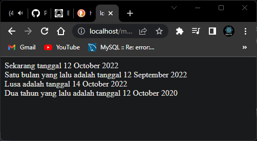

# mktime() Function

Function ini digunakan untuk membuat timestamp dengan format syntax sebagai berikut :

```PHP
mktime(hour, minute, second, month, day, year);
```
penggunaaan seperti ini:

```PHP
<?php
    $sekarang = mktime(12, 13, 40, date('m'), date('d'), date('Y'));
    echo "Sekarang tanggal ".date('d F Y', $sekarang);

    $bulanlalu = mktime(0, 0, 0, date('m')-1, date('d'), date('Y'));
    echo "<br>Satu bulan yang lalu adalah tanggal ".date('d F Y', $bulanlalu);

    $lusa = mktime(0, 0, 0, date('m'), date('d')+2, date('Y'));
    echo "<br>Lusa adalah tanggal ".date('d F Y', $lusa);

    $tahun = mktime(0, 0, 0, date('m'), date('d'), date('Y')-2);
    echo "<br> Dua tahun yang lalu adalah tanggal ".date('d F Y', $tahun);
?>
```

hasilnya seperti gambar dibawah ini:




Selain 2 function yang paling sering digunakan di atas, ada beberapa function lagi yang berkenaan dengan penggunaan tanggal, yaitu **date_default_timezone_set()** untuk menentukan timezone dan **strtotime()** untuk megubah string menjadi format tanggal atau waktu.