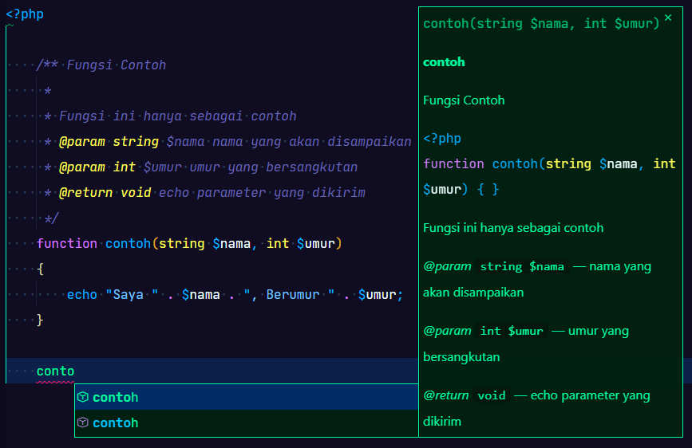

# Pengenalan Function

Dalam pengembangan aplikasi kita sering kali membuat lagi baris kode yang sama, karena aplikasi kita melakukan hal yang sama tetapi pada tempat dan waktu berbeda, dalam contoh dimana halaman web yang kita buat memiliki footer, maka kita akan membuat baris kode yang sama pada setiap halaman web untuk menampilkan footer tersebut. Hal ini dapat diminimalkan dengan melakukan penggunaan ulang script atau baris kode yang telah kita buat. Baris kode yang dapat digunakan ulang ini disebut Fungsi, dalam syntax PHP di tulis `function`.

Daftar Isi

1. [Fungsi Dasar](#1-fungsi-dasar)
2. [Parameter dan Return](#2-parameter-dan-return)
3. [Scope Variabel Dalam Fungsi](#3-scope-variabel-dalam-fungsi)
4. [Variable Statis Dalam Fungsi](#4-variabel-statis-dalam-fungsi)
5. [Fungsi Tanpa Nama](#5-fungsi-tanpa-nama)

## 1. Fungsi Dasar

Fungsi adalah program-program kecil yang memiliki tugas tersendiri untuk memecahkan khusus satu masalah komputasi. fungsi dapat saling memanggil untuk memecahkan masalah komputasi lebih sulit. Jika fungsi-fungsi ini di gabungkan terbentuklah sebuah aplikasi yang komplek.

Fungsi dalam PHP di tulis seperti di bawah ini:

```php
<?php
    function contoh_fungsi()
    {
        echo 'Fungsi Pertama Saya';
    }

```

Pada kode diatas kita telah membuat sebuah fungsi dengan nama `ContohFungsi`, saat fungsi ini di panggil, maka fungsi ini akan meng-eksekusi semua argumen dan perintah yang terdapat di dalam bracket `{}` fungsi tersebut.

Untuk memanggil fungsi tersebut kita menuliskan nama fungsi dan menambahkan tanda kurung `()`-Parentheses untuk memberi tahu PHP bahwa itu adalah fungsi, sebagai contoh pada baris kode di bawah ini :

```php

    contoh_fungsi();
?>
```

Harus di perhatikan bahwa fungsi tidak akan secara otomatis berjalan saat kita meng-akses halaman php tersebut, selama fungsi itu tidak di panggil.

>Secara umum penulisan fungsi PHP dalam pseudo :
>
>```php
>   function nama_fungsi($param_1, $param_2,.....,$param_n)
>   {
>       Argumen yang akan di jalakan
>   }
>```

[](1_Basic_Function.php)

## 2. Parameter dan Return

Fungsi dapat menerima variabel atau parameter untuk diproses dan dapat mengembalikan nilai hasil processing.

### 2.1 Parameter

Dalam penggunaan fungsi kita dapat mengirimkan parameter yang akan digunakan oleh fungsi, sebagai contoh di bawah fungsi yang tidak menerima parameter dan yang dapat menerima parameter:

```php
    // fungsi tidak menerima parameter
    function non_parameter()
    {
        echo "saya fungsi tanpa parameter"
    }

    // fungsi menerima parameter
    function with_parameter($param)
    {
        echo "saya fungsi, menerima parameter " . $param;
    }

    non_paramater();             //saya fungsi tanpa parameter
    with_parameter("Contoh");    //saya fungsi, menerima parameter Contoh
```

Fungsi diatas kita lihat bahwa fungsi dapat menerima parameter dari luar dengan syarat kita sudah siapkan parameter lokal-`local` pada fungsi untuk menampung nilai yang dikirimkan tersebut, fungsi yang tidak menerima parameter tetap bisa kita kirimkan parameter, tetapi tidak akan dapat di tampung dan di gunakan oleh fungsi.

Parameter yang di terima oleh fungsi dapat kita tentukan tipe datanya dengan cara mendeklarasikan type datanya, sebagai contoh pada baris kode di bawah ini :

```php
<?php
    function with_parameter(string $str, array $data, int $nomor, float $num, bool $boolean){
        argument
    }
?>
```

Dan berbagai macam tipe data lainnya, hal ini untuk mencegah terjadinya error saat fungsi berjalan menggunakan parameter yang tidak sesuai.  
Untuk PHP sebelum PHP versi 8, maka pengiriman parameter harus berurutan sesuai dengan yang telah di buat pada parameter penerima, sebagai contoh :

```php
<?php
    function person(string $firstname, string $lastname, int $age)
    {
        echo 'Hallo ' . $firstname . ' ' . $lastname . '<br>';
        echo 'Umur anda ' . $age . ' Tahun<br>';
    }

    // Pemanggilan Fungsi
    person('Foo', 'Bar', 17);
    // Jika parameter terbalik
    person('Bar', 'Foo', 17);

?>
```

Baris kode diatas akan menghasilkan :

```text
Hallo Foo Bar
Umur anda 17 Tahun
Hallo Bar Foo
Umur anda 17 Tahun
```

Pada pemanggilan fungsi untuk kedua kalinya akan menghasilkan nilai terbalik, untuk parameter penerima memiliki tipe data `string`  tetap menerima data bertipe `integer`, karena secara otomatis PHP akan mengkonversi data tersebut menjadi string, tetapi tidak berlaku untuk sebaliknya. Pada PHP ^8 telah di sediakan fitur untuk mengirimakan parameter dengan tidak berurutan dengan cara menyatakan nama parameter tujuan, contoh sebagai berikut:

```php
<?php
    function person(string $firstname, string $lastname, int $age)
    {
        echo 'Hallo ' . $firstname . ' ' . $lastname . '<br>';
        echo 'Umur anda ' . $age . ' Tahun';
    }

    // Pemanggilan fungsi
    person(lastname: `Bar`, age: 17, firstname: `Foo`);

    // Hasil eksekusi fungsi
    // Hallo Foo Bar
    // Umur anda 17 Tahun
?>
```

Maka hasil dari pengiriman fungsi akan tetap sesuai dengan yang urutkan pada fungsi.

> Penting :
> Fitur ini hanya tersedia pada PHP 8 ke atas,  
> jika rekan - rekan mencoba hal tersebut menghasilkan error,  
> harap periksa versi PHP rekan - rekan sekalian.

Selain dari itu kita juga dapat memberikan nilai awal (deafult value) pada parameter penerima kita, berguna bila parameter ini berupa opsional, contoh :

```php
<?php
    function contoh(string $nama, int $age = 18){
        echo 'Saya bernama ' . $nama . ', saat ini berumur ' . $age . ' tahun';
    }

    contoh('Bellshade');
    //Hasil : Saya bernama Bellshade, saat ini berumur 18 tahun
?>
```

Parameter di dalam fungsi berstatus lokal-`local` parameter, parameter ini dapat kita gunakan selama di dalam fungsi dan tidak akan dapat digunakan diluar fungsi jika kita ingin menggunakan variabel tersebut diluar fungsi maka kita harus menjadikan variabel tersebut menjadi global parameter(akan kita bahas pada materi scope).  
Sebagai contoh :

```php
<?php
    function coba($data)
    {
        $hasil = $data;
    }

    coba("saya");           //set $hasil dalam fungsi
    echo $hasil;            //error variable undefined
?>
```

Kode diatas akan membuat parameter `$hasil` bernilai `"saya"`, namun nilai tersebut tidak dapat di akses secara langsung dari fungsi. dimana baris kode diatas menghasilkan pesan error berupa *undefined variable $name*, karena variabel tersebut merupakan parameter local pada fungsi `coba`.  

**Tips :**  
Ada baiknya kita memberikan komentar tag pada fungsi yang kita buat dan menjelaskan parameter yang di butuhkan, sehingga *intelisense* dapat dengan mudah membatu kita saat menggunakan fungsi tersebut, sebagai contoh:

```php
<?php

    /**
     * Fungsi Contoh
     *
     * Fungsi ini hanya sebagai contoh
     * @param string $nama nama yang akan di sampaikan
     * @param int $umur umur yang bersangkutan
     * @return void echo nilai yang di kirim
     */
    function contoh(string $nama, int $umur){
        echo "Saya " . $nama . ", Berumur " . $umur;
    }
?>
```

Maka saat kita akan memakai fungsi tersebut php intelisense akan membatu kita untuk mengetahui parameter apa dan untuk apa parameter tersebut. contoh seperti gambar di bawah :



### 2.2 Return

Jika kita ingin fungsi mengirimkan kembali nilai dari hasil proses kepada baris kode yang kita buat, kita dapat menggunakan perintah `return` dalam fungsi tersebut. nilai tersebut dapat kita tampung dalam sebuah variabel atau langsung kita gunakan.

Perintah `return` ini akan mengembalikan nilai hasil proses dari fungsi dan sekaligus menghentikan fungsi tersebut, baris kode di dalam fungsi yang terdapat di bawah perintah `return` tidak akan di eksekusi bila perintah `return` ini berhasil di eksekusi. Secara umum perintah `return` di tulis seperti ini :

```php
return nilai;
```

Sebagai contoh penggunaan perintah `return` untuk mengembalikan nilai dalam sebuah fungsi :

```php
<?php
function perkalian(int $num1, int $num2){
    $hasil = (int) $num1 * $num2;
    return $hasil;
}

$nilai = perkalian(25, 24);         //menyimpan hasil dari fungsi pada variabel $nilai
echo $nilai;                        //hasil 600
?>
```

Fungsi diatas akan mengembalikan nilai hasil perkalian dari 25 dan 24, nilai tersebut akan di tampung kedalam variabel nilai.  
Nilai kembalian dari sebuah fungsi juga dapat berupa pemanggilan fungsi lain, sebagai contoh :

```php
<?php
function nama($depan, $belakang){
    $nama = $depan . ' ' . $belakang;
    return halo($nama);
}

function halo($data){
    $hasil = 'hallo, nama saya ' . ucwords($data);
    return $hasil;

    echo $data;             // baris kode ini tidak akan pernah di jalankan
}

$nilai = nama('asep', 'suherman');
echo $nilai;                // hasil : hallo, nama saya Asep Suherman
?>
```

Fungsi `nama` akan mengembalikan nilai berupa fungsi lain yaitu fungsi `halo`, dan nilai fungsi `halo` ini yang akan dikembalikan kedalam variabel yang kita siapkan untuk menampung nilai hasil fungsi, sedangkan perintah `echo` pada fungsi `nama` tidak akan pernah di eksekusi karena perintah ini berada setelah perintah `return`.

Sebuah fungsi hanya bisa mengembalikan satu nilai, tetapi fungsi dapat mengembalikan nilai dalam berbagai macam tipe data, untuk mengembalikan nilai lebih dari satu kita dapat menggunakan tipe data array sebagai solusinya.

[](2_Parameter_Return.php)

## 3. Scope Variabel dalam Fungsi

Scope atau Ruang Lingkup sebuah variabel mencangkup di mana variabel tersebut di buat, variabel PHP pada umumnya hanya memiliki satu cangkupan ruang lingkup. Jika sebuah variabel global di buat dalam suatu file maka variabel ini tersedia untuk file itu sendiri dan file-file yang di panggil oleh file tersebut, namun tidak dapat digunakan oleh fungsi-fungsi yang terdapat dalam file tersebut, karena secara bawaan fungsi menggunakan variabel terbatas pada variabel yang terdapat pada ruang lingkup fungsi itu sendiri (local scope variabel) sebagai contoh :

```php
<?php
    $contoh = 'ini contoh variabel global';

    fungsi scope_variabel(){
        print_r($contoh);
    }
?>
```

Hasil print_r tidak akan menghasilkan nilai dari variabel `$contoh` tapi sebuah pesan kesalahan berupa peringatan bahwa variabel `$contoh` tidak di temukan walaupun sebelumnya kita telah membuat variabel `$contoh` pada ruang lingkup file, ini terjadi karena variabel yang di gunakan oleh fungsi `scope_variabel()` adalah variabel `$contoh` yang di buat di dalam fungsi itu sendiri, sedangkan variabel tersebut belum pernah kita buat di dalam fungs, tujuan dari PHP adalah untuk mencegah secara tidak sengaja kita merubah dari nilai variabel global tersebut saat mengeksekusi sebuah fungsi.

Untuk dapat menggunakan variabel tersebut kita harus memberi tahu fungsi bahwa variabel yang kita gunakan adalah variabel yang tersedia pada file (global), sebagai berikut :

```php
<?php
    $contoh = 'Saya Variabel pada File PHP';

    function contoh_param(){
        global $contoh;         // Nyatakan bahwa variabel ruang lingkup global
        print_r($contoh);
    }

    contoh_param();     // Hasil 'Saya Variabel pada File PHP'
?>
```

Pada baris kode ini kita membuat sebuah global variabel `$contoh` pada file, dan kemudian membuat variabel lagi pada fungsi dengan cangkupan ruang lingkup global, karena variabel `$contoh` pada ruang lingkup global sudah ada maka fungsi tidak membuat baru atau merubah variabel tersebut, tetapi mereferensikan variabel tersebut kedalam fungsi, bila tidak ditemukan variabel tersebut pada ruang lingkup global maka fungsi akan membuat variabel baru dengan nama tersebut, dan variabel ini tersedia secara dalam cangkupan file walaupun fungsi telah berakhir, penting di ingat saat kita memberikan nilai baru pada variabel `$contoh` tersebut di dalam fungsi, maka selanjutnya nilai variabel `$contoh` pada fungsi akan menggunakan nilai baru.

Selain cara di atas kita dapat menggunakan variable `$GLOBALS` yang berupa array untuk menggunakan variabel yang tersedia pada ruang lingkup global, seperti contoh baris kode di bawah ini:

```php
<?php
    $x = 2;
    $y = 5;

    function sum(){
        $GLOBALS['hasil'] = $GLOBALS['x'] + $GLOBALS['y'];
    }

    sum();
    print_r($hasil);    //hasil 7
?>
```

Kita bisa perhatikan bahwa variabel `$GLOBALS` tersedia pada PHP merupakan sebuah array asosiatif dengan variabel dengan ruang lingkup global sebagai elemen nya, dan kita juga dapat membuat elemen baru yang akan menjadi sebuah variabel dengan ruang lingkup global yang nilai nya tersedia di luar fungsi, variabel `$GLOBALS` ini tersedia dimana saja karena variabel ini memiliki status `superglobal` dimana salah satu contoh lainnya adalah `$_POST`.

Untuk fungsi bersarang variable global harus di nyatakan/deklasikan di dalam fungsi bersarang tersebut untuk dapat enggunakan variabel tersebut.

## 4. Variabel Statis dalam Fungsi

## 5. Fungsi Tanpa Nama

### Referensi
