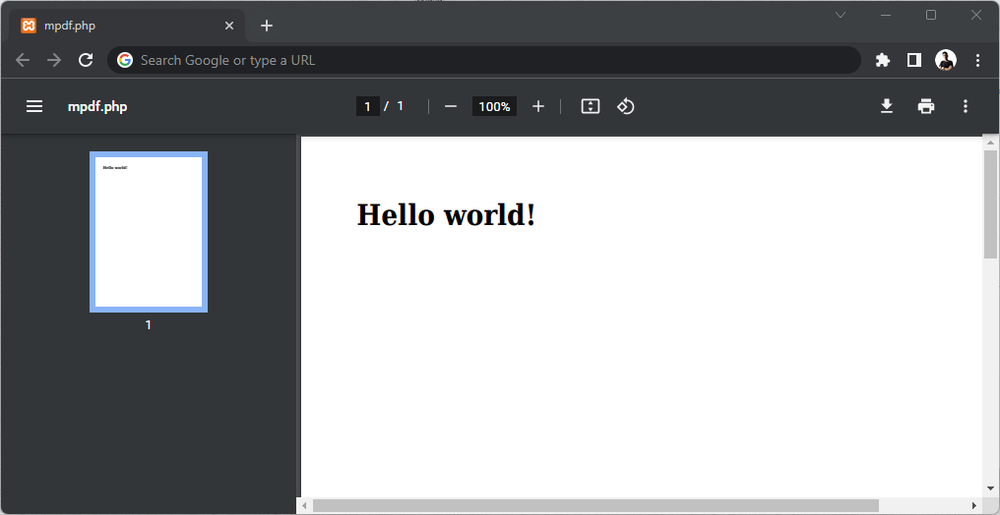

# mpdf

> mpdf website [https://mpdf.github.io/](https://mpdf.github.io/)

- Install v7+

    ```sh
    composer require mpdf/mpdf --ignore-platform-reqs
    ```

- examples
    > mpdf.php

    ```php
    <?php

    require_once __DIR__ . '/vendor/autoload.php';

    $mpdf = new \Mpdf\Mpdf();
    $mpdf->WriteHTML('<h1>Hello World!</h1>');
    $mpdf->Output();
    ```

- output

    
